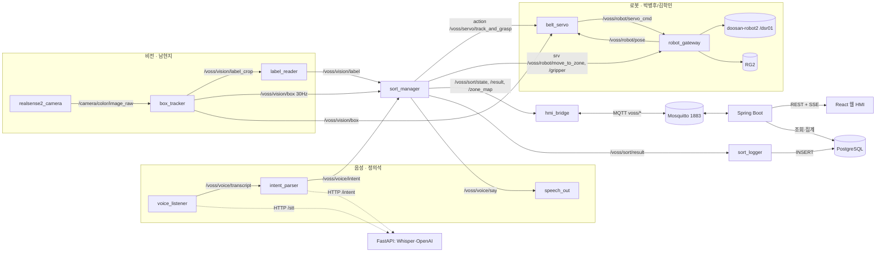

# VOSS 아키텍처

원본 그림과 전체 설명은 BRD 4장·SRD 3장(docs/requirements/). 여기는 개발자가 매일 보는 요약.

## 노드 구성 (논리)

웹·AI·DB 스택과 경계: ADR-0006. 브라우저·Spring Boot 는 ROS 에 직접 붙지 않고 MQTT 로만 연결한다.

## 배포 구성
| 위치 | 구성요소 | 이유 |
|---|---|---|
| 호스트 (공용 MSI 노트북) | 두산 브링업, robot_gateway, belt_servo(30 Hz), sort_manager, voice_listener/intent_parser/speech_out, hmi_bridge, sort_logger, Mosquitto(1883) | 서보 루프 지연을 컨테이너와 분리 |
| 비전 컨테이너 (GPU, `ros:jazzy` 계열) | box_tracker(YOLO), label_reader(PaddleOCR) | GPU 의존성 격리. `--network host`, 같은 ROS_DOMAIN_ID, `config/` 읽기 전용 마운트 |
| DB 컨테이너 | PostgreSQL (`sort_log`) | 호스트 볼륨 마운트. writer = sort_logger, Spring Boot 는 읽기 전용 (ADR-0006) |
| 웹 컨테이너 | Spring Boot(Java 21) + React·Nginx | REST·SSE·MQTT 클라이언트. `--network host` (ADR-0006) |
| AI 컨테이너 (GPU) | FastAPI + Whisper + OpenAI API | STT·intent 전용. 음성 ROS 노드가 HTTP 로 호출 (ADR-0006) |

네트워크: 로봇 컨트롤러는 유선 전용 서브넷, 카메라 USB 3.0, 아두이노는 속도 설정용 시리얼, OpenAI API는 Wi-Fi NIC.

## sort_manager 상태기계
`IDLE → RUNNING(관측·판단) → PICKING(추종·파지·적재) → RECHECK(재확인 구역 정적 재판독) → ASKING(작업자 질문 대기) → PAUSED(재개 시 RUNNING)`
전이 조건·타임아웃은 SDD 영역. 구현하며 결정한 값은 ADR 또는 src/voss_manager/CLAUDE.md 에 적는다.

## 파지 방식
- A안(기본): 폐루프 비주얼 서보 (픽셀 오차 → 속도 명령 + 벨트 속도 피드포워드), 30 Hz.
- B안(폴백): 개루프 동기 추종 (벨트 속도 알고 그 속도로 이동하며 하강).
- **10/10 게이트**: A안 추종 파지 20회 중 14회(70%) 점검. 미달이어도 자동 전환하지 않고 게이트 회의에서 ① B안 ② 범위 축소 ③ A안 10/12 연장 중 정한다. 결정은 ADR-0002에 남긴다.
- 그리퍼: **31 mm 면**을 잡는다(46 mm 변 = 벨트 방향, 닫힘축이 벨트를 가로지름, pending #16 10/07 결정). 사전 개방 90 mm(보고값, 실제 약 80 mm) → 벨트 가로 방향 양쪽 약 24.5 mm 여유. 벨트 방향 타이밍 오차는 그리퍼가 흡수하지 못하므로 추종이 맡는다.
- 두산 제어: `servol_stream` 계열 스트리밍 토픽이 있으면 사용, 없으면 짧은 상대 `move_line` ASYNC 큐 (10/06 확인).

## 핵심 수치 (SRD에서)
파지 성공률 ≥ 70% · OCR 분류코드 ≥ 90%(흐린 송장 제외 ≥ 95%) · 지시 해석 ≥ 95% · 사이클 ≤ 30초 · 시연 10개 중 8개 이상 올바른 구역 · 벨트 ≤ 10 cm/s · 서보 루프 100 ms 지연 예산 · 핸드아이 오차 ≤ 5 mm(제안값).
