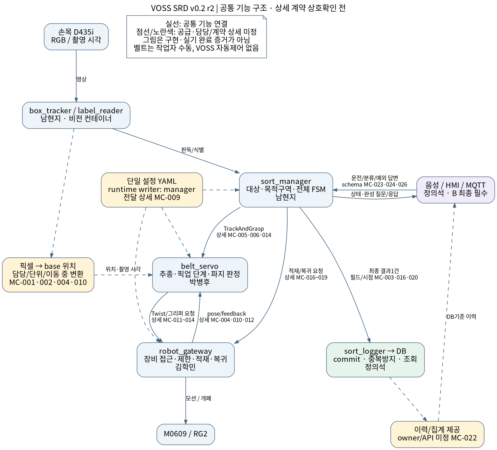

# VOSS SRD v0.2 — 시스템 요구사항 명세서

**확정 일정(KST):** 상호확인 회신 2026-10-06 18:30까지 · 첫 실기 실험/실측 2026-10-07까지 · 실제 1박스 전체 흐름 **G0 통과 목표 2026-10-10까지**. 구체 장비 시간·검토 방식·수락 확인자는 별도 확인한다.

**문서 ID:** SRD-VOSS-001 · **버전:** v0.2 · **작성일:** 2026-10-06(한국 시간)  
**상태:** 4인 회신 취합 반영본 v0.2 r2 / 상호 확인·전체 승인 전 / 실기 검증 미완료  
**작성·취합:** 박병후 · **시스템 범위 승인:** 남현지(PL) 및 관계 담당자

## 목차

- 0. 문서 관리
- 1. 소개
- 2. 범위와 운영 문맥
- 3. 시스템 개요와 할당
- 4. 기능 요구사항
- 5. 외부·파트 간 인터페이스 요구사항
- 6. 비기능 요구사항
- 7. 데이터·환경·운영·유지보수 요구사항
- 8. 검증·수락
- 9. 요구사항 추적성과 범위 변경
- 10. 취합할 빈 항목 대장
- 부록 A. 취합 후 완성하는 절차
- 부록 B. 요구사항 작성 카드
- 부록 C. 회신 반영 범위·상호 확인 상태

## 0. 문서 관리

### 0.1 변경 이력

| 버전 | 내용 | 승인 상태 |
|---|---|---|
| v0.1 | 기존 첨부 초안 | 팀 검토 전 |
| v0.2 | 요구사항 명세 구조 재작성. 최초 전체 흐름/최종 필수/선택 범위 분리. 새 요구사항 ID, 검증·추적표, 담당자 취합 ID 도입 | 취합·검토 전 |
| v0.2 r1 | Astra 6 독립 재검을 주 작성자가 판단해 반영. G0 실물/모의 구분, 환경 요구사항 추적, 단계별 취합 상태·카드 커버리지·결정 출처·하위 합격 조건 보완 | 취합·검토 전 |
| v0.2 r2 | 4인 회신 공통 내용·담당 설계 보고·계약 상태·VT 카드 연결 반영. 충돌/미정은 MC-001~034와 6개 상호 확인서로 관리. 기존 ID 유지 | 상호 확인 / 최종 승인 전 |
| v0.2 r2 일정 갱신 | 상호확인 회신 마감 2026-10-06 18:30 KST, 첫 실기 실험/실측 2026-10-07까지, G0 통과 2026-10-10까지 목표. 첫 실험과 G0 완주 수락을 구분 | 사용자 일정 지정 / 전체 수락 미완료 |
| v0.2 r1 관리정보 갱신 | 사용자 지정에 따라 제출 마감 2026-10-06 16:00(한국 시간) 확정. 검토 일정·G0 목표일은 별도 지정 | 제출 일정 확정 / 요구사항 취합·검토 전 |

### 0.2 승인·검토

| 구분 | 담당 | 결과·일시 |
|---|---|---|
| 시스템 범위·수락 기준 | 남현지(PL), 박병후 | [미기입] |
| 비전·OCR·작업 관리자 | 남현지 | [미기입] |
| 로봇·환경·안전 제약 | 김학민 | [미기입] |
| 음성·HMI·DB | 정의석 | [미기입] |
| 서보·전체 취합 | 박병후 | [미기입] |

취합 제출 마감: **2026-10-06 16:00(한국 시간, KST)**. 검토 회의·방식은 별도 지정. 이는 1차 회신의 문서 관리 일정이며 제품 요구사항이 아니다. 4인 회신은 취합했고, 이번 상호 확인 회신 마감은 2026-10-06 18:30 KST다. 첫 실기 실험·실측 목표는 2026-10-07까지, G0 통과 목표는 2026-10-10까지다. 검토 일정/방식·구체 장비 시간·확인자는 별도로 정한다.

### 0.3 초안의 읽는 방법

- `해야 한다`: 승인되면 준수할 시스템 요구사항. 본문에 공통으로 수용한 내용은 회신 취합 결과로 반영했다. 요구사항 전체·변경 계약의 최종 승인과 실기 수락은 별도이며 부록 C 와 MC-ID로 상태를 구분한다.
- `TBD-nnn`: 확정할 빈 항목. 10장의 지정 담당 양식에 답을 받아 채운다. 문서의 일부 값을 안다고 관련 계약 전체가 확정된 것은 아니다.
- `A`: 최초 전체 흐름에 필요한 필수 사항. `B`: 최초 연결 이후 최종 시연까지 필요한 필수 사항. `C`: 기본 흐름 안정화 후 채택 여부를 검토하는 선택 사항.
- 수치의 출처가 BRD 인 경우 목표값으로 계승한다. 실측·시험 결과로 표시하지 않는다. 기존 SRD에만 있는 수치는 재검토 제안으로 표시한다.
- v0.1의 SR-* 번호는 이 문서에서 그대로 재사용하지 않는다. v0.2의 SYS-* 번호와 BRD TR-/NFR- 연결은 9장에 있다. 기존 이슈·일정표의 SR-*는 원래 v0.1을 가리키므로 혼용하지 않는다.

## 1. 소개

### 1.1 목적

이 문서는 VOSS 전체 시스템이 제공해야 할 기능, 외부·파트 간 인터페이스, 성능, 데이터·운영·안전 제약과 검증 기준을 명세한다. 각 파트가 병렬 개발해도 같은 입력·출력 약속과 수락 기준을 사용하도록 한다.

### 1.2 문서 구성·표준 참고

[ISO/IEC/IEEE 29148:2018](https://www.iso.org/standard/72089.html) 의 요구사항 엔지니어링과 시스템 요구사항 명세(SyRS) 개념을 참고해 프로젝트 규모에 맞게 구성했다. 목적·범위·운영 문맥·시스템 요구사항·인터페이스·품질·제약·검증·추적성을 포함한다. 표준 조항별 적합성 인증 문서는 아니며 기존 초안의 장 순서를 계승하지 않는다.

SRD에는 외부에서 확인할 수 있는 동작·데이터·제약·성능을 작성한다. 제어 게인, OCR 내부 구현, 상세 클래스, 실행 스크립트 전문, 알고리즘 설계는 SDD/패키지 설계 문서에서 관리한다. 노드 이름은 기존 설계 후보이고 확정 계약은 관계 담당자 검토 후 저장소에 반영한다.

### 1.3 참조 문서와 적용 관계

| 참조 | 판·상태 | 사용 |
|---|---|---|
| 사용자 업무 지침 | 06 결정 대장의 DEC-005, 2026-10-06 | 인식→픽업→적재→기록을 먼저 연결. 규칙 변경·교시는 이후 |
| 사용자 측정 정책 | 06 결정 대장의 DEC-002, 2026-10-06 | 정상 자동/예외 처리 분리, 작업자 대기 별도 기록 |
| VOSS_BRD_v1.1.docx | 2026-10-05 | 제품 기능·제약·목표·시연 기준 |
| VOSS_개발일정.xlsx | 2026-10-05 | 담당·마일스톤. 이번 취합 제출 마감은 DEC-001에 별도 확정 |
| SRD_인계_BRD 에서_옮긴_노드·인터페이스.md | BRD 4장 내용 이전, 2026-10-05판 기준 | 기존 인터페이스 후보·미결정 경로 |
| 기존 SRD v0.1 | 팀 검토 전 | 일부 사양 후보·비교. 최신 BRD로 재검토 |
| docs/interfaces/* | 로컬 커밋 668703e, 제안 상태 | 현재 개발 계약 후보. 변경 승인 전에는 초안 유지 |
| src/voss_msgs/* | 같은 커밋 | 메시지 정의 파일 대조 대상. 실제 연결 완료 증거는 아님 |
| 4인 SRD v0.2 회신 | 남현지 r1·김학민 r1·정의석 r1·박병후 r2, 2026-10-06 | 공통 내용·담당 설계·계약 제안·미정 근거; 02 통합대장과 원본 sources 참조 |
| docs/measurements-1006.md·pending-decisions.md·adr/* | 기록·확정 필요 | 실측·결정 증거의 관리 위치 |

사용자 지침을 본 초안의 우선순위 기준으로 적용했다. BRD의 기능 범위와 차이가 나는 선택 기능은 4.3·9장에 표시한다. 이 문서 작성으로 기존 저장소 계약이 자동 변경되는 것은 아니다. 김학민이 참조한 BRD v1.2는 미제공이라 적용 차이는 MC-034에서 확인한다. 로컬 main@668703e 와 별도 브랜치의 승인 보고를 구분한다.

### 1.4 용어

| 용어 | 정의 |
|---|---|
| SRD / SyRS | 전체 시스템 요구사항 명세 |
| SDD | 시스템 요소가 어떻게 구현·상호작용하는지 설명하는 설계 문서 |
| 최초 전체 흐름 | 명확한 송장의 박스 1개를 인식→픽업→적재→기록→다음 관측 준비까지 연결하는 통합 기준 |
| 정상 자동 처리 | 재확인·작업자 판단 없이 올바른 구역에 적재되는 처리. 재시도 포함 여부는 TBD-025에서 정의 |
| 예외 처리 | 저신뢰·파지 실패 등으로 추가 절차가 발생한 처리. 작업자 대기는 별도 시간으로 기록 |
| 물리 박스 / 처리 시도 | 재투입해도 같은 실제 박스 / 하나의 처리 실행. 대응 규칙은 TBD-007 |
| track_id / box_id | 검출 추적 식별자 / 업무 처리 식별자. 동일 의미로 가정하지 않음 |
| A/B 추종안 | A 폐루프 비주얼 서보 / B 개루프 동기 추종. 요구사항 우선순위 A/B 와 별개 |
| 기본 매핑 | S07-01 역삼동→A, S07-02 대치동→B, S07-03 청담동→C |

## 2. 범위와 운영 문맥

### 2.1 시스템 목적·경계

VOSS 는 작업자가 1개씩 투입한 미니 택배 박스를 손목 RGB 카메라로 인식하고, 계속 움직이는 벨트에서 픽업하여 송장의 동에 대응하는 구역에 적재하고 결과를 기록하는 협동로봇 분류 어시스턴트다. 최종 필수 범위는 음성 지시·HMI·판독 예외 처리·이력 조회를 포함한다.

시스템 내부: VOSS 비전·작업 관리자·서보·로봇 게이트웨이·음성·HMI 브리지·로그 기능과 설정·DB·배포 연결. 경계 외부: 작업자, 로봇 컨트롤러·그리퍼·카메라·벨트, OpenAI 서비스. 장비는 외부 인터페이스이면서 시스템의 사용 제약으로 명세한다.

### 2.2 필수·선택 및 연결 순서

| 구분 | 포함 내용 | 연결 기준 |
|---|---|---|
| A 최초 전체 흐름 필수 | RGB 인식·명확한 송장 판독·기본 매핑·이동 중 픽업·성공 판정·적재·복귀·DB 기록, 필요한 설정·안전·입출력 | 명확한 박스 1개가 전체 흐름을 실제로 완주. 음성/HMI 완성 전에는 모의 유효 시작 입력을 사용할 수 있음 |
| B 최종 시연 필수 | 음성 호출/STT/intent/TTS, 시작·정지·재개, 우선/전체 분류, HMI 폴백·집계, 로그 기반 이력 질의, 다단 OCR·재확인·질문·보류, 파지 재시도, 성능 측정, 컨테이너 배포 | 최종 필수 시나리오와 각 목표를 확인. A 를 먼저 연결한다는 이유로 B 를 선택 기능으로 바꾸지 않음 |
| C 선택 | 자연어 구역 매핑 변경, 신규 구역 직접교시 | A 전체 흐름 승인 이후 구현 착수·채택 판단. B 완료를 지연시키면 범위 제외 가능 |

이동 중 픽업 자체는 필수다. A/B 추종 제어 방법 중 무엇을 사용하는지는 구현 선택·게이트 결정이며 픽업 기능을 선택 기능으로 바꾸지 않는다. 첫 흐름의 로그는 임시 메모리 출력만으로 완료 판정하지 않고 저장·조회까지 확인한다.

### 2.3 사용자·운영 시나리오

| 사용자 | 입력·역할 | 시스템 결과 |
|---|---|---|
| 작업자 | 박스 순차 투입, 시작/정지/재개·분류 지시, 불확실 송장 응답 | 픽업·분류·음성/HMI 상태·질문 |
| 관리자 | 예정 수량 입력, 동별·보류·남은 수 조회 | 작업 로그와 일치하는 집계 |
| 개발·운영 담당 | 설정·실측·기동·시험 | 버전과 시험 증거 확인 |

최초 흐름: 준비 확인→유효 시작 입력→박스 검출→송장 판독→기본 구역 결정→추종·픽업→파지 성공 확인→적재→결과 저장→복귀. 기록과 복귀의 선후·완료 경계는 TBD-007·TBD-018에서 확정한다. 어느 순서든 최초 흐름 완료 시 두 결과가 모두 확인되어야 한다.

최종 예외 흐름: 저신뢰 판독→재확인 구역→정지 재판독→후보 질문→유효 응답에 따른 적재 또는 30초 무응답 보류. 장비·통신·안전 오류는 업무 오류와 구분하며 계속 동작을 강제하지 않는다.

### 2.4 가정·제외 범위

- BRD 기준: M0609·RG2·손목 D435i, 46×31×27 mm 종이 박스, 40×25 mm 송장, 5개 구역(A/B/C/재확인/보류), 1개씩 투입, 벨트 목표 속도 ≤10 cm/s. 실제 설치·속도·좌표·안전값은 TBD-013~018에서 취합한다.
- 벨트 운전은 작업자가 담당한다. VOSS 의 시작·정지는 로봇 분류 작업을 가리키며 운전 중 벨트 속도·전원을 자동 조작하지 않는다.
- 제외: 실제 대형 택배, 다중 박스 연속 투입, 다단 적재 최적화, WMS 연동, 손글씨·다국어·받는 사람 판독, 현업 인증·24시간 운영 수준.
- OCR 엔진·검출 모델의 대안, VLM 폴백 등은 필수 판독 목표를 위한 구현 후보다. 사용한다고 기능 범위가 자동 확대되지 않으며 미채택 상태를 기록한다.

## 3. 시스템 개요와 할당

### 3.1 자원·배포·외부 장비

회신 간 일치하는 운영 규격/실행 구조와 담당자 보고를 다음과 같이 반영한다. 실측·설치 버전·동시부하가 확인되지 않은 항목은 확정 설치값이 아니다.

| 요소 | 회신 취합 내용 | 상태 / 남은 확인 |
| --- | --- | --- |
| 로봇/그리퍼 | M0609/RG2, gateway 만 장비 접근. RG2 Modbus 직접 제안,192.168.1.1:502 보고. 로봇 192.168.1.100:12345 보고. | 규격 공통. DRCF/DRFL·tool/TCP·RG2 경로/feedback/힘/폭·실제 장비 API 미정 MC-010~014/032 |
| 카메라 | 손목 D435i RGB, 깊이 미사용.1920×1080/rgb8/30fps 설정안, 수동노출 5~8ms 목표/고정 WB. | V/R 설정방향 일치. 실제브링업 720p 차이/설정·FPS·노출·clock 실측 MC-004/032 |
| 벨트/작업대 | 1개 투입·수동운전, 목표≤10cm/s, A/B/C/recheck/hold 5구역. 진행오른쪽(뷰기준) 보고. | 규격 공통. base 단위벡터/속도 3회표/pose/grid/배치/간섭 MC-009/018/032 |
| 공용 PC | MSI Katana17/i7-13620H/RAM32GB/RTX4060Laptop8GB, Ubuntu24.04/ROS2Jazzy/CycloneDDS/Python3.12, domain30 보고. | 정의석/타담당 사양보고·원본 미확인. 상세 driver/CUDA/Docker/USB/NIC/동시부하 MC-028/029 |
| 호스트 | gateway·servo·manager·음성 3노드·hmi_bridge·sort_logger, 두산브링업/Mosquitto1883 기존구조. | 기본노드할당 공통. broker 위치/포트·ready·launch·실행/복구 MC-019/026/029 |
| 컨테이너 | vision=box_tracker/label_reader(남현지), DB=정의석. 동일 DDSdomain/host-network 후보. | vision/DB 컨테이너 기능 요구 유지. 이미지/볼륨/정적설정/CT005주담당·web 위치 MC-009/029 |
| 음성/웹/DB 기술 | 로컬 Whisper STT + LangChain/OpenAI intent + TTS 담당방향. React/TypeScript+SpringBoot, PostgreSQL 은 정의석 제안. | 모델/engine/stack/DB 종류·버전/실기미정. 원본 말미 본인 확인 필요 MC-023/025/028/029 |

남현지 보고: 검출은 OpenCV 분할로 첫 연결 후 YOLO nano 를 평가해 전환 판단, PaddleOCR 한국어 우선. `belt_plane.py`/가상 시험은 별도 브랜치 구현 보고이고 나머지 주요 노드는 골격/설계 상태다. 박병후 보고: 폐루프 베이스 XY FF+P 추종을 담당 방향으로 채택했으며 실제 코드/장비 확인·상대 계약 합의는 남아 있다. 제어 게인/내부 알고리즘은 SDD에서 관리한다. 개루프 전환 조건은 MC-008에서 기존 ADR 와 동기화한다.

### 3.2 기능 할당과 논리 연결

| 기능 | 기존 노드 후보 | 주담당 | 출력·소비자 |
|---|---|---|---|
| 영상·검출·OCR | box_tracker, label_reader | 남현지 | 위치·송장 결과→servo/manager |
| 작업 판단·설정 | sort_manager | 남현지 | 파지 요청·적재 요청·상태·최종 결과 |
| 추종·픽업 | belt_servo | 박병후 | 제어 명령→gateway, 결과→manager |
| 장비 접근·적재 | robot_gateway | 김학민 | pose·그리퍼 피드백·동작 결과 |
| 음성 입출력 | voice_listener, intent_parser, speech_out | 정의석 | intent→manager, 확인·질문→작업자 |
| HMI·로그 | hmi_bridge, sort_logger, DB | 정의석 | 명령·화면·저장·조회 결과 |

논리 개요: 카메라→비전→관리자/서보→로봇 게이트웨이→장비. 관리자의 최종 결과→logger→DB. 음성/HMI→관리자, 상태/질문/결과→음성/HMI. DB→집계 조회→음성/HMI 의 구체 경로는 TBD-008이다. 설정→각 소비자 경로는 TBD-006이다.

그림 v0.2 r2: **기능 연결 구조**를 표시한다. 위치변환 생산자/단위, Stats 제공자, robot stop/ready/event, 설정의 정적 전달은 MC-ID 확인 전이며 점선으로 구분했다. 그림은 실기 연결 완료 증거가 아니다. 실행 위치/이미지/포트가 미정인 배포도는 §3.1 표와 MC-029로 관리한다.

### 3.3 운영 상태·동작 책임

상태 후보는 IDLE/RUNNING/PICKING/RECHECK/ASKING/PAUSED 다. 남현지 회신의 기본 FSM 골격을 수록한다. 기본 흐름은 IDLE→RUNNING→PICKING→적재/복귀→RUNNING 이며, 실제 적재/복귀 이벤트와 result 시점은 MC-016 확인 전이다. start 허용상태·정지후 보유박스·재개는 MC-015·023의 불일치로 전체 전이표를 확정하지 않았다. 이 목록은 순차 일렬 전이를 뜻하지 않는다. 상태별 진입 조건·허용 명령·진행 박스·정지/재개 조건·완료 이벤트는 TBD-005, 장비 정지·통신 상실·복구 책임은 TBD-017에서 채운다.

| 동작 | 업무 판단 | 실행 후보 | 합의 항목 |
|---|---|---|---|
| 대상 선택·재확인·질문 | manager | 비전/음성/HMI/로봇 협업 | TBD-004·005 |
| 추종·하강·파지 | manager 대상 요청, servo 픽업 단계·닫힘 타이밍·판정 | gateway 모션/RG2 실행 | MC-005·006·012·013·014: retry/인계/완료·정지 |
| 적재·복귀 | manager | gateway | TBD-016·018 |
| 정지·취소·재개 | manager·servo·gateway 협업 | gateway 장비 접근 | TBD-005·017·019·020 |
| 기록·집계 | manager 결과 확정 | logger/DB/조회 기능 | TBD-007·008·012 |

### 3.4 식별·설정·결과의 공통 규칙

- 영상 track_id 와 업무 box_id 는 역할을 구분한다. manager 가 업무 단계의 대응을 관리하며, 파지 재시도와 재투입은 구분한다. 최종 업무 결과는 처리 1건당 1건이며 DB 중복 수신이 행/집계를 늘리지 않아야 한다. 구체 session/task/attempt/유일키·재시작 발급은 MC-003에서 확정한다.
- 촬영 시각은 원본 프레임에서 검출/크롭/판독 연결까지 보존한다. pose 측정/응답시각과 제어/발행/수신시각은 구분한다. 이력이 없는 현재 pose 를 과거 capture 와 임의 결합하지 않는다. stamp 가 어느시계인지와 이력/age 한계는 MC-004.
- 단일 설정 원본은 `config/voss_config.yaml`, runtime writer 는 sort_manager 다. 미측정 placeholder 를 실제 구동값으로 쓰지 않으며 각 필드의 필수성/단위/유효성을 검사한다. 초기 정적 snapshot 의 launch 전달·schema/버전은 MC-009 확인 전.
- 물리 업무 결과(placed/held/failed 등의 최종 의미)와 저장 상태(DB_OK/DB_ERROR)는 구분한다. G0에서는 commit 된 동일 업무 ID 행과 조회·복귀를 모두 확인한다. manager 의 비차단 운전/DB 장애/ack 는 MC-016·027에서 정한다.

## 4. 기능 요구사항

현재 내용은 BRD/사용자 지침을 토대로 작성한 검토 초안이다. 담당자는 수용·수정·미정·범위 제외를 구분해 회신하고, 수정은 근거와 상대 영향까지 기재한다.

### 4.1 최초 전체 흐름(A)

#### SYS-FR-001 — A / 김학민

시스템은 카메라·로봇·그리퍼·설정·로그 저장 경로의 준비 여부를 확인한 뒤 기본 분류 작업의 실행 가능 여부를 표시해야 한다.

- 출처: 통합을 위한 파생 제안
- 검증 VT-001: 준비 항목별 정상/누락 입력으로 실행 가능 여부와 사유가 구분되는지 확인. 준비 항목은 TBD-018에서 확정.
- 취합 빈 항목: TBD-018

- 회신 취합 r2: 기존 주담당 김학민은 유지한다. NEW-R-01의 manager(남현지) 통합 주담당/파트별 ready 제공안은 MC-019에서 수용 확인 후 변경한다.

#### SYS-FR-002 — A / 남현지

시스템은 손목 카메라의 RGB 영상을 촬영 시각 정보와 함께 비전 기능에 제공해야 한다.

- 출처: TR-PICK-01·02
- 검증 VT-002: 정상 영상 입력과 촬영 시각이 비전 수신 지점까지 연결되는지 확인.
- 취합 빈 항목: TBD-001

#### SYS-FR-003 — A / 남현지

시스템은 벨트 위 박스를 검출하고 픽셀 중심과 검출 영역을 제공해야 한다.

- 출처: TR-PICK-02
- 검증 VT-003: 정답이 있는 박스 영상에서 중심·영역 출력과 검출 성능을 확인.
- 취합 빈 항목: TBD-001

- 회신 취합 r2: bbox 중심 u/v 와 x,y,w,h 픽셀 의미는 남현지 설계로 수록한다. 검출기 구현 선택과 좌표 공급 계약을 구분한다. base position 공급/변환 책임은 MC-001.

#### SYS-FR-004 — A / 남현지

시스템은 동일 박스의 검출·OCR·픽업·적재·기록 결과를 공통 식별 규약으로 연결해야 한다.

- 출처: TR-SYS-04에서 파생
- 검증 VT-004: 한 박스의 각 단계 식별자와 재투입 식별 규칙을 대조.
- 취합 빈 항목: TBD-003, TBD-007

- 회신 취합 r2: 영상 track_id/업무 box_id 역할 및 최종 결과 1건 원칙 반영(AC-005). 생성/재투입/만료/session/task/attempt·DB 키는 MC-003.

#### SYS-FR-005 — A / 남현지

시스템은 검출된 박스의 송장 판독용 영상을 해당 박스와 대응시켜 OCR 기능에 제공해야 한다.

- 출처: TR-OCR-03
- 검증 VT-005: 크롭 입력과 OCR 출력이 다른 박스나 다른 단계로 잘못 연결되지 않는지 확인.
- 취합 빈 항목: TBD-003

- 회신 취합 r2: 남현지의 LabelCrop(header,track_id,stage,sharpness,image) 팀승인 보고를 수록한다. 현재 main 은 Image 이므로 MC-034 승인/schema/반영 확인 전 후보.

#### SYS-FR-006 — A / 남현지

시스템은 명확한 송장의 분류코드·동 이름을 판독하고 기본 매핑에 따른 적재 대상 구역을 결정해야 한다.

- 출처: TR-OCR-04·05; TR-PICK-08
- 검증 VT-006: S07-01/02/03 송장이 기본 A/B/C 구역으로 판정되는지 확인. 임계값은 TBD-004.
- 취합 빈 항목: TBD-004

- 회신 취합 r2: 기본 3매핑은 공통 반영. 코드우선·불일치신뢰도감점·PaddleOCR 우선은 남현지 담당 설계. confidence_min=0.6은 미튜닝 설정 후보, 합격 임계값 아님.

#### SYS-FR-007 — A / 남현지

시스템은 RGB 관측과 캘리브레이션 정보를 이용해 픽업에 필요한 위치를 합의한 로봇 좌표계로 제공해야 한다.

- 출처: TR-PICK-03
- 검증 VT-007: 검증점에서 변환 출력·기준 좌표의 오차와 단위 일치 확인.
- 취합 빈 항목: TBD-002

- 회신 취합 r2: RGB/알려진 27mm 높이 가정 반영. consumer homography(mm)↔producer base(m) 및 이동카메라 유효성/TCP 불일치는 MC-001·002·010. ≤5mm 와 1.72mm 를 실측으로 확정하지 않음.

#### SYS-FR-008 — A / 박병후

시스템은 계속 움직이는 컨베이어 위 박스를 선택한 추종 방식으로 따라가 픽업 위치에 도달해야 한다.

- 출처: TR-PICK-04
- 검증 VT-008: 벨트를 멈추지 않은 단일 박스 시험으로 추종·접근 결과를 확인.
- 취합 빈 항목: TBD-019, TBD-021

- 회신 취합 r2: 병후 담당 채택 방향은 폐루프 베이스 XY 위치오차+벨트속도 FF+P, 고정자세·단계별 Z. 실제 입력/명령/캘리브레이션과 개루프 검토 정책은 MC-001·002·008·011 확인 전.

#### SYS-FR-009 — A / 박병후

시스템은 픽업 대상 박스의 하강·그리퍼 파지 동작을 수행해야 한다.

- 출처: TR-PICK-06
- 검증 VT-009: 서보와 게이트웨이의 동작 책임 및 그리퍼 명령·응답이 연결되는지 확인.
- 취합 빈 항목: TBD-015, TBD-019

- 회신 취합 r2: servo 닫힘 타이밍/픽업 진행, gateway 실제 장비 실행의 책임 반영. close 병행·lift 인계·완료 조건은 MC-006·013.

#### SYS-FR-010 — A / 박병후

시스템은 그리퍼 피드백을 이용해 파지 성공 여부를 판정해야 한다.

- 출처: TR-PICK-07
- 검증 VT-010: 빈 파지·정상 파지 피드백으로 성공/실패가 구분되는지 확인.
- 취합 빈 항목: TBD-015, TBD-019

- 회신 취합 r2: 단순서비스 ok/접수와 물체 확보를 구분한다(AC-008). rawfeedback 실험 후 직접센서 또는 폭/완료/lift 유지 대안을 선택; 수치/타입 MC-012 미정.

#### SYS-FR-012 — A / 김학민

시스템은 파지한 박스를 결정된 구역의 유효 적재 위치에 놓아야 한다.

- 출처: TR-PICK-08
- 검증 VT-012: 실측된 5구역의 유효 슬롯에서 적재 성공·위치 충돌 여부 확인.
- 취합 빈 항목: TBD-016

- 회신 취합 r2: manager 목적 구역, gateway 적재 실행. slot 카운터 manager 안/2×2 pitch60mm/hold 격자는 MC-018 확인 전. 좌표는 실측 전.

#### SYS-FR-013 — A / 김학민

시스템은 적재 완료 후 다음 박스를 관측할 수 있는 대기 자세로 복귀해야 한다.

- 출처: TR-PICK-08
- 검증 VT-013: 적재 이후 대기 자세와 다음 입력 수신 준비 상태 확인.
- 취합 빈 항목: TBD-016, TBD-018

- 회신 취합 r2: 복귀와 물리적 적재완료·result·DBcommit 시각을 구분한다. MoveToZone 응답을 복귀완료로 할지 및 중간 placed 전달은 MC-016.

#### SYS-FR-014 — A / 정의석

시스템은 박스별 최종 처리 결과를 작업 로그 저장소에 기록해야 한다.

- 출처: TR-SYS-04
- 검증 VT-014: 한 박스의 결과가 저장되고 조회되는지 확인. 첫 루프도 로그 저장까지 포함.
- 취합 빈 항목: TBD-007, TBD-012

- 회신 취합 r2: 저장 성공=DB transaction commit, G0는동일 ID 행 SELECT 조회까지 확인(AC-010). final1건/중복방지 반영. DB 종류/키/schema/장애 다음박스는 MC-003·020·027.

#### SYS-FR-033 — A / 남현지

시스템은 단일 설정 기준의 동·코드·구역·좌표 정보를 필요한 기능에 일관되게 제공해야 한다.

- 출처: TR-SYS-06
- 검증 VT-033: 기본 매핑과 제어·OCR·표시 값이 일치하는지 확인. 배포 경로는 TBD-006.
- 취합 빈 항목: TBD-006

- 회신 취합 r2: 단일 YAML/runtime managerwriter/유효성검증 원칙 반영. 전체필드·SI/native 경계·launch snapshot/ZoneMap 추가필드 MC-009·034.

### 4.2 최종 시연 필수 기능(B)

#### SYS-FR-011 — B / 박병후

시스템은 파지 실패 시 최초 시도 이후 최대 2회 재시도하고, 재시도 후 실패를 미분류 결과로 확정해야 한다.

- 출처: TR-PICK-07
- 검증 VT-011: 최초 실패 후 성공 및 총 3회 실패 시나리오를 확인. 반복 가능 조건은 TBD-019.
- 취합 빈 항목: TBD-019

- 회신 취합 r2: 최대 3회 총시도 공통 수용. 안전오류 자동재시도 금지. manager 와 servo 의 국소 retry 소유 불일치는 MC-005, 임의로 양쪽 retry 하지 않음.

#### SYS-FR-015 — B / 정의석

시스템은 호출어 "헬로, 로키"가 감지된 발화에 대해 음성 명령 수집을 시작해야 한다.

- 출처: TR-VOICE-01
- 검증 VT-015: 호출어 포함/미포함 발화의 명령 수집 여부 확인.
- 취합 빈 항목: TBD-010

#### SYS-FR-016 — B / 정의석

시스템은 수집한 한국어 음성 명령을 텍스트로 변환해야 한다.

- 출처: TR-VOICE-02
- 검증 VT-016: 녹음 시험 세트의 전사 결과와 정답 대조.
- 취합 빈 항목: TBD-010

#### SYS-FR-017 — B / 정의석

시스템은 명령 텍스트를 구조화된 intent 로 변환하고 실행 전에 유형·인자·허용값을 검증해야 한다.

- 출처: TR-VOICE-03
- 검증 VT-017: 정상·누락·허용 목록 외 입력을 비교해 무효 명령이 실행되지 않는지 확인.
- 취합 빈 항목: TBD-009

- 회신 취합 r2: allow-list/무효명령실행금지·voice/HMI 동일의미 반영. query_history/query_kind/HOLD·arg·command_id 는 CHG-EUS-01/MC-023·026 확인 전.

#### SYS-FR-018 — B / 남현지

시스템은 유효한 시작 명령을 받은 경우 준비된 분류 작업을 시작해야 한다.

- 출처: TR-VOICE-05
- 검증 VT-018: 음성 및 HMI 시작 명령의 동일한 실행 결과 확인.
- 취합 빈 항목: TBD-005, TBD-009

- 회신 취합 r2: V 회신 내부 start(IDLE·PAUSED)↔상세표(IDLE 만)의 차이는 MC-023. start/resume 규약을 두 가지로 구현하지 않음.

#### SYS-FR-019 — B / 남현지

시스템은 유효한 재개 명령을 받은 경우 정지 상태와 현재 박스 상태에 따른 재개 조건을 적용해야 한다.

- 출처: TR-VOICE-05
- 검증 VT-019: 정지 단계별 재개 조건을 시험하고 이중 파지·이중 기록 여부 확인.
- 취합 빈 항목: TBD-005, TBD-017

- 회신 취합 r2: 물체보유 상태에서 사람제거(R)↔자동이동계속(V)의 차이는 MC-015. 정지확인/재기동/기록여부를 구분해 합의 후 전이표 반영.

#### SYS-FR-020 — B / 남현지

시스템은 특정 동 우선 분류와 전체 분류 지시를 지원해야 한다.

- 출처: TR-VOICE-06
- 검증 VT-020: 특정 동 우선/전체 지시에 따른 대상 선택 결과 확인.
- 취합 빈 항목: TBD-005, TBD-009

- 회신 취합 r2: 전체=priority(빈 dong)(V)↔start(mode=all)(E), priority 빈동허용 차이를 MC-023에서 확정.

#### SYS-FR-021 — B / 남현지

시스템은 현재 지시 대상이 아닌 박스를 픽업하지 않고 통과시켜야 한다.

- 출처: TR-PICK-09
- 검증 VT-021: 우선 분류 지시에서 비대상 박스의 파지 명령이 발생하지 않는지 확인.
- 취합 빈 항목: TBD-005

- 회신 취합 r2: 비대상 통과 기능 유지. outcome=passed 추가는 NEW-V-02/MC-020, 최종집계/재투입 MC-003·021 확인 전.

#### SYS-FR-022 — B / 정의석

시스템은 지시 확인·처리 완료·예외 질문을 작업자에게 음성으로 알려야 한다.

- 출처: TR-VOICE-04
- 검증 VT-022: 각 유형의 TTS 출력과 상태/박스 대응을 확인.
- 취합 빈 항목: TBD-010

- 회신 취합 r2: manager 완성문장→say(String)→speech_out 경로 반영. 중복억제 담당(V speech_out/E manager)·발화우선순위·duplex MC-025.

#### SYS-FR-023 — B / 남현지

시스템은 입구 관측의 1차 OCR 과 추종 중 선택 프레임의 2차 다수결 OCR 을 단계별로 처리하며, OCR 실행을 서보 루프와 분리해야 한다.

- 출처: TR-OCR-01·02
- 검증 VT-023: 하위 조건: (1) 1차 판독, (2) 2차 선택 프레임 다수결, (3) 박스·단계 식별 일치, (4) OCR 실행 분리 및 서보 주기 영향 확인. 각 조건별 결과를 기록하고 모두 만족할 때 전체 통과.
- 취합 빈 항목: TBD-003, TBD-004

- 회신 취합 r2: 현 B 필수/검증 4조건 유지. 병후의 2차 OCR 구조가능성판단 제안은 MC-007에 기록, 이번취합으로 삭제·C 전환·통과 처리하지 않음.

#### SYS-FR-024 — B / 남현지

시스템은 분류코드와 동 이름을 교차 검증하고 불일치·저신뢰 판정 규칙을 적용해야 한다.

- 출처: TR-OCR-05
- 검증 VT-024: 일치·불일치·인식 오류 송장을 비교. 퍼지 매칭 기준은 TBD-004.
- 취합 빈 항목: TBD-004

- 회신 취합 r2: 코드우선·신뢰도감점은 남현지 담당 설계, confidence0.6은 튜닝 전. 판정 결과와 2위/raw/stamp 전달 NEW-V-01/MC-020.

#### SYS-FR-025 — B / 남현지

시스템은 신뢰도 기준에 미달한 박스를 재확인 구역에서 정지 상태로 재판독해야 한다.

- 출처: TR-OCR-06
- 검증 VT-025: 저신뢰 입력에서 재확인 구역 이동과 3단계 OCR 호출·응답 확인.
- 취합 빈 항목: TBD-004, TBD-005

- 회신 취합 r2: ReadLabel 서비스 승인보고는 MC-034 동기화확인전 후보. 놓기→정지 OCR 자세→다시집기 경로는 현 MoveToZone 에 부족하여 MC-017.

#### SYS-FR-026 — B / 남현지

시스템은 재판독으로 확정하지 못한 박스에 대해 1·2위 후보를 제시해 작업자 판단을 요청해야 한다.

- 출처: TR-OCR-07
- 검증 VT-026: 흐린 송장에서 후보·질문·현재 박스의 대응 확인.
- 취합 빈 항목: TBD-004, TBD-005

- 회신 취합 r2: 1·2위후보기능 유지. LabelRead 의 2위필드/raw/stamp 추가는 NEW-V-01/MC-020, 질문/box 상관 MC-024.

#### SYS-FR-027 — B / 남현지

시스템은 예외 질문의 유효한 후보 또는 보류 응답만 받아 해당 박스의 목적지를 결정해야 한다.

- 출처: TR-VOICE-07
- 검증 VT-027: 유효·무효·다른 박스에 대한 응답 입력의 처리 확인.
- 취합 빈 항목: TBD-005, TBD-009

- 회신 취합 r2: 후보동 또는보류 유효답 원칙은 V/E 합치. HOLD/hold/보류표현·질문 ID·lateanswer 필터 MC-023·024.

#### SYS-FR-028 — B / 남현지

시스템은 예외 질문에 30초 동안 유효한 답이 없는 경우 박스를 보류 구역으로 처리해야 한다.

- 출처: TR-OCR-07
- 검증 VT-028: 답변 타이머의 시작·무효 응답·만료·늦은 응답 처리 확인.
- 취합 빈 항목: TBD-005, TBD-025

- 회신 취합 r2: 30초 무응답보류 요구 유지. V 안은 say 발행기준;재생실패/시작지연·pause/resume·humanwait 계산을 MC-024에서 확인.

#### SYS-FR-029 — B / 정의석

시스템은 작업 로그를 기준으로 동별 처리 수·보류 수·남은 수를 음성과 HMI 에 제공해야 한다.

- 출처: TR-VOICE-08; TR-SYS-04
- 검증 VT-029: DB 조회값·음성·HMI 값의 일치를 대조.
- 취합 빈 항목: TBD-008

- 회신 취합 r2: DB 로그기준음성/HMI 동일집계 반영(AC-011). provider/기존 Stats schema/메모리 fallback MC-022, 실패포함/재투입 MC-021.

#### SYS-FR-030 — B / 정의석

시스템은 음성 입력을 사용할 수 없을 때 HMI 의 운전·분류 지시 버튼으로 같은 작업을 제어할 수 있어야 한다.

- 출처: TR-VOICE-02; TR-SYS-03
- 검증 VT-030: 음성 경로 비활성 상태에서 시작·정지·재개·우선·전체 명령 시험.
- 취합 빈 항목: TBD-009, TBD-011

#### SYS-FR-031 — B / 정의석

시스템은 HMI 에 운전 상태·현재 지시·OCR 결과·로봇 상태·구역별 집계·보류 목록을 표시해야 한다.

- 출처: TR-SYS-03
- 검증 VT-031: 하위 조건: (1) 운전 상태, (2) 현재 지시, (3) OCR 결과, (4) 로봇 상태, (5) 구역별 집계, (6) 보류 목록. 원천 데이터와 화면 값을 항목별 대조하고 6개 모두 만족할 때 전체 통과.
- 취합 빈 항목: TBD-011

- 회신 취합 r2: 6개 표시 요구 유지. 로봇상태원천·ready/상태 token 은 NEW-R-06/MC-019, state/JSON/QoS MC-026.

#### SYS-FR-032 — B / 정의석

시스템은 투입 예정 수량을 입력받고 처리 수 기준의 남은 수를 계산해야 한다.

- 출처: TR-VOICE-08; TR-SYS-03
- 검증 VT-032: 기본 10개 및 수정 입력에서 남은 수, 보류·실패·재투입 집계 확인.
- 취합 빈 항목: TBD-007, TBD-008, TBD-011

- 회신 취합 r2: planned 기본 10은 E 시연기본제안. FAILED 포함(V)↔제외(E),물리 박스/투입 회차 수·clamp/session MC-021, 확정식으로 채택하지 않음.

#### SYS-FR-034 — B / 남현지

시스템은 OCR·파지·적재·로그 오류를 구분된 상태 또는 결과로 보고해야 한다.

- 출처: TR-SYS-02; TR-SYS-04에서 파생
- 검증 VT-034: 오류 입력별 사유·후속 조치·결과 기록 확인. 물리 동작 오류 시 계속 운전은 보장하지 않음.
- 취합 빈 항목: TBD-005, TBD-007, TBD-017

- 회신 취합 r2: 업무/장비오류·업무결과/저장실패 구분 반영. reason enum·DB_ERROR 전달/next-box/PAUSED MC-006·020·027.

### 4.3 선택 기능(C)

사용자 지침에 따라 규칙 변경과 신규 구역 교시는 선택 범위로 둔다. BRD의 TR-VOICE-09는 후순위 기능, TR-VOICE-10은 Should 다. 규칙 변경의 최종 필수 여부는 이번 사용자 지침을 적용한 범위 조정이며 9장에 명시한다. 선택 기능을 미채택하더라도 기본 매핑·설정·적재와 필수 성능은 유지한다.

#### SYS-OP-001 — C / 남현지

선택 기능 채택 시 시스템은 자연어로 동→구역 매핑을 변경하고 적용 시점·변경 내용을 음성과 HMI 로 확인해야 한다.

- 출처: TR-VOICE-09; 사용자 우선순위 지침
- 검증 VT-035: 기본 흐름 승인 이후 변경·확인·다음 박스 적용·실패 복구 시험.
- 취합 빈 항목: TBD-023

- 회신 취합 r2: 남현지 채택제안만 접수. G0이후팀채택 전 C 후속검토 유지, 원자 swap/적용/rollback MC-033.

#### SYS-OP-002 — C / 김학민

선택 기능 채택 시 시스템은 대기 상태의 직접교시 좌표를 확인받아 새 구역으로 등록해야 한다.

- 출처: TR-VOICE-10(Should); 사용자 지침
- 검증 VT-036: 기본 흐름 승인 이후 교시·유효 좌표 검증·등록·취소 시험.
- 취합 빈 항목: TBD-024

- 회신 취합 r2: G0이후후속검토. TeachZone 응답 pose·TCP/flange·managerwriter 충돌 MC-033.

## 5. 외부·파트 간 인터페이스 요구사항

### 5.1 계약에 반드시 포함할 정보

인터페이스 카드는 이름만 적지 않는다. 생산자·소비자, transport/topic/service/action, message schema·예시, 단위·좌표·식별·시각, 주기·QoS·timeout, 접수 / 완료/실패/취소 의미, 변경 영향과 양쪽 검토 결과를 기록한다. 정보의 전달 경로가 없는 경우 빈 필드를 임의로 만들어 확정하지 않고 TBD로 둔다.

#### SYS-IF-001 — A / 남현지

시스템의 영상·검출·OCR 인터페이스는 박스 식별·단계·촬영 시각을 연계할 수 있는 데이터 규약을 가져야 한다.

- 출처: TR-PICK-02; TR-OCR-01~06에서 파생
- 검증 VT-037: 데이터 예시와 송수신 계약 대조.
- 취합 빈 항목: TBD-003

#### SYS-IF-002 — A / 박병후

시스템의 픽업 인터페이스는 대상 박스, 진행 정보, 성공/실패 결과 및 취소 동작을 정의해야 한다.

- 출처: TR-PICK-04~07에서 파생
- 검증 VT-038: 액션 goal/feedback/result/cancel 을 송수신 양쪽에서 검토.
- 취합 빈 항목: TBD-019

#### SYS-IF-003 — A / 김학민

시스템의 로봇 인터페이스는 좌표·속도·그리퍼의 단위, 좌표계, 응답 의미와 오류 규약을 명시해야 한다.

- 출처: TR-PICK-03·05·06·08에서 파생
- 검증 VT-039: ROS 타입·두산 posx·그리퍼 타입의 변환과 응답 시점 대조.
- 취합 빈 항목: TBD-014, TBD-015, TBD-016

- 회신 취합 r2: Twist linear m/s·angular rad/s, Pose m·quaternion, native 변환 gateway 반영(AC-007). frame/TCP/stamp/API 조건 MC-004·010·011.

#### SYS-IF-004 — A / 정의석

시스템의 처리 결과 인터페이스는 OCR 원문·판정 동·신뢰도·판정 주체·구역·결과·식별자·시각의 저장 경로를 정의해야 한다.

- 출처: TR-SYS-04
- 검증 VT-040: 발행 예시 → DB 행 → 조회 결과를 필드별 대조.
- 취합 빈 항목: TBD-007, TBD-012

#### SYS-IF-005 — B / 정의석

시스템의 명령 인터페이스는 운전·분류·이력 질의·예외 응답의 유형과 인자 및 무효 입력 처리 규약을 정의해야 한다.

- 출처: TR-VOICE-03·05~08
- 검증 VT-041: 음성 intent·서비스 arg·MQTT JSON 의 같은 명령 대조.
- 취합 빈 항목: TBD-009, TBD-011

#### SYS-IF-006 — B / 정의석

시스템의 HMI 인터페이스는 데이터 항목, 명령 회신, 정기 상태 갱신과 박스별 결과 이벤트의 전송 규약을 정의해야 한다.

- 출처: TR-SYS-03; 기존 SRD 제안
- 검증 VT-042: MQTT schema·QoS·retained·중복 명령 처리 검토.
- 취합 빈 항목: TBD-011

#### SYS-IF-007 — A / 남현지

시스템은 설정·좌표·벨트 속도·별칭·코드 목록의 소비자와 전달 규약을 명시해야 한다.

- 출처: TR-SYS-06에서 파생
- 검증 VT-043: 실제 필요한 값이 모든 소비자에게 도달하는지 검토.
- 취합 빈 항목: TBD-006

#### SYS-IF-008 — A / 박병후

시스템의 노드 간 계약은 이름·타입·필드·QoS·주기·타임아웃·실패 동작을 송수신 양쪽이 확인한 버전으로 관리해야 한다.

- 출처: 저장소 docs/interfaces 규칙
- 검증 VT-044: 요구사항·계약·메시지 정의의 같은 버전 대조.
- 취합 빈 항목: TBD-003, TBD-014, TBD-019

### 5.2 회신 취합 계약 목록과 미확정 경계

공통으로 수용한 역할/의미는 반영하고 서로 다른 필드·단위·완료 의미는 MC-ID를 남긴다. 아래 ‘현재골격’은 main@668703e 의 코드 정의이지 실행/승인 증거가 아니다. 송수신 예시·최종 IDL·QoS·timeout 은 6개 상호 확인서에서 작성한다.

| IC-ID | 연결 | 공통/현재/보고 내용 | 미확정 경계 |
| --- | --- | --- | --- |
| IC-VISION-01 | camera→tracker | image_raw Image / camera_info; 원본촬영 stamp | 1080p/rgb8/30fps·노출은 설정/목표, 실제 장비와 clock MC-004·032 |
| IC-VISION-02 | tracker/변환→manager/servo | BoxTrack(track_id,u,v,bbox,stamp) 현재골격 | base 공급/소비자변환·mm/m·movingcamera 충돌 MC-001·002·004 |
| IC-VISION-03 | tracker→reader | 현재 main Image; V 보고 LabelCrop(header,track_id,stage,sharpness,image) | 승인보고후보·main 미반영 MC-034. stage2프레임 MC-007 |
| IC-VISION-04 | reader→manager | LabelRead 현재골격, V 제안 stamp/raw/2위; ReadLabel 서비스 승인보고 | NEW-V-01·MC-020/034. recheck/repick MC-017 |
| IC-PICK-01 | manager↔servo | TrackAndGrasp, track_id→grasped/reason; err_u/v(px)/phase | client/server 방향 공통, phase/retry/인계/stop MC-005·006·014 |
| IC-ROBOT-01 | servo→gateway | TwistStamped linear m/s·angular rad/s, latest 방향 | native speedl/서비스변환·base·expiry/watchdog/큐 MC-009·011·014 |
| IC-ROBOT-02 | gateway→servo/변환 | PoseStamped m·quaternion | frame/TCP·stamp 측정 vs 수신·실제주기/이력 MC-004·010·011 |
| IC-ROBOT-03 | manager/servo↔gateway | MoveToZone/Gripper, manager 목적 구역·servo 닫힘, gateway 실행 | placed/복귀·repick/observe·graspfeedback/busy·stop/state 제안 MC-006·012~019 |
| IC-CMD-01 | voice/HMI→manager/query | Intent + srv/Command(command,arg→ok,message), ack≠완료 | all/priority 빈동·query_history/Stats·HOLD·questionID·ID/TTL MC-023·024·026 |
| IC-VOICE-01 | manager→speech_out | /voss/voice/say String, 완성한국어문장 | 엔진/dup/dedupe/우선순위·타이머/재생 event MC-024·025 |
| IC-STATE-01 | manager→HMI/tracker | SortState(state,box_id,pending_question),6상태골격 | 정기≥2Hz 후보·volatile/TL·robot/ready 원천·허용표 MC-015·019·023·026 |
| IC-RESULT-01 | manager→logger/HMI | SortResult box/code/dong/confidence/decided_by/zone/outcome/stamp,final1건 | 발행시점·원문 / 사유/attempts·passed·유일키 MC-003·016·020 |
| IC-CONFIG-01 | YAML/manager→소비자 | 단일 원본 / runtimewriter=manager;ZoneMap 기본,정적 launchsnapshot 제안 | schema/단위/valid·code/aliases 승인보고·READY MC-009·019·034 |
| IC-STATS-01 | DB 조회→voice/HMI | DB 기준동일집계;현재 Stats 는빈 req→total/placed/held/failed/json | owner·query_kind/dong/session 새 schema·fallback/FAILED MC-021·022 |
| IC-MQTT-01 | bridge↔web | voss/state,result,zone_map,command 기본 4경로 | JSONcommand/arg↔type/args·QoS1/retain·ack/port/date MC-026·029 |
| IC-DB-01 | logger↔DB/query | final→transactioncommit→같은 ID 조회·멱등저장 | PostgreSQL 제안;PK/DDL/원천필드/volume/장애/보존 MC-003·020·027·029 |
| IC-DEVICE-01 | gateway↔두산/RG2 | 두산서비스직렬·ROS SI/native mmdeg 변환 | 실제 type/경로/DRCF 지원·Modbus/driver·stop MC-010·011·012·014 |
| IC-OPTION-01 | 명령↔설정/robot | C 후속검토(update_zone_map/teach_zone) | 채택/원자 swap/버전/pose 반환·writer MC-033 |

**LabelCrop/ReadLabel/ZoneMap 의 상태:** 남현지는 10/06 팀승인·branch386d632를 보고했지만, 현재 확인한 로컬 main 에는 LabelCrop/ReadLabel 타입 및 code/aliases 가 없다. 해당 개선안을 본문에 수록하고 승인자/최종 schema/PR·commit 동기화 확인은 MC-034로 남긴다. LabelRead 추가와 SortResult 확장은 별도 NEW-V-01/02 제안이다. 새 필드 추가만으로 기존 노드와 wire 호환이 보장되지 않는다.

### 5.3 공통 내용 등록과 계약 확정 상태

AC-001~016은 4인 회신의 **공통 내용 반영 기록**이다. ‘양쪽이 최종 IDL/수치/시각을 확인한 완성 계약’으로 표시하지 않는다. 모든 18개 IC 는 일부 미확정 경계가 있으므로 전체 계약 확정은 보류다. 세부 승인·실측·원본은 02 통합대장과 상호 확인서에서 추적한다.

| 구분 | 등록 범위 | 승인·확정 경계 |
| --- | --- | --- |
| 공통 수용내용 | A/B/C·기본 매핑·기본책임·결과 1건/중복방지·commit/query·DB 집계·설정 writer·정상/예외 정책 | SRD 본문/부록 C 에 반영; 전체기준선·실기 통과와 구분 |
| 담당 설계/선택 보고 | V: 분할우선/YOLO 평가/PaddleOCR/호모그래피; B: FF+P 폐루프; E: Whisper/OpenAI 방향 | SDD/담당결정으로 수록; 상대계약/게이트/수치는 미확정 |
| 승인 보고 후보 | LabelCrop·ReadLabel·ZoneMap code/aliases | MC-034 확인 전 팀승인 증거/저장소 동기화 미확인 |
| 양쪽 계약 확정 | MC 별공동회신→영향담당확인→PL 검토→취합자가해당 SYS/IC/VT 반영 | 현재 전체계약 확정 0건; 미정조건/양쪽확인자·일시·근거를 남김 |

## 6. 비기능 요구사항

### 6.1 성능·품질 요구사항

#### SYS-PF-001 — B / 박병후

시스템은 재시도 포함 이동 중 픽업 성공률 70% 이상을 달성해야 한다.

- 출처: NFR-01
- 검증 VT-045: 20회 중 14회 이상. 최초 시도와 재시도를 구분해 기록하고 분모를 고정.
- 취합 빈 항목: TBD-021, TBD-022

#### SYS-PF-002 — B / 남현지

시스템은 분류코드 OCR 정확도 90% 이상, 흐린 송장 제외 시 95% 이상을 달성해야 한다.

- 출처: NFR-02
- 검증 VT-046: 하위 조건: (1) 전체 시험 집합 ≥90%, (2) 흐린 송장 제외 집합 ≥95%. 모집단별 분모·성공수·판정을 별도 기록하고 두 조건 모두 만족할 때 전체 통과.
- 취합 빈 항목: TBD-022

#### SYS-PF-003 — B / 정의석

시스템은 필수 지시 유형의 해석 정확도 95% 이상을 달성해야 한다.

- 출처: NFR-03
- 검증 VT-047: 운전·분류·이력·예외 4종×5문장 중 19개 이상.
- 취합 빈 항목: TBD-009, TBD-022

#### SYS-PF-004 — B / 박병후

시스템은 정상 자동 처리에서 박스 감지부터 적재 완료까지 사이클 시간 30초 이하를 달성해야 한다.

- 출처: NFR-04; 병후님 측정 정책
- 검증 VT-048: 정상 자동·예외 처리 세트를 분리. 예외 처리의 전체 시간과 작업자 대기는 별도 기록하며 30초 목표를 그대로 적용하지 않음. 시작/종료 이벤트·재시도 분류는 TBD-025.
- 취합 빈 항목: TBD-025

- 회신 취합 r2: 사용자 정상/예외/작업자대기 정책 반영. detected→result(V)↔실제 placed(B)·retry 예외여부 MC-016·030.

#### SYS-PF-005 — B / 정의석

시스템은 발화 종료부터 TTS 응답 시작까지 3초 이내의 응답 시간을 달성해야 한다.

- 출처: NFR-05
- 검증 VT-049: 음성 입력 종료·응답 시작 시각과 API 장애 사례를 분리 기록.
- 취합 빈 항목: TBD-010, TBD-022

#### SYS-PF-006 — B / 박병후

시스템은 정상 추종 동작에서 30 Hz 서보 갱신을 유지해야 한다.

- 출처: NFR-06
- 검증 VT-050: 통합 부하 하의 루프 주기·지터·미달 횟수 측정. 평균/최소 판정 범위는 TBD-020.
- 취합 빈 항목: TBD-020

- 회신 취합 r2: publish30Hz 와실제적용 30Hz 를 구분해 주기/지터/누락 기록. 최종평균/상한/허용 MC-011·031, 실측 없음.

#### SYS-PF-007 — B / 박병후

시스템은 카메라·추론·통신으로 구성된 관측 지연을 100 ms 이내로 유지해야 한다.

- 출처: TR-PICK-03; NFR-06
- 검증 VT-051: 촬영 시각에서 제어 입력 소비까지 시각차 측정. 경계·집계 방식은 TBD-020.
- 취합 빈 항목: TBD-003, TBD-020

- 회신 취합 r2: capture→servo consume age 경계 공통 방향 반영. 시간예측으로관측지연감소를주장하지 않음. clock/posehistory MC-004, 허용판정 MC-031.

#### SYS-PF-008 — B / 정의석

시스템은 HMI 대상 상태 변경을 1초 이내에 화면에 반영해야 한다.

- 출처: 기존 SRD 목표를 재검토하는 제안
- 검증 VT-052: 상태 변경 시각과 화면 반영 시각 비교. 팀 승인 전에는 확정 수치로 간주하지 않음.
- 취합 빈 항목: TBD-011, TBD-022

- 회신 취합 r2: 정의석≤1초 목표수용 보고 반영, 실측/전체 승인 전. bridge 수신→DOM 은 부분구간으로, 상태변경→bridge 수신 누락 및브라우저 clock 을 MC-031에서 확인.

#### SYS-PF-009 — B / 남현지

시스템은 최종 필수 기능 시연에서 서로 다른 물리 박스 10개 중 8개 이상을 올바른 구역에 최종 적재해야 한다.

- 출처: NFR-07
- 검증 VT-067: 비대상 통과 박스는 재투입 후 최종 결과로 집계. 흐린 송장은 유효 작업자 응답 후 올바른 적재 시 성공.
- 취합 빈 항목: TBD-007, TBD-022

### 6.2 성능 측정 정의와 남은 확인

**병후님 결정 완료:** 정상 자동 처리와 예외 처리를 분리한다. 정상 자동 사이클은 30초 목표로 측정하고, 예외 처리의 전체 시간·작업자 대기 시간을 별도 기록한다. 예외 처리는 대기 시간을 빼면 자동으로 정상 처리에 포함되는 것으로 간주하지 않는다.

| 항목 | 기존 목표·제약 | 확정해야 할 시험 정의 |
|---|---|---|
| 이동 중 파지 | 20회 중 ≥14회, 재시도 포함 | 시도·물리 박스·재투입 분모, 실패 분류, A/B 방식: TBD-021·022 |
| OCR | ≥90%, 흐린 송장 제외 ≥95% | 정답 세트·단계별/최종 판독·정규화·분모: TBD-022 |
| intent | 4유형×5문장 중 ≥19개 | 운전·분류·이력·예외 문장 및 정답 JSON: TBD-009·022 |
| 정상 자동 사이클 | 감지→적재 ≤30초 | 이벤트명·재시도 분류·타임스탬프·최댓값/분포: TBD-025 |
| 예외 처리 | 30초 정상 목표와 별도 보고 | 전체/작업자 대기/자동 동작 시간·성공 결과: TBD-025 |
| 서보·지연 | 30 Hz·관측 지연 ≤100 ms | 측정 경계·시계·평균/상한·부하·누락: TBD-003·020 |
| 음성 | 발화 종료→TTS 시작 ≤3초 | API 정상·실패 구분·시간 기록: TBD-010·022 |
| HMI | 반영 ≤1초(기존 SRD 제안) | 목표 승인·발행/표시 시각·표시 항목: TBD-011 |
| 개별 후보 사양 | 검출 30Hz: BRD v1.1 TR-PICK-02. 1차 OCR≤300ms: TR-OCR-01 | 목표 정의·시험 근거 재검토: TBD-001·004 |
| 비전 내부 예산 / 위치 제안 | 남현지 회신: 검출≤20ms·OCR 크롭≤100ms 는 내부예산, 위치검증≤5mm 는 승인전제안 | 앞의 두 내부예산을 SYS 성능요구로 추가하지 않음. ≤5mm 는 MC-002·031 실측/승인 후 검증기준 반영 |

capture→consume, cmd publish/receive/actualapply, detect/placed/result/observe_ready/db_committed/query, question/answer/timeout 은 의미가 서로 다른 측정점이다. 성능 목표의 전체 구간을 부분 구간 측정으로 대신하지 않는다. 정상/예외 분류·t_detect·t_placed·human_wait·최대값/분포 허용은 MC-024·030·031에서 확정한다. 재시도 픽업 20사례와 최종 10물리 박스 적재 시험을 구분한다.

모든 시험에 조건·분모·입력·절차·측정점·결과·증거·확인자를 기록한다. 아직 정보가 없는 수치를 실측값으로 기입하지 않는다.

### 6.3 안전·오류 처리 요구사항

#### SYS-SF-001 — A / 김학민

시스템은 정지 명령 또는 유효 제어 입력 상실 시 승인된 안전 중단 동작을 수행해야 한다.

- 출처: TR-VOICE-05; NFR-09에서 파생
- 검증 VT-053: 진행 단계별 stop/cancel/입력 상실 시험. 최대 정지 지연과 정책은 TBD-017.
- 취합 빈 항목: TBD-017, TBD-020

- 회신 취합 r2: cancel 접수≠정지완료·gateway 입력감시 책임 반영. 0속도후 canceled(V)↔actualstop 후 cancel(B),pose 변화없음(R)↔추가 actualstatus(B) MC-014.

#### SYS-SF-002 — A / 김학민

시스템은 로봇 동작 명령에 작업 영역과 속도 제한을 적용해야 한다.

- 출처: NFR-09; 저장소 robot_gateway 규칙
- 검증 VT-054: 경계 밖 좌표·속도 초과 입력의 거부/제한 동작 검토·시험. 제한값은 실측 후 확정.
- 취합 빈 항목: TBD-017

- 회신 취합 r2: gateway 제한 강제 책임 반영. speed/acc/workspace/gripper 상한은 MC-009/032 실측과검토전.

#### SYS-SF-003 — A / 김학민

물리 비상정지는 음성·클라우드·웹 HMI 의 정상 동작과 독립적으로 접근 가능해야 한다.

- 출처: NFR-09
- 검증 VT-055: 장비 배치와 비상정지 접근·동작을 사람이 확인.
- 취합 빈 항목: TBD-017

#### SYS-SF-004 — B / 남현지

시스템은 판독·파지 실패에 대해 합의된 재시도·재확인·질문·보류 절차로 처리해야 한다.

- 출처: TR-SYS-02; NFR-08
- 검증 VT-056: 복구 가능 업무 오류와 안전 중단이 필요한 장비 오류를 분리해 시험.
- 취합 빈 항목: TBD-005, TBD-017

## 7. 데이터·환경·운영·유지보수 요구사항

### 7.1 데이터·로그

#### SYS-DT-001 — A / 정의석

시스템은 동일 박스 최종 결과의 중복 수신으로 처리 수가 이중 집계되지 않도록 기록 규약을 가져야 한다.

- 출처: TR-SYS-04에서 파생
- 검증 VT-057: 중복 결과·재시도·재투입·재기동 시험의 저장 행과 집계 확인.
- 취합 빈 항목: TBD-007, TBD-012

- 회신 취합 r2: 동일 final 중복수신행/집계불증가 반영. session/재투입/파지 attempt 유일키는 MC-003 확인 후 확정.

#### SYS-DT-002 — B / 정의석

시스템은 로그 저장 실패를 확인할 수 있는 오류 정보를 제공해야 한다.

- 출처: NFR-12에서 파생
- 검증 VT-058: DB 연결 실패·저장 오류에서 표시·재시도·후속 처리 확인. 정책은 TBD-012.
- 취합 빈 항목: TBD-012

- 회신 취합 r2: 물리 outcome 과 DB_ERROR 분리 반영. 오류알림/재시도/buffer/다음박스 pause 는 MC-027 미합의.

#### SYS-DT-003 — B / 정의석

시스템은 승인된 보존 기간과 재기동 조건에 따라 작업 로그를 보존해야 한다.

- 출처: TR-SYS-04; 운영 파생 제안
- 검증 VT-059: DB 컨테이너 재기동 전후 자료 확인. 기간·세션 구분은 TBD-012.
- 취합 빈 항목: TBD-012

- 회신 취합 r2: 컨테이너재기동 보존 방향 공통. hostvolume 경로/retention/backup/sessionreset MC-027·029 미정.

### 7.2 자원·배포·물리 제약

#### SYS-CT-001 — A / 김학민

시스템은 지정된 M0609·RG2·D435i·컨베이어 장비와 ROS 2 Jazzy 환경에서 동작해야 한다.

- 출처: BRD 6.1
- 검증 VT-060: 실제 장비·OS·드라이버·DDS 버전과 호환 경로 확인.
- 취합 빈 항목: TBD-013, TBD-026

#### SYS-CT-002 — A / 남현지

시스템은 D435i 깊이 영상 대신 RGB 와 알려진 박스 높이를 위치 산출에 사용해야 한다.

- 출처: TR-PICK-02; BRD 6.2
- 검증 VT-061: 입력·변환 계약과 실행 설정 검사.
- 취합 빈 항목: TBD-002

#### SYS-CT-003 — A / 김학민

시스템의 두산 서비스 조회·명령은 robot_gateway 의 단일 직렬 호출 경로를 통해 실행되어야 한다.

- 출처: TR-PICK-05; BRD 6.2
- 검증 VT-062: 호출 경로와 동시 호출 로그 검사. 스트리밍 명령의 적용 범위는 TBD-014.
- 취합 빈 항목: TBD-014

- 회신 취합 r2: 두산서비스직렬원칙 유지. 스트리밍·pose 조회·RG2 병행·정지우회는 MC-011·013·014 확인 후 적용.

#### SYS-CT-004 — A / 김학민

시스템은 한 번에 박스 1개를 운영하고 분류 동작 중 컨베이어 속도·운전을 자동 제어하지 않아야 한다.

- 출처: BRD 2.2·6.2
- 검증 VT-063: 투입 절차와 컨베이어 연결·명령 경로 검사.
- 취합 빈 항목: TBD-013

#### SYS-CT-005 — B / 김학민

시스템은 비전 추론과 DB 를 컨테이너로 실행하고 호스트 기능과 통신할 수 있어야 한다.

- 출처: TR-SYS-05
- 검증 VT-064: 배포 목록·연결·데이터 볼륨·기동 절차 확인.
- 취합 빈 항목: TBD-018, TBD-026

- 회신 취합 r2: 기존담당김학민 유지, NEW-R-03 비전남현지/DB 정의석/host 김학민 공동할당안은 MC-029 확인전 제안.

#### SYS-CT-006 — B / 정의석

시스템은 API 키를 소스 코드·공유 설정·취합 문서에 포함하지 않고 런타임의 별도 설정으로 제공받아야 한다.

- 출처: BRD 6.1; NFR 보안 최소 범위
- 검증 VT-065: 설정 주입 방식과 공개 저장소 제외 설정 검사. 키 값 제출 불필요.
- 취합 빈 항목: TBD-026

### 7.3 유지보수·단독 검증

#### SYS-MT-001 — B / 박병후

시스템의 각 기능은 저장 영상·녹음·모의 메시지·dry-run 입력으로 단독 검증 가능한 시험 경로를 제공해야 한다.

- 출처: 기존 SRD 유지보수 제안; 저장소 파트 지침
- 검증 VT-066: 담당자별 고정 입력으로 실행한 시험 절차·증거 확인.
- 취합 빈 항목: TBD-022

### 7.4 환경·운영 한계

운영 환경은 실내 강의실·탁상 작업대다. 아래 환경 제약에도 SYS-ID·VT-ID·담당자·취합 경로를 부여한다. 목표·후보와 실제 설치값을 구분하고, 온도·습도·외부 인증 수치를 임의로 추가하지 않는다. 장비 사양의 제한이 있다면 R-01에 기재한다.

#### SYS-EN-001 — A / 남현지

시스템은 RGB 송장 관측에 수동 노출 5~8 ms 와 고정 화이트밸런스를 적용하고 판독에 필요한 글자 대비를 확보해야 한다.

- 출처: NFR-13; BRD 6.2
- 검증 VT-068: 설정·실제 영상의 글자 대비·필요 시 보조 조명을 검사. 노출 범위는 BRD 목표로 검토하고 변경 제안은 근거와 함께 제출.
- 취합 빈 항목: TBD-001, TBD-013

#### SYS-EN-002 — A / 김학민

작업자의 박스 투입 위치는 로봇의 관측·대기 위치와 겹치지 않아야 한다.

- 출처: NFR-10
- 검증 VT-069: 실제 배치·로봇 대기 자세·작업자 투입 경로를 확인하고 근거 사진/배치도를 기록.
- 취합 빈 항목: TBD-013, TBD-017

#### SYS-EN-003 — A / 김학민

장비 배치와 케이블은 승인된 로봇·그리퍼·벨트 동작 범위에서 간섭이나 케이블 당김을 발생시키지 않아야 한다.

- 출처: BRD 6.2; 물리 간섭 제약
- 검증 VT-070: 케이블 여유·그리퍼/벨트/가이드 간섭을 동작 범위별 검사. 가이드 사용 시 BRD의 높이≤15mm 조건도 확인.
- 취합 빈 항목: TBD-013, TBD-017

장비 또는 서비스 미가용 시의 제한 운전·복구·사용자 표시 조건은 TBD-005·012·017·018에 포함한다. 사람에게 필요한 운전 절차와 복구 확인 지점도 회신받아 운영 문서로 연결한다.

## 8. 검증·수락

### 8.1 검증 방법

- 검사(I): 버전·설정·필드·계약·배포 문서를 대조한다.
- 분석(A): 좌표·시간·성공률·집계값을 계산한다.
- 시연(D): 사용자 기능 흐름을 관찰한다.
- 시험(T): 정해진 입력·실패 조건에 대한 결과를 기록한다.

실기 결과와 모의 시험 결과를 구분한다. 실제 장비 미확인 상태에서는 실기 통과로 기록하지 않는다. 시험의 수행자·환경·버전·일시·증거 경로는 담당 취합 양식의 검증 카드에서 회신한다.

### 8.2 단계별 수락 기준

| 단계 | 통과 조건 | 남길 증거 |
|---|---|---|
| G0 최초 전체 흐름 | 실제 카메라·이동 벨트·로봇·그리퍼에서 명확한 송장 박스 1개가 인식→픽업→올바른 기본 구역 적재→DB 기록·조회→복귀/다음 관측 준비까지 완주. **시작 명령만 모의 입력 허용. 전체 모의 완주는 사전 연결 확인으로 기록하며 G0 실물 통과와 구분** | 공통 식별자·송장 판정·픽업 결과·적재·DB 행·복귀, 단계 시각 로그·실물 확인자 |
| G1 기본 안정화·제어 게이트 | 20사례 파지시험·14회 이상 목표 평가 유지. 병후는 폐루프 우선·실측성능이 상당히 부족하다는 팀 판단 후 개루프 검토를 보고했다. 기존 ADR의 미달시자동전환과 충돌하여 MC-008 확인전이며, 이번취합으로 자동전환을 실행/승인하지 않음 | 조건·방식·성공/실패·재시도·ADR |
| G2 최종 필수 수락 | 아래 필수 시나리오와 SYS-* 목표 검증. 물리 박스 10개 중 8개 이상 올바른 최종 적재 | 시나리오 영상·박스별 결과·DB/HMI/음성 집계·성능 표 |
| G3 선택 기능 수락 | G0 승인 이후 채택한 OP 항목만 검증. 기본 필수 수락 결과를 유지 | 채택 기록·변경 전후 증거·회귀 확인 |

팀원 제출 마감은 2026-10-06 16:00(한국 시간)이다. 상호 확인 회신 마감은 2026-10-06 18:30 KST다. 첫 실기 점검·실험은 2026-10-07 안에 수행하는 것이 사용자 목표다. 실제 1박스 전체 완주의 G0 수락 조건과 첫 실험 수행을 구분하며, G0 통과 목표는 사용자 지정에 따라 2026-10-10까지다. 구체 장비 시간·확인 담당과 검토 방식은 별도 확인한다. 기존 10/10 성능점검·10/13 통합·10/15 시연은 일정표상의 계획일로 유지하되 담당 회신의 구체 날짜는 제안/목표다. 개루프 자동전환 조건은 MC-008에서 확인한다. G0는 실제 1박스 전체 흐름 완료를 확인해야 통과이며, 첫 실험 수행을 통과로 기록하지 않는다.

최종 필수 시나리오: 호출어/시작 → 특정 동 우선과 비대상 통과 → 전체 분류와 재투입 → 흐린 송장 재확인/질문/유효 답 적재 → 무응답 보류 → 로그 기반 동별/보류/남은 수 질의 → 정지·재개 → 운전 종료와 최종 집계. 원래 BRD 시연의 규칙 변경 단계는 선택 채택 시에만 추가한다. 최종 송장 세트에서 무응답 시험을 별도 수행할지 같은 세트에서 수행할지는 TBD-022에 기록한다.

### 8.3 검증 결과 기록 양식

| 검증 ID | 요구사항 ID | 방법·입력·조건 | 하위 조건별 결과·전체 판정 | 증거·확인자 |
|---|---|---|---|---|
| [9장 VT-ID 사용] | [SYS-ID] | [담당자 검증 카드 반영] | 미수행/통과/실패/보류 | [미기입] |

복수 합격 조건을 가진 요구사항은 조건별로 결과를 기록한다. 적용되는 모든 조건을 만족할 때만 전체 통과다. 일부 통과를 전체 통과로 표시하지 않는다. 하나의 시험 카드에 여러 SYS/VT-ID를 연결할 수 있으며, 각 ID 별 판정·미수행 조건은 구분한다. 보류 승인은 요구사항 충족이나 G0/G2 시험 통과를 뜻하지 않는다. 문서 발행 때 승인된 보류를 남길 경우 항목·담당·기한·영향 단계·승인자와 근거를 기록하고, 필수 수락 기준의 면제·변경은 별도 변경 승인으로 처리한다.

## 9. 요구사항 추적성과 범위 변경

각 요구사항의 원문·담당·빈 항목은 4~7장, 시험 ID 와 추적 연결은 아래에서 관리한다. 사용자에게는 기능 범위를 승인받고, 입출력 계약은 관련 담당자 및 PL이 확인한다.

| 요구사항 / 단계 | 근거 | 담당·검증 ID | 취합 빈 항목 |
| --- | --- | --- | --- |
| SYS-FR-001 / A | 통합을 위한 파생 제안 | 김학민 / VT-001 | TBD-018 |
| SYS-FR-002 / A | TR-PICK-01·02 | 남현지 / VT-002 | TBD-001 |
| SYS-FR-003 / A | TR-PICK-02 | 남현지 / VT-003 | TBD-001 |
| SYS-FR-004 / A | TR-SYS-04에서 파생 | 남현지 / VT-004 | TBD-003, TBD-007 |
| SYS-FR-005 / A | TR-OCR-03 | 남현지 / VT-005 | TBD-003 |
| SYS-FR-006 / A | TR-OCR-04·05; TR-PICK-08 | 남현지 / VT-006 | TBD-004 |
| SYS-FR-007 / A | TR-PICK-03 | 남현지 / VT-007 | TBD-002 |
| SYS-FR-008 / A | TR-PICK-04 | 박병후 / VT-008 | TBD-019, TBD-021 |
| SYS-FR-009 / A | TR-PICK-06 | 박병후 / VT-009 | TBD-015, TBD-019 |
| SYS-FR-010 / A | TR-PICK-07 | 박병후 / VT-010 | TBD-015, TBD-019 |
| SYS-FR-011 / B | TR-PICK-07 | 박병후 / VT-011 | TBD-019 |
| SYS-FR-012 / A | TR-PICK-08 | 김학민 / VT-012 | TBD-016 |
| SYS-FR-013 / A | TR-PICK-08 | 김학민 / VT-013 | TBD-016, TBD-018 |
| SYS-FR-014 / A | TR-SYS-04 | 정의석 / VT-014 | TBD-007, TBD-012 |
| SYS-FR-015 / B | TR-VOICE-01 | 정의석 / VT-015 | TBD-010 |
| SYS-FR-016 / B | TR-VOICE-02 | 정의석 / VT-016 | TBD-010 |
| SYS-FR-017 / B | TR-VOICE-03 | 정의석 / VT-017 | TBD-009 |
| SYS-FR-018 / B | TR-VOICE-05 | 남현지 / VT-018 | TBD-005, TBD-009 |
| SYS-FR-019 / B | TR-VOICE-05 | 남현지 / VT-019 | TBD-005, TBD-017 |
| SYS-FR-020 / B | TR-VOICE-06 | 남현지 / VT-020 | TBD-005, TBD-009 |
| SYS-FR-021 / B | TR-PICK-09 | 남현지 / VT-021 | TBD-005 |
| SYS-FR-022 / B | TR-VOICE-04 | 정의석 / VT-022 | TBD-010 |
| SYS-FR-023 / B | TR-OCR-01·02 | 남현지 / VT-023 | TBD-003, TBD-004 |
| SYS-FR-024 / B | TR-OCR-05 | 남현지 / VT-024 | TBD-004 |
| SYS-FR-025 / B | TR-OCR-06 | 남현지 / VT-025 | TBD-004, TBD-005 |
| SYS-FR-026 / B | TR-OCR-07 | 남현지 / VT-026 | TBD-004, TBD-005 |
| SYS-FR-027 / B | TR-VOICE-07 | 남현지 / VT-027 | TBD-005, TBD-009 |
| SYS-FR-028 / B | TR-OCR-07 | 남현지 / VT-028 | TBD-005, TBD-025 |
| SYS-FR-029 / B | TR-VOICE-08; TR-SYS-04 | 정의석 / VT-029 | TBD-008 |
| SYS-FR-030 / B | TR-VOICE-02; TR-SYS-03 | 정의석 / VT-030 | TBD-009, TBD-011 |
| SYS-FR-031 / B | TR-SYS-03 | 정의석 / VT-031 | TBD-011 |
| SYS-FR-032 / B | TR-VOICE-08; TR-SYS-03 | 정의석 / VT-032 | TBD-007, TBD-008, TBD-011 |
| SYS-FR-033 / A | TR-SYS-06 | 남현지 / VT-033 | TBD-006 |
| SYS-FR-034 / B | TR-SYS-02; TR-SYS-04에서 파생 | 남현지 / VT-034 | TBD-005, TBD-007, TBD-017 |
| SYS-OP-001 / C | TR-VOICE-09; 사용자 우선순위 지침 | 남현지 / VT-035 | TBD-023 |
| SYS-OP-002 / C | TR-VOICE-10(Should); 사용자 지침 | 김학민 / VT-036 | TBD-024 |
| SYS-IF-001 / A | TR-PICK-02; TR-OCR-01~06에서 파생 | 남현지 / VT-037 | TBD-003 |
| SYS-IF-002 / A | TR-PICK-04~07에서 파생 | 박병후 / VT-038 | TBD-019 |
| SYS-IF-003 / A | TR-PICK-03·05·06·08에서 파생 | 김학민 / VT-039 | TBD-014, TBD-015, TBD-016 |
| SYS-IF-004 / A | TR-SYS-04 | 정의석 / VT-040 | TBD-007, TBD-012 |
| SYS-IF-005 / B | TR-VOICE-03·05~08 | 정의석 / VT-041 | TBD-009, TBD-011 |
| SYS-IF-006 / B | TR-SYS-03; 기존 SRD 제안 | 정의석 / VT-042 | TBD-011 |
| SYS-IF-007 / A | TR-SYS-06에서 파생 | 남현지 / VT-043 | TBD-006 |
| SYS-IF-008 / A | 저장소 docs/interfaces 규칙 | 박병후 / VT-044 | TBD-003, TBD-014, TBD-019 |
| SYS-PF-001 / B | NFR-01 | 박병후 / VT-045 | TBD-021, TBD-022 |
| SYS-PF-002 / B | NFR-02 | 남현지 / VT-046 | TBD-022 |
| SYS-PF-003 / B | NFR-03 | 정의석 / VT-047 | TBD-009, TBD-022 |
| SYS-PF-004 / B | NFR-04; 병후님 측정 정책 | 박병후 / VT-048 | TBD-025 |
| SYS-PF-005 / B | NFR-05 | 정의석 / VT-049 | TBD-010, TBD-022 |
| SYS-PF-006 / B | NFR-06 | 박병후 / VT-050 | TBD-020 |
| SYS-PF-007 / B | TR-PICK-03; NFR-06 | 박병후 / VT-051 | TBD-003, TBD-020 |
| SYS-PF-008 / B | 기존 SRD 목표를 재검토하는 제안 | 정의석 / VT-052 | TBD-011, TBD-022 |
| SYS-SF-001 / A | TR-VOICE-05; NFR-09에서 파생 | 김학민 / VT-053 | TBD-017, TBD-020 |
| SYS-SF-002 / A | NFR-09; 저장소 robot_gateway 규칙 | 김학민 / VT-054 | TBD-017 |
| SYS-SF-003 / A | NFR-09 | 김학민 / VT-055 | TBD-017 |
| SYS-SF-004 / B | TR-SYS-02; NFR-08 | 남현지 / VT-056 | TBD-005, TBD-017 |
| SYS-DT-001 / A | TR-SYS-04에서 파생 | 정의석 / VT-057 | TBD-007, TBD-012 |
| SYS-DT-002 / B | NFR-12에서 파생 | 정의석 / VT-058 | TBD-012 |
| SYS-DT-003 / B | TR-SYS-04; 운영 파생 제안 | 정의석 / VT-059 | TBD-012 |
| SYS-CT-001 / A | BRD 6.1 | 김학민 / VT-060 | TBD-013, TBD-026 |
| SYS-CT-002 / A | TR-PICK-02; BRD 6.2 | 남현지 / VT-061 | TBD-002 |
| SYS-CT-003 / A | TR-PICK-05; BRD 6.2 | 김학민 / VT-062 | TBD-014 |
| SYS-CT-004 / A | BRD 2.2·6.2 | 김학민 / VT-063 | TBD-013 |
| SYS-CT-005 / B | TR-SYS-05 | 김학민 / VT-064 | TBD-018, TBD-026 |
| SYS-CT-006 / B | BRD 6.1; NFR 보안 최소 범위 | 정의석 / VT-065 | TBD-026 |
| SYS-MT-001 / B | 기존 SRD 유지보수 제안; 저장소 파트 지침 | 박병후 / VT-066 | TBD-022 |
| SYS-PF-009 / B | NFR-07 | 남현지 / VT-067 | TBD-007, TBD-022 |
| SYS-EN-001 / A | NFR-13; BRD 6.2 | 남현지 / VT-068 | TBD-001, TBD-013 |
| SYS-EN-002 / A | NFR-10 | 김학민 / VT-069 | TBD-013, TBD-017 |
| SYS-EN-003 / A | BRD 6.2; 물리 간섭 제약 | 김학민 / VT-070 | TBD-013, TBD-017 |

### 9.1 BRD 와의 차이·관리

| 항목 | v0.2의 적용 | 승인·추적 |
|---|---|---|
| 규칙 변경 TR-VOICE-09 | 사용자 지침에 따라 선택 SYS-OP-001. 미채택 시 최종 필수 시연에서 제외 | 사용자 범위 지침 반영. PL에 변경 내용 전달 |
| 신규 구역 교시 TR-VOICE-10 | Should 를 선택 SYS-OP-002 로 관리 | 기본 흐름 승인 후 채택 판단 |
| 사이클 NFR-04 | 정상 자동 30초, 예외/작업자 대기 별도 측정 | 사용자 결정. 세부 시간 필드는 TBD-025 |
| 로그·안전·준비 등 파생 요구사항 | 원 BRD의 목적을 실현하기 위한 제안으로 표시 | 관련 담당자 검토 전 확정하지 않음 |
| 기존 SRD만의 수치·설계 | 확정값 대신 제안·취합 대상으로 표시 | 담당자 근거·측정과 팀 승인 필요 |

### 9.2 변경 기록 양식

담당자는 요구사항·ID·인터페이스/검증 카드의 수정·추가·삭제가 꼭 필요하다고 판단하면 양식에 맞춘 변경안을 제안할 수 있다. 전체 파트 계약·구현·시험에 영향을 주므로 필수 동작 누락, 충돌, 검증 불가능 등 실질적 문제를 해결하는 경우에 한해 신중히 제안한다. 변경 유형·대상 ID·변경 전후 내용·필수 근거·영향받는 담당/계약/시험·이행 방법을 기록하고, 관련 담당자 확인과 PL 검토를 거쳐 취합자가 확정 문서에 반영한다. 기존 행과 ID를 지우거나 재사용하지 않고 삭제 제안은 폐기 대상으로 표시한다. ID 변경이 필요하면 이전→새 ID 대응을 남긴다. 신설 항목은 담당별 임시 ID를 사용하고 정식 ID는 취합 시 부여한다.

| 변경 ID | 요구사항/계약 | 이전→변경 | 근거·영향 | 확인자·일시 |
|---|---|---|---|---|
| COL-001 | 기존 SYS/VT/IC/TBD 전체 | r1 정보 취합 전→r2 공통 답변·담당 보고·계약 상태 반영 | 4인 회신, AC-001~016. 기존 ID 유지. 문서 취합이며 코드/전체 계약 승인 아님 | 취합: 박병후 / 2026-10-06; 관계자 최종 확인 미완료 |
| COL-002 | 좌표/픽업/정지/결과/명령/집계/배포 | 충돌·정보 공백을 MC-001~034와 6개 상호확인서로 분리 | 02 통합대장. 상대 계약은 임의 변경하지 않음 | 두 사람/영향 담당자 및 PL 확인 대기 |
| COL-003 | 문서 관리 일정 | 1차 마감10/06 16:00→상호확인 회신10/06 18:30 KST, 첫 실기 실험10/07 안 목표 추가 | 사용자 추가 지정. G0 전체 흐름 통과 조건과 첫 실험 수행 구분 | 사용자 결정 / 2026-10-06 |

## 10. 취합 반영·미정 항목 대장

4인 회신을 받았고 아래 답변을 관련 본문에 반영했다. **26개 항목 모두 일부 상세·실측·상대확인이 남아 전체 닫힘으로 처리하지 않았다.** 담당 질문 ID는 유지하며 A 최소/B 후속/C 선택을 구분해 닫는다. 이번 상호 확인 회신 마감은 2026-10-06 18:30 KST다. 첫 실기 점검·실험은 2026-10-07 안이 목표이며, G0 통과 목표는 2026-10-10까지다. 구체 장비 시간·확인자는 별도 확인한다.

| TBD | 내용·원 질문 | 현재 상태 | 반영한 내용 / 남은 내용 | 상호 확인 |
| --- | --- | --- | --- | --- |
| TBD-001 | 영상·검출 / V-01 | 설정/방법 일부 수록 | 1080p/rgb8/30fps 설정 후보·분할 우선→YOLO 평가 담당 결정; 노출/FPS/검출 실측·최종 모델 미정 | MC-028·031·032 |
| TBD-002 | 좌표·캘리브레이션 / V-02 | 공통 가정 반영/계약 충돌 | RGB/27mm 가정 반영. 변환 담당·단위·이동중 핸드아이·실측 오차·TCP 미정 | MC-001·002·004·010·032 |
| TBD-003 | 식별·시각·OCR 연결 / V-03 | 역할 반영/상세 미정 | track↔box 역할·원본 capture 보존 원칙. LabelCrop/ReadLabel 은 승인 보고 후보; clock/IDL/stage/과거데이터 미정 | MC-003·004·007·020·034 |
| TBD-004 | OCR 판정·후보 / V-04 | 담당 설계 수록 | 코드우선·confidence[0,1]·불일치감점·PaddleOCR 우선 담당 설계;0.6 미튜닝. 2위/원문 / stamp/2·3차 계약 미정 | MC-007·017·020·024 |
| TBD-005 | FSM·정지·예외 / V-05 | 6상태 수록/계약 충돌 | 기본 대상/관리 책임 반영, start/resume·전체·retry·resumeheld·질문타이머 미합의 | MC-005·014·015·019·023·024·027 |
| TBD-006 | 설정 전달 / V-06 | 원본 / writer 반영 | 단일 YAML/runtime managerwriter·placeholder 검증원칙. launch params/schema·vector·버전·READY 미합의 | MC-009·019·034 |
| TBD-007 | 결과·업무 ID / V-07 | final1건 반영/계약 충돌 | 처리 1건 final/중복방지. PK/재기동/재투입·outcome·decided_by·events·fields 미정 | MC-003·016·020·021 |
| TBD-008 | 이력·남은수 / E-05 | DB 원칙 반영/계산 충돌 | DB 기준·음성/HMI 동일값;FAILED 포함·session·Statsowner/schema·메모리 fallback 미정 | MC-021·022 |
| TBD-009 | 명령 schema / E-01 | 공통 경로 반영/계약 충돌 | 접수 / 완료·allow-list 원칙; all/priority/query_history/HOLD·arg/ID/TTL 미정 | MC-023·024·026 |
| TBD-010 | 음성 / E-02 | 담당 방향 수록/선택 미정 | 로컬 Whisper+OpenAI 구조화+TTS 방향; wake/model/TTS·timeout/dedupe/duplex·3초판정 미정 | MC-024·025·028·031 |
| TBD-011 | HMI/MQTT / E-03 | 기능/이름 수록/상세 미정 | 최종필수화면·MQTT4경로·HMI≤1초목표;stack/JSON/QoS/ack/robotstate/배포 미정 | MC-019·026·029·031 |
| TBD-012 | DB / E-04 | commit/query 원칙 반영 | DB 종류/버전·DDL/unique·fieldsource/장애/retention/backup/sessionreset 미정;PostgreSQL 제안 | MC-003·016·020·027·029 |
| TBD-013 | 장비/벨트/환경 / R-01 | 규격 반영/실측 대기 | 장비후보/네트워크 보고. 드라이버/DRCF·belt3회표/치수/배치/투입분리/노출/방향 미정 | MC-009·028·032·034 |
| TBD-014 | robot API/큐 / R-02 | 단위/역할 반영 | ROS SI·gateway 변환·서비스직렬원칙. nativeAPI/stream 조건·동시성/pose 시각/주기/stop 경로 미정 | MC-004·010·011·013·014 |
| TBD-015 | gripper / R-03 | 단순 ok≠grasp 원칙 반영 | Modbus 직접 제안·힘/폭/latency/feedback 실측/판정/완료 IDL 미정 | MC-012·013 |
| TBD-016 | pose/grid/적재 / R-04 | 책임 반영/실측 미정 | manager 목적 구역→gateway 적재/복귀. flange/TCP·slot·hold capacity·recheck/observe·events 미정 | MC-010·016·017·018·019·032 |
| TBD-017 | stop/limits/recovery / R-05 | 책임 반영/상세 충돌 | gateway 제한/watchdog·cancel 접수≠정지·물리 E-stop 원칙. 값·정지확인·resumeheld 미정 | MC-009·014·015·032 |
| TBD-018 | 배포/READY / R-06 | 대체로합치/상세 미정 | 기본 host/vision/DB 배치후보·tool 재등록 필요보고. 통합 READYowner·정지/관측/state·launch 미정 | MC-009·019·029 |
| TBD-019 | 픽업 action / B-01 | 기본책임 반영/충돌 | managerclient↔servoserver, gateway 실행. phase/reason/retry/lift/stop/grasp 판정 미정 | MC-005·006·012·013·014 |
| TBD-020 | 주기/age/상실 / B-02 | 측정원칙 반영/설정 미정 | publish/consume/actualapply 분리·capture→consume age·목표 유지;watchdog/age/지터/clock 판정 미정 | MC-004·009·011·014·031 |
| TBD-021 | 추종/게이트 / B-03 | 담당 방향 수록/팀동기화대기 | 병후폐루프 FF+P 우선 보고·자동개루프전환 충돌명시. 팀검토/ADR 갱신 미완료 | MC-002·008·011·031 |
| TBD-022 | 시험세트/증거 / B-04 | 카드 연결반영/미수행 | 70SYS/VT 카드매핑 수록;모의 / 실기 분리. 분모/조건/예정일/G0 확인자/정답/전체 승인 미정 | MC-003·031·034 |
| TBD-023 | 선택매핑 / V-08 | C 후속검토 유지 | 남현지 채택제안만,팀 미확정. G0이후채택·원자 swap/적용/ruleversion/rollback 확인 | MC-033 |
| TBD-024 | 선택 teach / R-07 | C 후속검토 유지 | G0이후채택·TCP/flange/pose 반환/설정 writer/등록취소 미정 | MC-033 |
| TBD-025 | 사이클 / B-05 | 사용자 정책 반영/경계 충돌 | 정상 30초/예외전체/작업자대기 분리확정. detect/placed/result·retry 분류·max 집계·question 구간 미정 | MC-016·024·030·031 |
| TBD-026 | PC/GPU/resources / E-06 | 담당 보고 수록/증거 대기 | MSI/i7/RAM32/4060Laptop8 보고;#5원본·USB/NIC 수정·GPU 동시부하/versions/배치·credentials 미검증 | MC-028·029 |

정적 좌표·벨트 속도·gripper 힘/폭·latency·안전제한은 측정 자료가 없으므로 숫자로 채우지 않는다. 서보 timer30Hz, pose50Hz, confidence0.6, slot pitch60mm, preopen90mm 등의 담당 후보와 실제측정/최종승인을 구분한다. 전체계약을 닫는 공동회신 절차는 부록 A 와 각상호 확인서에 있다.

## 부록 A. 취합 후 완성하는 절차

1. 4인 회신 취합은 완료했다. 02 통합대장의 MC-ID를 기준으로 03~08 상호 확인서를 배포하고 공동 회신·증거를 기록한다.
2. 같은 MC-ID가 여러 조합에 있으면 모든 영향 담당자의 일치 확인을 모은다. 이 조합의 합의로 다른 담당자의 계약까지 닫지 않는다. 송신·수신 담당자의 주장이 다른 계약을 합의 대기 상태로 둔다. 유효성·성능의 근거 없는 수치는 TBD로 유지한다.
3. 합의된 값을 해당 TBD가 가리키는 SRD 장·SYS 요구사항·IC 계약에 반영한다. 승인 수치·설계 선택 변경에는 근거·변경 기록을 남긴다.
4. 필수 A/B 의 남은 빈 항목을 닫고 요구사항의 측정 가능성·출처·검증을 확인한다. 선택 미채택은 이유를 기록한다.
5. 검토·승인 후 기준선을 지정한다. 원본 SRD를 관리하고 저장소 사본·인터페이스·메시지 정의·구성도와 동기화한다.

## 부록 B. 요구사항 작성 카드

요구사항 ID / 상태 / 필수·선택 / 책임 담당 / 조건 / 시스템이 해야 할 동작 / 측정 가능한 결과 / 근거 / 관련 계약 / 검증 방법·합격 기준 / 의존·미정 / 양쪽 검토를 기록한다. 요구사항 ID는 내용 변경 때 유지하고 폐기·신설은 변경 기록에 남긴다. 빈 값은 0이나 추정값 대신 TBD로 표시한다.

## 부록 C. 회신 반영 범위·상호 확인 상태

| AC-ID | 공통 반영 내용 | 반영범위·한계 |
| --- | --- | --- |
| AC-001 | A/B/C 범위·G0 | A 는 실제 박스 1개 인식→이동중픽업→기본구역적재→DB commit·조회→복귀/다음관측 준비. 시작 입력만 모의 가능. 음성/HMI/예외/이력/성능은 B 필수, 매핑변경/교시는 C 선택. |
| AC-002 | 기본 매핑·장비 가정 | S07-01 역삼동→A, S07-02 대치동→B, S07-03 청담동→C. M0609/RG2/손목 D435i, 박스 46×31×27mm·송장 40×25mm 는 운영 규격. 실제 치수/배치/좌표는 측정 전. |
| AC-003 | 1개 투입·벨트 수동 | 한 번에 박스 1개, VOSS 는 벨트 운전/속도를 자동 제어하지 않는다. 로봇 작업 stop 과 벨트 정지는 별개. |
| AC-004 | RGB+알려진 높이 | 깊이 미사용, RGB 와 알려진 박스 높이 27mm 및 캘리브레이션 사용. 이동 카메라 변환 방식·위치 단위는 MC-001·002·010에서 확인. |
| AC-005 | 업무 식별 역할·결과 수 | track_id 는 영상 추적, box_id 는 업무 처리 식별이다. 파지 재시도와 물리 재투입을 구분하며, 한 업무 처리의 최종 결과는 1건, 중복 수신은 이중 저장·집계 금지. 정확한 키/발급 규칙은 MC-003. |
| AC-006 | manager/servo/gateway 기본 책임 | manager 대상/목적 구역/전체 FSM/최종 업무결과, servo 추종/픽업 단계/닫힘 요청 타이밍·파지 판정, gateway 실제 장비 접근·단위 변환·제한·적재/복귀. retry·안전높이 인계·stop 상세는 미합의. |
| AC-007 | 공통 ROS 골격과 제어 단위 | servo_cmd 는 TwistStamped 후보 유지, linear m/s·angular rad/s. pose 는 PoseStamped m·quaternion 후보 유지. native mm/deg 변환은 gateway. base 이름·TCP 기준·stamp 의미는 MC-004·010. |
| AC-008 | 그리퍼 응답≠물체 확보 | gateway 는 그리퍼 개폐/피드백 제공, servo 는 픽업 중 닫힘 요청·파지 성공 판정. 단순 ok/접수만을 grasped 로 간주하지 않는다. 판정 경로/힘/폭/IDL 은 실험 후 확인. |
| AC-009 | 단일 장비 접근·제한·정지 의미 | 두산 장비 접근은 gateway, 서비스 호출은 직렬화. gateway 는 속도/영역 제한과 유효 제어 입력 상실 감시를 담당. cancel 접수와 실제 정지를 구분. 소프트웨어 정지는 안전등급 비상정지를 대체하지 않음. |
| AC-010 | DB commit·조회·업무/저장 상태 분리 | manager 최종 결과→sort_logger→DB. 저장 성공은 commit 후 판정, G0는 같은 식별자 DB 행 조회까지 확인. 물리 placed 와 DB_OK/DB_ERROR 는 분리한다. 비차단 여부/장애운전은 MC-016·027. |
| AC-011 | 이력·화면의 DB 기준 | 음성 이력과 HMI 공식 집계는 저장된 작업 로그를 기준으로 일치해야 한다. provider/키/계산식/DB 장애시 메모리 백업은 미확정. |
| AC-012 | 설정 단일 원본·writer | config/voss_config.yaml 단일 원본, 런타임 writer 는 sort_manager. 초기 실측은 담당자가 기록·입력. 미측정 placeholder 를 유효 구동값으로 쓰지 않는다. 정적 launch snapshot 과 필드별 null 검증은 합의 대기. |
| AC-013 | 음성/HMI·TTS 기본 경로 | 음성 Intent 와 HMI command 가 같은 업무동작을 표현, 무효/허용외 입력 실행 금지. Command 응답은 접수/거부, 실제 완료는 state/result. manager 가 완성 문장을 say(String)로 전달. 세부 enum·query·중복억제는 미확정. |
| AC-014 | 정상/예외/작업자 대기 | 정상 자동≤30초 목표. 예외 전체 시간과 작업자 대기 별도 기록, 대기를 뺀 예외를 정상으로 재분류하지 않는다. 감지/placed 종료·retry 분류는 MC-030. |
| AC-015 | 성능 목표와 실측 구분 | 픽업 70%(20사례≥14), OCR90/95%, intent4종×5문장≥19/20, 음성≤3초, 서보 30Hz, 관측지연≤100ms, 최종 10물리 박스≥8 올바른 적재. HMI≤1초도 정의석 수용목표이며 전체측정/승인확인 남음. 구현/실기 통과 의미 아님. |
| AC-016 | 재시도 횟수의 기능 요구 | 최초+최대 2회 추가 파지 시도, 최대 3회. 대상이 유효하고 안전 정상인 경우에만 시도하며 최종 실패는 manager 가 업무 결과 확정. 재시도 실행 소유자는 MC-005. |

**설계/실기 구분:** 주요 노드는 골격 또는 설계상태라는 담당 보고가 있다. 이번 문서는 원본 회신과 현재 로컬 계약을 읽어 취합한 것으로, 로봇/벨트/그리퍼 실행이나 공용 PC 실측을 수행하지 않았다. 수용한 목표·설계보고·승인보고후보·상대계약 확정·실기검증 상태는 서로 별개다.

**70개 SYS/VT 검증 연결:** 09 검증카드 매핑 문서를 참조한다. 각 VT 의 미수행·예정일·subcondition·증거는 담당 회신에서 그대로 구분해 관리한다. 신규 피드백/필드/서비스·담당 변경은 02 제안 접수대장의 임시 ID를 유지하며, 공동확인/PL 검토 전 기존 요구사항 ID를 삭제하거나 재사용하지 않는다.
