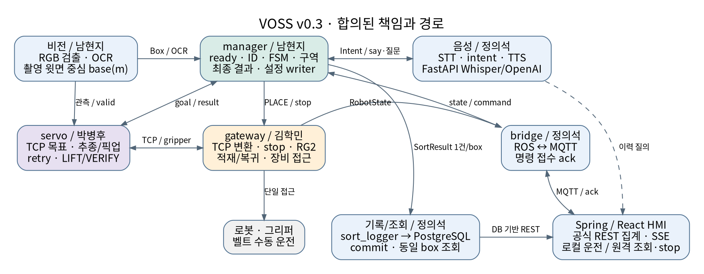

# VOSS SRD v0.4 — 시스템 요구사항 명세서

**문서 ID:** SRD-VOSS-001 · **버전:** v0.4 · **작성일:** 2026-10-07(KST) 
**상태:** 취합자 확정본(#50~#55 합의·PR #77 리뷰·독립 재검·main@671c67f 재대조 반영) / 팀 전체 기준선 승인(PL, #6)과 실기 수락은 별도 
**작성·취합:** 박병후 · **범위·기준선 승인:** 남현지(PL) 및 영향 담당자

**일정:** 상호 확인 회신은 2026-10-06 까지(KST, 시간 지정 없음)로 변경했고 6 개 이슈가 10/07 종료됐다. 첫 실기 실험·실측 목표는 **10/07 까지**, 실제 1 박스 전체 흐름 **G0 통과 목표는 10/10 까지**다. 수행 사실·수락 결과는 증거로 별도 기록한다.

## 목차

- 0. 문서 관리
- 1. 소개
- 2. 범위와 운영 문맥
- 3. 시스템 개요와 할당
- 4. 기능 요구사항
- 5. 외부·파트 간 인터페이스 요구사항
- 6. 비기능 요구사항
- 7. 데이터·환경·운영·유지보수 요구사항
- 8. 검증·수락
- 9. 요구사항 추적성과 범위 변경
- 10. 취합 반영·미정 항목 대장
- 부록 A. 합의 반영 후 기준선 확정 절차
- 부록 B. 요구사항 작성 카드
- 부록 C. 합의 근거와 구현 동기화 상태

## 0. 문서 관리

### 0.1 변경 이력

| 버전 | 내용 | 승인 상태 |
|---|---|---|
| v0.1 | 기존 첨부 초안 | 당시 팀 검토 전 |
| v0.2 / r1 | ISO/IEC/IEEE 29148을 참고한 시스템 요구사항 구조, A/B/C, SYS/IC/VT/TBD 및 추적표. r1 독립 재검 반영 | 당시 취합·검토 전 |
| v0.2 r2 | 4 인 회신 공통 내용 반영, MC-001~034와 6 개 상호 확인서로 충돌·미정 관리 | 당시 상호 확인 전 |
| v0.3 | 종료된 #50~#55의 최종 정정·합의·후속 범위 반영. 70 SYS·70 VT·18 IC·26 TBD·34 MC ID 유지. 좌표/TCP/정지/재시도/결과/조회/배포 규약 정합 | 조합별 회신 확인 완료 / 전체 문서 최종 승인·실기 수락 별도 |
| v0.3 r1 | PR #77 리뷰(남현지·김학민) 반영: 경로 docs/requirements/srd/, 중복 ZIP 제거. #50~#55 재대조로 MC-018 slot 재사용·MC-015 새 session 범위·HMI 시계·시험 분모를 정정하고, stop·RobotState·MQTT·설정의 main 미반영 표시와 토픽·서비스 이름을 보강 | 문서 게시 승인(리뷰 2건) / 전체 기준선 승인·실기 수락 별도 |
| v0.4 | 독립 재검 채택분과 main@671c67f 재대조 반영: 31 mm 폭 파지 결정(pending #16·#70·BRD v1.3 #79), Intent.box_id(#73)·web_api(#68)·SortState.session_id(#78)·direction_base/값 규칙(#64) main 반영, DDS 14900–15149/udp(#55 10/07), 남은 계약 차이(늦은 답 문장·stop·RobotState·MQTT) 정리. 파일명 01_VOSS_SRD_v0.4 | 취합자 확정 / 팀 기준선 승인(PL)·실기 수락 별도 |

### 0.2 승인·검토

| 구분 | 확인 근거 | 남은 승인·검증 |
|---|---|---|
| 남현지–박병후 | #50, 14 개 MC 회신 종료(10/07) | 동적 좌표·B 상세·성능 실측 |
| 남현지–김학민 | #51, 15 개 MC 회신 종료(10/07) | 트레이/파지 후속 결정·장비 구현·실측 |
| 남현지–정의석 | #52, 14 개 MC 회신 종료(10/07) | 미반영 IDL·manager 로그·부분 실패 업무 결과 |
| 김학민–박병후 | #53, 12 개 MC 회신 종료(10/07) | MC-006/012 일부 상세·MC-011 실측 |
| 박병후–정의석 | #54, 7 개 MC 회신 종료(10/07) | B 질문 회차·저장 시험·타담당 상세 |
| 김학민–정의석 | #55, 4 개 MC 회신 종료(10/07) | RobotState/네트워크/GPU 확인 |
| SRD v0.3 전체 기준선 | 본 문서 작성 | 남현지(PL)·박병후·관계 담당자, 승인 일시 [미정] |
| G0/G2 실기 수락 | 이슈 종료로 대신하지 않음 | 수행자·입회자·결과·증거 [미정] |

66 개 조합별 확인 항목은 중복을 포함한다. 고유 MC는 34 개다. 조합 이슈의 종료는 회신·정정 및 후속 범위 확인이며, 모든 상세 계약·구현·실측 완료를 뜻하지 않는다.

### 0.3 문서의 읽는 방법

- `해야 한다`: 시스템 요구사항. 조합별 합의된 규약은 본문에 반영하되 v0.3 전체 기준선 승인은 별도 기록한다.
- `A`: 최초 실제 1 박스 흐름 필수. `B`: A 연결 이후 최종 시연까지 필수. `C`: G0 이후 채택 여부를 정하는 선택 기능.
- `TBD-nnn`: 원래 취합 질문 ID를 유지한 상세/값/검증 보완 항목. 여러 쟁점이 묶였으면 규약 확정과 실측 대기를 분리한다. 잔여 실행 항목은 별도 문서의 F-01~16 에 연결한다.
- `MC-nnn`: 6 개 조합의 최종 합의·정정 출처. 규약과 후속을 모두 보존한다. 수치의 목표·설정·관측·후보를 구분한다.
- 문서/IDL 에 반영된 계약, 런타임 구현, 모의 시험, 실기 수락은 서로 다른 상태다. 미수행 항목을 이슈 종료만으로 통과 처리하지 않는다.
- SYS/IC/VT/TBD를 삭제·재사용하지 않았다. v0.1의 SR-*와 v0.2 부터의 SYS-*를 혼용하지 않는다.

## 1. 소개

### 1.1 목적

VOSS 전체 시스템의 기능, 외부·파트 간 입출력, 성능, 데이터·운영·안전 제약과 검증 기준을 명세한다. 병렬 개발 파트가 같은 식별자·단위·완료/실패 의미를 사용하도록 한다.

### 1.2 문서 구성·표준 참고

[ISO/IEC/IEEE 29148:2018](https://www.iso.org/standard/72089.html)의 요구사항 엔지니어링과 시스템 요구사항 명세(SyRS) 구성을 참고했다. 기존 v0.2의 목적·범위·운영 문맥·시스템 개요·기능·인터페이스·품질·데이터/제약·검증·추적성·미정 대장 순서를 유지한다. 표준 조항별 적합성 인증 문서는 아니다.

외부에서 확인할 수 있는 동작·데이터·제약·성능을 SRD 에 둔다. 제어 게인·OCR 내부 알고리즘·클래스·스크립트 전문은 SDD/패키지 설계/ADR에서 관리한다. 노드명과 선정 스택은 합의된 기능 할당을 설명하며 코드 완성의 증거로 사용하지 않는다.

### 1.3 참조 문서와 적용 관계

| 참조 | 판·기준 | 적용 |
|---|---|---|
| 범위·측정·일정 안내 | #6 본문·#50~#55 공통 안내, 2026-10-06~07 | A 먼저, B 최종 필수, C 선택. 정상/예외 분리·작업자 대기 별도. 첫 실험 10/07·G0 10/10. docs/plan.md는 아직 10/13을 전체 루프 첫 완주로 두므로 PL 정합 대기(F-15) |
| SRD v0.2 r2·4 인 회신 | 2026-10-06 | 기존 70 SYS/VT·18 IC·26 TBD·34 MC 및 카드 출처 |
| GitHub #50~#55 전체 댓글 | 6 개 종료, 2026-10-07 확인 | 최종 정정·공동 수용과 잔여 범위. 02 합의 종합에 permalink |
| BRD v1.3 Word | PL, PR #79 (v1.2 #66에서 파지 방향만 정정) | 적용 BRD 판. v1.1↔v1.2 TR/NFR 45 행 동일, v1.2→v1.3은 TR-PICK-06·2.4 크기 조건·R-06만 바뀜(05 참조) |
| VOSS_BRD.md 및 기존 BRD v1.1 | 기존 TR/NFR 연결의 출처 | #79에서 v1.3 사본으로 교체됨. 기존 요구사항 ID 연결 유지 |
| VOSS_개발일정.xlsx | 기존 계획 | 담당·마일스톤. #6의 최신 일정을 우선하며 plan.md 반영은 PL 확인 대기 |
| docs/interfaces/*·src/voss_msgs/* | main@671c67f3a5e4f1de46dec3f34b4cf2975727c975 (v0.3은 fff1121) | 실제 문서/IDL 대조 기준. #63/#65/#64/#68/#70/#73/#78/#79 머지 내용과 미반영 IDL 구분 |
| docs/measurements-1006.md·config/voss_config.yaml | 같은 main | 벨트/카메라/TCP/트레이/PC 관측·설정 출처. 동적 성능 수락과 구분 |
| ADR-0002/0005/0006 | 같은 main | 폐루프 게이트·RG2 Modbus 직접·웹/AI/DB 스택. 예정 번호: 0003 캘리브레이션(#48)·0007 호출어(#72)·0008 OCR(#75)·0009 31 mm 폭 파지 근거(김학민, PR #77 리뷰) |
| 열린 PR #48/#71/#72/#75/#76/#80/#81/#82 (v0.3 때 열려 있던 #64/#68/#70/#73/#74는 머지됨) | 확인 당시 head 별도 기록 | 후속 제안·구현/시험 보고. main 반영 또는 전체 실기 승인으로 표시하지 않음 |

최종 공동 정정과 사용자 지침을 우선 적용했다. 오래된 720p·플랜지 pose·중간 시각·Stats/ROS query·STOP_UNCONFIRMED·질문 box_id#회차 제안은 최신 규약으로 대체했다. 다른 시점의 수치·초안과 혼용하지 않는다. 문서와 구현의 차이는 부록 C/03 후속 대장에서 추적한다.

### 1.4 용어

| 용어 | 정의 |
|---|---|
| SRD / SyRS, SDD | 시스템 요구사항 명세 / 구현 설계 문서 |
| G0 | 실제 명확한 송장 박스 1 개 인식→이동 중 픽업→올바른적재→DB commit·동일 box 조회→복귀/다음관측 준비 |
| 정상 자동 | attempts=1·decided_by=OCR·outcome=PLACED. t_detect→t_placed 박스별≤30 초 |
| 예외 / human_wait | retry/recheck/operator/held/failed 등 / say 발행→유효답 또는 timeout 별도구간 |
| 물리 박스 / 투입 회차 | 시험대장의 같은 실물 / manager가 새 box_id로 관리하는 한번의 투입 |
| track_id / box_id / session_id / attempts | 영상 트랙 / 투입 회차 DB 키 / manager 실행세션 / 한 goal 내 파지횟수 |
| 플랜지 / TCP | zones/observe posx 원본 기준점 / 실제 핑거 끝 기준점. 변환은 gateway |
| placed_stamp / db_committed | 개방 완료 시각(적재 proxy) / commit 성공 반환 후 logger 로그 사건 |
| 제어 A 안/B 안 | 폐루프/개루프. 요구사항 단계 A/B와 별개 |
| 기본 매핑 | S07-01 역삼동→A, S07-02 대치동→B, S07-03 청담동→C |

## 2. 범위와 운영 문맥

### 2.1 시스템 목적·경계

작업자가 1 개씩 투입한 미니 택배 박스를 손목 RGB 카메라로 인식하고 계속 움직이는 벨트에서 픽업해 송장 동에 대응하는 구역에 적재·기록하는 협동로봇 어시스턴트다. 음성 지시·HMI·판독 예외·이력 조회는 최종 필수다.

내부는 비전/manager/servo/gateway/음성/bridge/logger, 설정, 웹/AI/DB 배포 연결이다. 외부는 작업자·로봇 컨트롤러·그리퍼·카메라·벨트·OpenAI 서비스다. 장비 제약은 시스템 사용 조건으로 함께 명세한다.

### 2.2 필수·선택 및 연결 순서

| 단계 | 범위 | 수락 관계 |
|---|---|---|
| A 최초 흐름 필수 | RGB 인식·명확한 OCR·기본 매핑·이동 중 유효 위치 갱신·픽업/확보/안전인계·적재/복귀·DB commit/조회·설정/ready·기본 정지/입력상실/limit | 실제 1 박스 G0. 시작 입력만 모의 허용. 정지 지연 등 실측·미준비 항목 별도 검사 |
| B 최종 필수 | 호출/STT/intent/TTS, 운전·정지·재개·우선/전체, HMI/집계·이력, 다단 OCR·재확인/질문/보류·retry, 상세복구·성능·컨테이너 | A를 먼저 연결해도 선택 기능으로 바뀌지 않음 |
| C 선택 | 자연어 매핑 변경·신규구역 교시 | G0 이후 10/11 채택 결정. 미채택은 G0/B 수락 차단 아님 |

이동 중 픽업과 동적 좌표 갱신은 A 다. 추종 방식의 변경은 ADR-0002 게이트 결정이며 픽업 기능을 선택으로 바꾸지 않는다. 첫 흐름도 메모리 출력으로 기록 완료를 대신하지 않는다.

### 2.3 사용자·운영 시나리오

작업자는 순차 투입·운전/분류 지시·불확실 송장 응답을 수행한다. 관리자는 예정 수량과 동별/보류/남은 수를 조회한다. 개발·운영 담당은 준비/기동/실측/버전·증거를 관리한다.

정상: 준비→유효시작→검출/업무 ID→OCR/구역결정→TrackAndGrasp→LIFT/VERIFY 인계→PLACE(개방/상승/OBSERVE 복귀)→응답→SortResult→logger commit→동일 box 조회. manager는 저장을 기다리지 않지만 G0 수락은 저장·조회·복귀 모두 확인한다.

예외(B): 저신뢰→RECHECK 놓기→VIEW/정지 ReadLabel→후보질문→유효답/30 초무응답→PICK→목적/HOLD 적재. 장비 오류·정지 요청 실패는 PAUSED·사람 확인으로 연결한다. RETURN_FAILED 업무 결과/질문 회차 상세는 TBD를 유지한다.

### 2.4 가정·제외 범위

- M0609/RG2/손목 D435i, RGB만, 알려진 박스 46×31×27mm·송장 40×25mm, A/B/C/RECHECK/HOLD 5 구역. 벨트 목표≤10cm/s, 개발설정 4.8cm/s는 실측 기반 설정이다.
- 한 번에 1 개 투입. VOSS는 벨트 운전/속도/전원을 자동 조작하지 않는다. 로봇 분류 stop과 벨트 정지는 별개다.
- 파지 방향은 31 mm 폭 파지(핑거 간격 31 mm, 46×27 mm 긴 옆면 두 개를 잡고 닫힘축은 벨트 가로, 46 mm 변은 벨트 방향)으로 PL이 확정했다(pending #16 결정, PR #70, BRD v1.3 #79). 정량 비교 없는 현장 판단이며 게이트에서 면 방향 원인 실패가 반복되면 재검토한다. 근거 ADR-0009(김학민)와 T34 10회 시험(빈 파지·미끄러짐·상승 유지·무손상)은 F-03 에 남긴다.
- 제외: 대형택배·다중박스 연속투입·다단적재최적화·WMS·손글씨/다국어/받는사람판독·현업인증/24 시간운영. 흐린송장은 재확인·질문 시험을 실제로 유발하는 세트를 별도 확보한다.

## 3. 시스템 개요와 할당

### 3.1 자원·배포·외부 장비

| 요소 | 적용 규약·보고값 | 검증 경계 |
|---|---|---|
| 로봇/RG2 | M0609/RG2, 장비접근 gateway만. RG2 Modbus TCP 직접(ADR-0005), WebLogic STOP 후 단일제어 | 실제 API·동시성·피드백확장·정지/limit 실측 F-02~04 |
| 카메라 | RGB1920×1080/rgb8/30fps 설정·depth off·수동 6.0ms/WB4600. USB3 직결 | 드라이버 stamp/실제 fps·통합지연 F-01/13 |
| 벨트/트레이 | 설정 4.8cm/s·방향단위벡터, X 방향 pitch60mm ABC3 칸·RECHECK/HOLD2 칸 | 구역용량/동적간섭·점유/복귀 실패 F-06/07 |
| PC | MSI Katana17/i7-13620H/RAM32GB/RTX4060Laptop8188MiB, Ubuntu24.04/ROS2Jazzy/CycloneDDS, domain30 | 사양원본있음; GPU 동시 부하·USB 육안/마이크/네트워크 별도 |
| 호스트 ROS | gateway/servo/manager/voice_listener/intent_parser/speech_out/hmi_bridge/sort_logger, 두산 bringup·Mosquitto | runtime 완성·launch 기동/복구 검증 별도 |
| 컨테이너 | vision(GPU), FastAPI AI(GPU), SpringBoot/React+Nginx/PostgreSQL | ADR-0006 채택. compose·자원·볼륨·연결 시험 별도 |

비전의 초기 OpenCV 분할→자동라벨/YOLO nano 비교, PaddleOCR 한국어는 담당 설계/ADR로 관리한다. 제어는 폐루프 FF+P 우선이다. 모델/게인 선택은 성능 요구사항을 대체하지 않는다.

### 3.2 기능 할당과 논리 연결

| 기능 | 노드/서비스 | 담당 | 상대 |
|---|---|---|---|
| 검출·좌표변환·OCR | box_tracker/label_reader | 남현지 | BoxTrack→servo/manager, LabelRead→manager |
| 통합 ready/FSM/설정/업무결과 | sort_manager | 남현지 | goal·적재/질문·state/result/zone_map |
| 추종/픽업/국소 retry/확보 | belt_servo | 박병후 | TCP 속도/gripper→gateway, result→manager |
| 장비접근/TCP 변환/적재/복귀/stop | robot_gateway | 김학민 | pose/state/피드백·서비스응답 |
| 음성 | voice_listener/intent_parser/speech_out·FastAPI | 정의석 | intent→manager, 조회→REST, say→작업자 |
| HMI/DB·조회 | hmi_bridge/sort_logger·SpringBoot/React/PostgreSQL | 정의석 | MQTT/SSE·DBcommit/REST |
| 환경/bringup | voss_bringup·호스트/네트워크 | 김학민(비전남현지·DB/AI/웹정의석협업) | 정적 snapshot·logger 선기동 |



그림은 합의된 책임/경로를 표시한다. 실기 연결 통과를 표시하지 않는다. 세부 계약은 5 장, 미반영 IDL/실측은부록 C·10 장이다.

### 3.3 운영 상태·동작 책임

manager 상태는 IDLE/RUNNING/PICKING/RECHECK/ASKING/PAUSED 다. 기본은 IDLE→RUNNING→PICKING→적재/복귀→RUNNING이며 적재/복귀는 PLACE 내부 동작이다. start/priority/answer/resume의 허용 상태는 5.7, B 단계별 복구는 TBD-005 에 연결한다.

manager는 대상·구역·최종 업무 결과와 준비 여부를 판단한다. servo는 goal 내 픽업·최대 3회 attempt·닫힘 요청·확보/LIFT/VERIFY를 수행한다. gateway는 장비 접근·TCP 변환·모션/RG2 자원·limit/stop·PLACE/VIEW/PICK를 실행한다. logger는 DB 저장·스풀·commit 증거를, Spring은 공식 집계를 담당한다.

기본 stop은 A, 보유 박스/질문별 resume 상세는 B다. 정지 요청 실패는 DEVICE_ERROR·PAUSED로 연결하며, 사람 확인 후 수동 재개하고 자동 개방하지 않는다. 일시정지와 재기동을 같은 복구로 취급하지 않는다.

### 3.4 식별·설정·결과의 공통 규칙

- track_id(영상)·box_id(투입 회차)·session_id(manager 세션)·goal/attempts(픽업시도)를 구분한다. box_id는 DB 유일키·최종 1 건, 재투입은 새 ID 다. 물리 박스 시험 대장이재투입 ID를 같은 실물에 연결한다.
- 비전은 촬영 시각 박스 윗면 중심 m를 제공한다. servo가 TCP 목표/예측/파지 오프셋을 계산한다. 이동 중 좌표 유효성은 핸드아이/촬영 pose 정합·동적 검증에 따른다.
- capture stamp를 보존한다. pose는 응답 수신 시각이며 측정 시각/RTT 보장값이 아니다. 현재 pose를 과거 capture에 임의 결합하지 않는다.
- 단일 YAML/manager runtime writer·launch snapshot/version/hash를 유지한다. null은 미측정이고 의미 있는 0은 허용한다. 소비자 필수값/단위/등록 TCP 검증을 수행한다.
- 물리 placed/업무 SortResult/복귀/DBcommit/query는 별도다. manager 비차단 운전과 G0의 commit·조회 필수 조건을 함께 유지한다.

## 4. 기능 요구사항

기존 요구사항 ID·조건·검증 연결을 유지하고 최종 합의로 상세 규약을 채웠다. 각 카드의 v0.3 반영과 MC 출처, 남은 구현/실측을 함께 관리한다. 전체 계약 변경은 §9.2 절차를 따른다.

### 4.1 최초 전체 흐름(A)

#### SYS-FR-001 — A / 남현지

시스템은 카메라·로봇·그리퍼·설정·로그 저장 경로의 준비 여부를 확인한 뒤 기본 분류 작업의 실행 가능 여부를 표시해야 한다.

- 출처: 통합을 위한 파생 제안
- 검증 VT-001: 준비 항목별 정상/누락 입력으로 실행 가능 여부와 사유가 구분되는지 확인. ROBOT/SERVO/VISION/OCR/LOG의 정상·누락·stale·설정 무효 입력으로 start 차단과 ready/not_ready를 확인. 상세는 TBD-018.
- 후속 추적: TBD-018
- v0.3 합의 반영: 통합 주담당을 남현지로 변경했다. manager가 ROBOT/SERVO/VISION/OCR/LOG 준비를 모아 start를 허용/거부한다. RobotState·logger heartbeat·calib/설정 유효성은 §5.7. VT-001 통합 카드 보완 필요.
- 합의 근거: MC-019, MC-009, MC-029 (02 합의 종합의 최종 댓글).
- 이행·검증: 계약 반영과 구현/실측 수락을 구분한다. VT 별 상태는 04 검증 추적표 참조.

#### SYS-FR-002 — A / 남현지

시스템은 손목 카메라의 RGB 영상을 촬영 시각 정보와 함께 비전 기능에 제공해야 한다.

- 출처: TR-PICK-01·02
- 검증 VT-002: 정상 영상 입력과 촬영 시각이 비전 수신 지점까지 연결되는지 확인.
- 후속 추적: TBD-001
- v0.3 합의 반영: 1920×1080/rgb8/30fps·depth off·수동 6.0ms/WB4600으로 결정. 원본 촬영 stamp를 보존하며 실제 FPS/드라이버 시간 매핑은 검증한다.
- 합의 근거: MC-004, MC-032 (02 합의 종합의 최종 댓글).
- 이행·검증: 계약 반영과 구현/실측 수락을 구분한다. VT 별 상태는 04 검증 추적표 참조.

#### SYS-FR-003 — A / 남현지

시스템은 벨트 위 박스를 검출하고 픽셀 중심과 검출 영역을 제공해야 한다.

- 출처: TR-PICK-02
- 검증 VT-003: 정답이 있는 박스 영상에서 중심·영역 출력과 검출 성능을 확인.
- 후속 추적: TBD-001
- v0.3 합의 반영: BoxTrack 픽셀 필드와 증가/재사용 금지 track_id 규칙을 유지한다. 미검출은 발행하지 않고 검출좌표 무효와 구분한다. 검출 방식의 비교/성능은 별도 시험이다.
- 합의 근거: MC-001, MC-003, MC-028, MC-031 (02 합의 종합의 최종 댓글).
- 이행·검증: 계약 반영과 구현/실측 수락을 구분한다. VT 별 상태는 04 검증 추적표 참조.

#### SYS-FR-004 — A / 남현지

시스템은 동일 박스의 검출·OCR·픽업·적재·기록 결과를 공통 식별 규약으로 연결해야 한다.

- 출처: TR-SYS-04에서 파생
- 검증 VT-004: 한 박스의 각 단계 식별자와 재투입 식별 규칙을 대조.
- 후속 추적: TBD-003, TBD-007
- v0.3 합의 반영: manager의 box_id는 투입 회차·DB PK, session_id는 난수 4hex 접미사를 가진 세션이다. retry는 같은 goal/box, 재투입은 새 box. 물리 시험대장과 대응한다(§5.8).
- 합의 근거: MC-003, MC-004, MC-020 (02 합의 종합의 최종 댓글).
- 이행·검증: 계약 반영과 구현/실측 수락을 구분한다. VT 별 상태는 04 검증 추적표 참조.

#### SYS-FR-005 — A / 남현지

시스템은 검출된 박스의 송장 판독용 영상을 해당 박스와 대응시켜 OCR 기능에 제공해야 한다.

- 출처: TR-OCR-03
- 검증 VT-005: 크롭 입력과 OCR 출력이 다른 박스나 다른 단계로 잘못 연결되지 않는지 확인.
- 후속 추적: TBD-003
- v0.3 합의 반영: LabelCrop/LabelRead/ReadLabel은 main에 반영됐다. header/track_id/stage/sharpness와 원본 stamp를 보존하며, 현재 SortState.track_id의 판독만 stage 2/3에 연결한다.
- 합의 근거: MC-007, MC-034 (02 합의 종합의 최종 댓글).
- 이행·검증: 계약 반영과 구현/실측 수락을 구분한다. VT 별 상태는 04 검증 추적표 참조.

#### SYS-FR-006 — A / 남현지

시스템은 명확한 송장의 분류코드·동 이름을 판독하고 기본 매핑에 따른 적재 대상 구역을 결정해야 한다.

- 출처: TR-OCR-04·05; TR-PICK-08
- 검증 VT-006: S07-01/02/03 송장이 기본 A/B/C 구역으로 판정되는지 확인. 임계값은 TBD-004.
- 후속 추적: TBD-004
- v0.3 합의 반영: 기본 3개 매핑을 유지한다. LabelRead의 원문·2위 후보·촬영 stamp를 사용한다. confidence_min=0.6은 현재 설정이며, 정답 세트 튜닝과 성능 수락 전에는 보장된 임계값으로 표시하지 않는다.
- 합의 근거: MC-020, MC-032 (02 합의 종합의 최종 댓글).
- 이행·검증: 계약 반영과 구현/실측 수락을 구분한다. VT 별 상태는 04 검증 추적표 참조.

#### SYS-FR-007 — A / 남현지

시스템은 RGB 관측과 캘리브레이션 정보를 이용해 픽업에 필요한 위치를 합의한 로봇 좌표계로 제공해야 한다.

- 출처: TR-PICK-03
- 검증 VT-007: 검증점에서 변환 출력·기준 좌표의 오차와 단위 일치 확인.
- 후속 추적: TBD-002
- v0.3 합의 반영: 비전이 촬영 시각 윗면 중심을 base_link·m로 제공하고 servo가 TCP 목표를 계산한다. HAND_EYE 이동 중 갱신은 A/G0 필수, 동적 검증 전 valid=false. ≤5mm는 제안이다.
- 합의 근거: MC-001, MC-002, MC-004, MC-010 (02 합의 종합의 최종 댓글).
- 이행·검증: 계약 반영과 구현/실측 수락을 구분한다. VT 별 상태는 04 검증 추적표 참조.

#### SYS-FR-008 — A / 박병후

시스템은 계속 움직이는 컨베이어 위 박스를 선택한 추종 방식으로 따라가 픽업 위치에 도달해야 한다.

- 출처: TR-PICK-04
- 검증 VT-008: 벨트를 멈추지 않은 단일 박스 시험으로 추종·접근 결과를 확인.
- 후속 추적: TBD-019, TBD-021
- v0.3 합의 반영: 폐루프 FF+P를 우선하며 성능 미달만으로 자동 전환하지 않는다. 10/10의 20사례 게이트는 전원이 결정하고 PL이 ADR에 기록한다. 실제 stream·동적 위치·가림/입력 상실을 검증한다.
- 합의 근거: MC-002, MC-008, MC-011 (02 합의 종합의 최종 댓글).
- 이행·검증: 계약 반영과 구현/실측 수락을 구분한다. VT 별 상태는 04 검증 추적표 참조.

#### SYS-FR-009 — A / 박병후

시스템은 픽업 대상 박스의 하강·그리퍼 파지 동작을 수행해야 한다.

- 출처: TR-PICK-06
- 검증 VT-009: 서보와 게이트웨이의 동작 책임 및 그리퍼 명령·응답이 연결되는지 확인.
- 후속 추적: TBD-015, TBD-019
- v0.3 합의 반영: goal 중 servo 단독 async 그리퍼 호출, 닫힘 동안 추종 유지. gateway는 모션/RG2 자원을 분리한다. PREPARE~VERIFY와 인계는 §5.5.
- 합의 근거: MC-006, MC-012, MC-013 (02 합의 종합의 최종 댓글).
- 이행·검증: 계약 반영과 구현/실측 수락을 구분한다. VT 별 상태는 04 검증 추적표 참조.

#### SYS-FR-010 — A / 박병후

시스템은 그리퍼 피드백을 이용해 파지 성공 여부를 판정해야 한다.

- 출처: TR-PICK-07
- 검증 VT-010: 빈 파지·정상 파지 피드백으로 성공/실패가 구분되는지 확인.
- 후속 추적: TBD-015, TBD-019
- v0.3 합의 반영: 닫힘 완료·정상 통신·grip_detected·검증된 보고 폭을 모두 만족해야 LIFT한다. 안전 높이에서 VERIFY까지 마쳐 grasped=true로 인계한다. 폭/힘/높이와 Gripper 응답 확장은 F-03/04에서 관리한다.
- 합의 근거: MC-006, MC-012 (02 합의 종합의 최종 댓글).
- 이행·검증: 계약 반영과 구현/실측 수락을 구분한다. VT 별 상태는 04 검증 추적표 참조.

#### SYS-FR-012 — A / 김학민

시스템은 파지한 박스를 결정된 구역의 유효 적재 위치에 놓아야 한다.

- 출처: TR-PICK-08
- 검증 VT-012: 실측된 5 구역의 유효 슬롯에서 적재 성공·위치 충돌 여부 확인.
- 후속 추적: TBD-016
- v0.3 합의 반영: 최신 ABC 3×1/RECHECK·HOLD 2×1(pitch 60mm)을 기준으로 한다. PLACE 응답·placed_stamp·실물 영상·slot 점유를 구분한다. 용량과 부분 실패 처리는 F-06/07에서 관리한다.
- 합의 근거: MC-010, MC-016, MC-018 (02 합의 종합의 최종 댓글).
- 이행·검증: 계약 반영과 구현/실측 수락을 구분한다. VT 별 상태는 04 검증 추적표 참조.

#### SYS-FR-013 — A / 김학민

시스템은 적재 완료 후 다음 박스를 관측할 수 있는 대기 자세로 복귀해야 한다.

- 출처: TR-PICK-08
- 검증 VT-013: 적재 이후 대기 자세와 다음 입력 수신 준비 상태 확인.
- 후속 추적: TBD-016, TBD-018
- v0.3 합의 반영: PLACE는 OBSERVE 복귀 후 응답한다. 개방 완료 stamp·응답 수신·실제 복귀 도달 시각을 별도로 남긴다. RETURN_FAILED와 응답 유실 시에는 자동 재실행하지 않는다.
- 합의 근거: MC-016, MC-019 (02 합의 종합의 최종 댓글).
- 이행·검증: 계약 반영과 구현/실측 수락을 구분한다. VT 별 상태는 04 검증 추적표 참조.

#### SYS-FR-014 — A / 정의석

시스템은 박스별 최종 처리 결과를 작업 로그 저장소에 기록해야 한다.

- 출처: TR-SYS-04
- 검증 VT-014: 한 박스의 결과가 저장되고 조회되는지 확인. 첫 루프도 로그 저장까지 포함.
- 후속 추적: TBD-007, TBD-012
- v0.3 합의 반영: PostgreSQL·PK box_id·멱등 저장. manager는 비차단, logger commit 성공 반환 후 로그와 동일 box 별도 SELECT가 A/G0 증거다. inserted_at은 commit 시각이 아니다.
- 합의 근거: MC-003, MC-016, MC-020, MC-027 (02 합의 종합의 최종 댓글).
- 이행·검증: 계약 반영과 구현/실측 수락을 구분한다. VT 별 상태는 04 검증 추적표 참조.

#### SYS-FR-033 — A / 남현지

시스템은 단일 설정 기준의 동·코드·구역·좌표 정보를 필요한 기능에 일관되게 제공해야 한다.

- 출처: TR-SYS-06
- 검증 VT-033: 기본 매핑과 제어·OCR·표시 값이 일치하는지 확인. 배포 경로는 TBD-006.
- 후속 추적: TBD-006
- v0.3 합의 반영: 공유 YAML의 runtime writer는 manager이며, launch에서 같은 snapshot/version/hash를 전달하고 로드 시 검증한다. 단위벡터·null·의미 있는 0·ZoneMap code/aliases를 사용하며, main(#64) 값 규칙을 따른다.
- 합의 근거: MC-009, MC-019, MC-034 (02 합의 종합의 최종 댓글).
- 이행·검증: 계약 반영과 구현/실측 수락을 구분한다. VT 별 상태는 04 검증 추적표 참조.

### 4.2 최종 시연 필수 기능(B)

#### SYS-FR-011 — B / 박병후

시스템은 파지 실패 시 최초 시도 이후 최대 2 회 재시도하고, 재시도 후 실패를 미분류 결과로 확정해야 한다.

- 출처: TR-PICK-07
- 검증 VT-011: 최초 실패 후 성공 및 총 3 회 실패 시나리오를 확인. 반복 가능 조건은 TBD-019.
- 후속 추적: TBD-019
- v0.3 합의 반영: belt_servo 한 goal 안에서 최대 3 회, 카운터 단독 소유. manager retry goal 없음. 장비/안전 오류 자동 retry 금지. attempts와 최종 reason을 대조한다.
- 합의 근거: MC-005, MC-006 (02 합의 종합의 최종 댓글).
- 이행·검증: 계약 반영과 구현/실측 수락을 구분한다. VT 별 상태는 04 검증 추적표 참조.

#### SYS-FR-015 — B / 정의석

시스템은 호출어 "헬로, 로키"가 감지된 발화에 대해 음성 명령 수집을 시작해야 한다.

- 출처: TR-VOICE-01
- 검증 VT-015: 호출어 포함/미포함 발화의 명령 수집 여부 확인.
- 후속 추적: TBD-010
- v0.3 합의 반영: 호출어·1m 수음/내장 DMIC 기본은 B 시험으로 확인한다. Whisper 모델/GPU 동시 부하는 별도 선택/검증이며 음성을 선택 범위로 바꾸지 않는다.
- 합의 근거: MC-028 (02 합의 종합의 최종 댓글).
- 이행·검증: 계약 반영과 구현/실측 수락을 구분한다. VT 별 상태는 04 검증 추적표 참조.

#### SYS-FR-016 — B / 정의석

시스템은 수집한 한국어 음성 명령을 텍스트로 변환해야 한다.

- 출처: TR-VOICE-02
- 검증 VT-016: 녹음 시험 세트의 전사 결과와 정답 대조. 제안 기준: 녹음 20개 중 18개 이상 정확(정답표 사전 커밋, #54 VC-EUS-VOICE-01).
- 후속 추적: TBD-010
- v0.3 합의 반영: FastAPI 로컬 Whisper와 host voice_listener의 전달/timeout/오류를 검증한다. 모델 크기는 공용 PC 동시 부하 결과로 결정한다.
- 합의 근거: MC-028, MC-029 (02 합의 종합의 최종 댓글).
- 이행·검증: 계약 반영과 구현/실측 수락을 구분한다. VT 별 상태는 04 검증 추적표 참조.

#### SYS-FR-017 — B / 정의석

시스템은 명령 텍스트를 구조화된 intent로 변환하고 실행 전에 유형·인자·허용값을 검증해야 한다.

- 출처: TR-VOICE-03
- 검증 VT-017: 정상·누락·허용 목록 외 입력을 비교해 무효 명령이 실행되지 않는지 확인.
- 후속 추적: TBD-009
- v0.3 합의 반영: 소문자 intent type·허용 동·대문자 zone·answer box_id를 검증한다. query_history는 REST로 직접 조회한다. stop의 로컬 경로와 구조화된 오류 처리를 검증하며, 무효 명령은 실행하지 않는다.
- 합의 근거: MC-023, MC-024, MC-026 (02 합의 종합의 최종 댓글).
- 이행·검증: 계약 반영과 구현/실측 수락을 구분한다. VT 별 상태는 04 검증 추적표 참조.

#### SYS-FR-018 — B / 남현지

시스템은 유효한 시작 명령을 받은 경우 준비된 분류 작업을 시작해야 한다.

- 출처: TR-VOICE-05
- 검증 VT-018: 음성 및 HMI 시작 명령의 동일한 실행 결과 확인.
- 후속 추적: TBD-005, TBD-009
- v0.3 합의 반영: start는 IDLE에서 시작하고 RUNNING에서는 전체 분류로 전환한다. stop은 모든 상태에서 허용한다. 기본 장비 stop/cancel은 A이며 이 B 운전 기능과 구분한다. PAUSED는 resume으로만 재개한다.
- 합의 근거: MC-014, MC-023 (02 합의 종합의 최종 댓글).
- 이행·검증: 계약 반영과 구현/실측 수락을 구분한다. VT 별 상태는 04 검증 추적표 참조.

#### SYS-FR-019 — B / 남현지

시스템은 유효한 재개 명령을 받은 경우 정지 상태와 현재 박스 상태에 따른 재개 조건을 적용해야 한다.

- 출처: TR-VOICE-05
- 검증 VT-019: 정지 단계별 재개 조건을 시험하고 이중 파지·이중 기록 여부 확인.
- 후속 추적: TBD-005, TBD-017
- v0.3 합의 반영: resume은 PAUSED에서만 허용한다. 일시정지는 정지 요청·오류 해소·보유 확인 후 구역 확정 여부에 따라 이어간다. 노드 재기동·장비 오류 뒤 보유 박스는 사람이 확인·제거한다. 새 session은 manager 재기동(크래시)에만 해당하며 IDLE부터 시작한다(#50·#51 MC-015). 단계별 상세와 실기는 B 후속이다.
- 합의 근거: MC-015, MC-024 (02 합의 종합의 최종 댓글).
- 이행·검증: 계약 반영과 구현/실측 수락을 구분한다. VT 별 상태는 04 검증 추적표 참조.

#### SYS-FR-020 — B / 남현지

시스템은 특정 동 우선 분류와 전체 분류 지시를 지원해야 한다.

- 출처: TR-VOICE-06
- 검증 VT-020: 특정 동 우선/전체 지시에 따른 대상 선택 결과 확인.
- 후속 추적: TBD-005, TBD-009
- v0.3 합의 반영: priority arg는 허용 동 이름이며 다음 박스부터 적용한다. 현재 PICKING/RECHECK/ASKING 박스의 목적지를 임의로 바꾸지 않는다. start/ALL로 전체 분류로 전환한다.
- 합의 근거: MC-023 (02 합의 종합의 최종 댓글).
- 이행·검증: 계약 반영과 구현/실측 수락을 구분한다. VT 별 상태는 04 검증 추적표 참조.

#### SYS-FR-021 — B / 남현지

시스템은 현재 지시 대상이 아닌 박스를 픽업하지 않고 통과시켜야 한다.

- 출처: TR-PICK-09
- 검증 VT-021: 우선 분류 지시에서 비대상 박스의 파지 명령이 발생하지 않는지 확인.
- 후속 추적: TBD-005
- v0.3 합의 반영: 비대상은 PASSED·NON_TARGET, attempts=0이며 remaining 집계에서 제외한다. 같은 실물을 재투입하면 새 box_id를 발급하고, 물리 박스 대장으로 최종 성공률을 대조한다.
- 합의 근거: MC-003, MC-021, MC-023 (02 합의 종합의 최종 댓글).
- 이행·검증: 계약 반영과 구현/실측 수락을 구분한다. VT 별 상태는 04 검증 추적표 참조.

#### SYS-FR-022 — B / 정의석

시스템은 지시 확인·처리 완료·예외 질문을 작업자에게 음성으로 알려야 한다.

- 출처: TR-VOICE-04
- 검증 VT-022: 각 유형의 TTS 출력과 상태/박스 대응을 확인.
- 후속 추적: TBD-010
- v0.3 합의 반영: manager와 intent_parser는 각자 say 이벤트 중복을 억제하고 speech_out은 FIFO로 재생한다. G0에서는 재생 중 끼어들지 않는다. 재생 로그와 say 발행 기준 질문 타이머를 구분한다.
- 합의 근거: MC-024, MC-025 (02 합의 종합의 최종 댓글).
- 이행·검증: 계약 반영과 구현/실측 수락을 구분한다. VT 별 상태는 04 검증 추적표 참조.

#### SYS-FR-023 — B / 남현지

시스템은 입구 관측의 1 차 OCR과 추종 중 선택 프레임의 2 차 다수결 OCR을 단계별로 처리하며, OCR 실행을 서보 루프와 분리해야 한다.

- 출처: TR-OCR-01·02
- 검증 VT-023: 하위 조건: (1) 1 차 판독, (2) 2 차 선택 프레임 다수결, (3) 박스·단계 식별 일치, (4) OCR 실행 분리 및 서보 주기 영향 확인. 각 조건별 결과를 기록하고 모두 만족할 때 전체 통과.
- 후속 추적: TBD-003, TBD-004
- v0.3 합의 반영: 1/2단계 및 독립 실행 요구를 유지한다. PICKING의 현재 트랙과 영상 품질로 2차 OCR 프레임을 선택한다. GRASP 진입만으로 마감하거나 phase 문자열에 의존하지 않는다. 실제 가림·추종 영상·OCR 부하로 확인하며, 불가능하면 변경 승인이 필요하다.
- 합의 근거: MC-007, MC-017, MC-031 (02 합의 종합의 최종 댓글).
- 이행·검증: 계약 반영과 구현/실측 수락을 구분한다. VT 별 상태는 04 검증 추적표 참조.

#### SYS-FR-024 — B / 남현지

시스템은 분류코드와 동 이름을 교차 검증하고 불일치·저신뢰 판정 규칙을 적용해야 한다.

- 출처: TR-OCR-05
- 검증 VT-024: 일치·불일치·인식 오류 송장을 비교. 퍼지 매칭 기준은 TBD-004.
- 후속 추적: TBD-004
- v0.3 합의 반영: 다수결/신뢰도·정규화 정책은 비전 설계와 정답 세트로 검증한다. crop/판독의 track/stage/capture stamp를 보존하고 오래된 결과를 현재 판정에 쓰지 않는다.
- 합의 근거: MC-020, MC-031 (02 합의 종합의 최종 댓글).
- 이행·검증: 계약 반영과 구현/실측 수락을 구분한다. VT 별 상태는 04 검증 추적표 참조.

#### SYS-FR-025 — B / 남현지

시스템은 신뢰도 기준에 미달한 박스를 재확인 구역에서 정지 상태로 재판독해야 한다.

- 출처: TR-OCR-06
- 검증 VT-025: 저신뢰 입력에서 재확인 구역 이동과 3 단계 OCR 호출·응답 확인.
- 후속 추적: TBD-004, TBD-005
- v0.3 합의 반영: PLACE RECHECK→VIEW RECHECK→ReadLabel→PICK RECHECK→목적 구역 PLACE 경로를 사용한다. view_pose·작업대 파지 높이·PICK 실패·임시 점유는 F-07/10에서 관리한다.
- 합의 근거: MC-017 (02 합의 종합의 최종 댓글).
- 이행·검증: 계약 반영과 구현/실측 수락을 구분한다. VT 별 상태는 04 검증 추적표 참조.

#### SYS-FR-026 — B / 남현지

시스템은 재판독으로 확정하지 못한 박스에 대해 1·2 위 후보를 제시해 작업자 판단을 요청해야 한다.

- 출처: TR-OCR-07
- 검증 VT-026: 흐린 송장에서 후보·질문·현재 박스의 대응 확인.
- 후속 추적: TBD-004, TBD-005
- v0.3 합의 반영: 현재 box_id·후보 2개 동/HOLD를 표시하고 say 발행부터 질문 창을 연다. 질문 회차와 수락 창 상세는 B 후속이며 box_id#회차 안은 철회됐다.
- 합의 근거: MC-024 (02 합의 종합의 최종 댓글).
- 이행·검증: 계약 반영과 구현/실측 수락을 구분한다. VT 별 상태는 04 검증 추적표 참조.

#### SYS-FR-027 — B / 남현지

시스템은 예외 질문의 유효한 후보 또는 보류 응답만 받아 해당 박스의 목적지를 결정해야 한다.

- 출처: TR-VOICE-07
- 검증 VT-027: 유효·무효·다른 박스에 대한 응답 입력의 처리 확인.
- 후속 추적: TBD-005, TBD-009
- v0.3 합의 반영: Intent.box_id/Command arg로 원래 투입 ID를 검증한다. 현재 ASKING과 허용 후보만 수용하며, 확정 후 RECHECK PICK/목적 구역 PLACE를 수행한다. 같은 box의 늦은 답 방지는 F-09에서 관리한다.
- 합의 근거: MC-017, MC-023, MC-024 (02 합의 종합의 최종 댓글).
- 이행·검증: 계약 반영과 구현/실측 수락을 구분한다. VT 별 상태는 04 검증 추적표 참조.

#### SYS-FR-028 — B / 남현지

시스템은 예외 질문에 30 초 동안 유효한 답이 없는 경우 박스를 보류 구역으로 처리해야 한다.

- 출처: TR-OCR-07
- 검증 VT-028: 답변 타이머의 시작·무효 응답·만료·늦은 응답 처리 확인.
- 후속 추적: TBD-005, TBD-025
- v0.3 합의 반영: 30초는 say 발행부터 측정한다. 무효 답은 1회 재안내하고 타이머를 유지하며 TTS 실패에도 진행한다. stop 중에는 정지하고 resume에서 재발화/30초를 새로 시작한다. NO_ANSWER는 NONE/HELD로 기록하고 human_wait를 따로 남긴다.
- 합의 근거: MC-024 (02 합의 종합의 최종 댓글).
- 이행·검증: 계약 반영과 구현/실측 수락을 구분한다. VT 별 상태는 04 검증 추적표 참조.

#### SYS-FR-029 — B / 정의석

시스템은 작업 로그를 기준으로 동별 처리 수·보류 수·남은 수를 음성과 HMI 에 제공해야 한다.

- 출처: TR-VOICE-08; TR-SYS-04
- 검증 VT-029: DB 조회값·음성·HMI 값의 일치를 대조.
- 후속 추적: TBD-008
- v0.3 합의 반영: 음성/HMI는 Spring GET /api/stats 한 곳을 사용한다. count_by_dong은 PLACED의 동별 수, held_count는 HELD이며(main web_api.md, #68) remaining_count는 확정식을 따른다. DB 오류는 조회 불가로 표시하고 메모리 값을 공식 대체값으로 쓰지 않는다.
- 합의 근거: MC-021, MC-022 (02 합의 종합의 최종 댓글).
- 이행·검증: 계약 반영과 구현/실측 수락을 구분한다. VT 별 상태는 04 검증 추적표 참조.

#### SYS-FR-030 — B / 정의석

시스템은 음성 입력을 사용할 수 없을 때 HMI의 운전·분류 지시 버튼으로 같은 작업을 제어할 수 있어야 한다.

- 출처: TR-VOICE-02; TR-SYS-03
- 검증 VT-030: 음성 경로 비활성 상태에서 시작·정지·재개·우선·전체 명령 시험.
- 후속 추적: TBD-009, TBD-011
- v0.3 합의 반영: 로컬 공용 PC HMI의 canonical 명령→MQTT→bridge→Command 경로를 사용한다. 원격은 stop/조회만 허용하며 접수 ack와 완료 state/result를 구분한다.
- 합의 근거: MC-023, MC-026 (02 합의 종합의 최종 댓글).
- 이행·검증: 계약 반영과 구현/실측 수락을 구분한다. VT 별 상태는 04 검증 추적표 참조.

#### SYS-FR-031 — B / 정의석

시스템은 HMI 에 운전 상태·현재 지시·OCR 결과·로봇 상태·구역별 집계·보류 목록을 표시해야 한다.

- 출처: TR-SYS-03
- 검증 VT-031: 하위 조건: (1) 운전 상태, (2) 현재 지시, (3) OCR 결과, (4) 로봇 상태, (5) 구역별 집계, (6) 보류 목록. 원천 데이터와 화면 값을 항목별 대조하고 6 개 모두 만족할 때 전체 통과.
- 후속 추적: TBD-011
- v0.3 합의 반영: 6개 표시 요구를 유지한다. RobotState를 직접 구독해 MQTT robot으로 전달하고, 미수신/3초 무갱신은 UNKNOWN으로 표시한다. logger 오류·ready 사유 전달과 manager 변경→DOM 전체 지연을 검증한다.
- 합의 근거: MC-019, MC-026, MC-031 (02 합의 종합의 최종 댓글).
- 이행·검증: 계약 반영과 구현/실측 수락을 구분한다. VT 별 상태는 04 검증 추적표 참조.

#### SYS-FR-032 — B / 정의석

시스템은 투입 예정 수량을 입력받고 처리 수 기준의 남은 수를 계산해야 한다.

- 출처: TR-VOICE-08; TR-SYS-03
- 검증 VT-032: 기본 10 개 및 수정 입력에서 남은 수, 보류·실패·재투입 집계 확인.
- 후속 추적: TBD-007, TBD-008, TBD-011
- v0.3 합의 반영: planned는 시연 기본 10이며 현재 session을 기준으로 한다. remaining=max(planned−(PLACED+HELD+FAILED),0), PASSED는 제외한다. FAILED는 운영 처리 종료이며 물리 적재 성공이 아니다. session_plan/current session은 F-11에서 관리한다.
- 합의 근거: MC-003, MC-021, MC-022 (02 합의 종합의 최종 댓글).
- 이행·검증: 계약 반영과 구현/실측 수락을 구분한다. VT 별 상태는 04 검증 추적표 참조.

#### SYS-FR-034 — B / 남현지

시스템은 OCR·파지·적재·로그 오류를 구분된 상태 또는 결과로 보고해야 한다.

- 출처: TR-SYS-02; TR-SYS-04에서 파생
- 검증 VT-034: 오류 입력별 사유·후속 조치·결과 기록 확인. 물리 동작 오류 시 계속 운전은 보장하지 않음.
- 후속 추적: TBD-005, TBD-007, TBD-017
- v0.3 합의 반영: 업무 reason/outcome, 장비 DEVICE_ERROR/PAUSED, logger DB_ERROR/SPOOL_FULL을 구분한다. RETURN_FAILED의 최종 업무 분류는 미합의로 유지하며 logger는 받은 결과를 보존한다.
- 합의 근거: MC-006, MC-014, MC-016, MC-020, MC-027 (02 합의 종합의 최종 댓글).
- 이행·검증: 계약 반영과 구현/실측 수락을 구분한다. VT 별 상태는 04 검증 추적표 참조.

### 4.3 선택 기능(C)

사용자 지침에 따라 규칙 변경과 신규 구역 교시는 선택 범위로 둔다. BRD의 TR-VOICE-09는 후순위 기능, TR-VOICE-10은 Should 다. 규칙 변경의 최종 필수 여부는 이번 사용자 지침을 적용한 범위 조정이며 9 장에 명시한다. 선택 기능을 미채택하더라도 기본 매핑·설정·적재와 필수 성능은 유지한다.

#### SYS-OP-001 — C / 남현지

선택 기능 채택 시 시스템은 자연어로 동→구역 매핑을 변경하고 적용 시점·변경 내용을 음성과 HMI로 확인해야 한다.

- 출처: TR-VOICE-09; 사용자 우선순위 지침
- 검증 VT-035: 기본 흐름 승인 이후 변경·확인·다음 박스 적용·실패 복구 시험.
- 후속 추적: TBD-023
- v0.3 합의 반영: C 선택 기능으로 G0 이후 10/11에 채택 여부를 결정한다. 채택하면 원자적 swap/rollback·rule_version·현재 박스 목적지 유지·다음 결정 박스부터 적용을 별도 시험한다.
- 합의 근거: MC-033 (02 합의 종합의 최종 댓글).
- 이행·검증: 계약 반영과 구현/실측 수락을 구분한다. VT 별 상태는 04 검증 추적표 참조.

#### SYS-OP-002 — C / 김학민

선택 기능 채택 시 시스템은 대기 상태의 직접교시 좌표를 확인받아 새 구역으로 등록해야 한다.

- 출처: TR-VOICE-10(Should); 사용자 지침
- 검증 VT-036: 기본 흐름 승인 이후 교시·유효 좌표 검증·등록·취소 시험.
- 후속 추적: TBD-024
- v0.3 합의 반영: C 선택 기능으로 G0 후 채택 여부를 정한다. 채택하면 플랜지/TCP 기준·pose 반환/등록 취소·manager writer 규약을 확정한다. 기존 TeachZone의 존재만으로 수락하지 않는다.
- 합의 근거: MC-033 (02 합의 종합의 최종 댓글).
- 이행·검증: 계약 반영과 구현/실측 수락을 구분한다. VT 별 상태는 04 검증 추적표 참조.

## 5. 외부·파트 간 인터페이스 요구사항

### 5.1 계약에 반드시 포함할 정보

인터페이스 카드는 이름만 적지 않는다. 생산자·소비자, transport/topic/service/action, message schema·예시, 단위·좌표·식별·시각, 주기·QoS·timeout, 접수 / 완료/실패/취소 의미, 변경 영향과 양쪽 검토 결과를 기록한다. 정보의 전달 경로가 없는 경우 빈 필드를 임의로 만들어 확정하지 않고 TBD로 둔다.

#### SYS-IF-001 — A / 남현지

시스템의 영상·검출·OCR 인터페이스는 박스 식별·단계·촬영 시각을 연계할 수 있는 데이터 규약을 가져야 한다.

- 출처: TR-PICK-02; TR-OCR-01~06에서 파생
- 검증 VT-037: 데이터 예시와 송수신 계약 대조.
- 후속 추적: TBD-003
- v0.3 합의 반영: 관련 최종 규약은 §5.2~5.9 에 명시했다. 문서/IDL 반영과 런타임·실측 상태는 부록 C 및 03 후속 대장으로 구분하며 양쪽 계약과 동일 버전으로 검증한다.
- 합의 근거: MC-001, MC-003, MC-004, MC-007, MC-034 (02 합의 종합의 최종 댓글).
- 이행·검증: 계약 반영과 구현/실측 수락을 구분한다. VT 별 상태는 04 검증 추적표 참조.

#### SYS-IF-002 — A / 박병후

시스템의 픽업 인터페이스는 대상 박스, 진행 정보, 성공/실패 결과 및 취소 동작을 정의해야 한다.

- 출처: TR-PICK-04~07에서 파생
- 검증 VT-038: 액션 goal/feedback/result/cancel을 송수신 양쪽에서 검토.
- 후속 추적: TBD-019
- v0.3 합의 반영: 관련 최종 규약은 §5.2~5.9 에 명시했다. 문서/IDL 반영과 런타임·실측 상태는 부록 C 및 03 후속 대장으로 구분하며 양쪽 계약과 동일 버전으로 검증한다.
- 합의 근거: MC-005, MC-006, MC-014 (02 합의 종합의 최종 댓글).
- 이행·검증: 계약 반영과 구현/실측 수락을 구분한다. VT 별 상태는 04 검증 추적표 참조.

#### SYS-IF-003 — A / 김학민

시스템의 로봇 인터페이스는 좌표·속도·그리퍼의 단위, 좌표계, 응답 의미와 오류 규약을 명시해야 한다.

- 출처: TR-PICK-03·05·06·08에서 파생
- 검증 VT-039: ROS 타입·두산 posx·그리퍼 타입의 변환과 응답 시점 대조.
- 후속 추적: TBD-014, TBD-015, TBD-016
- v0.3 합의 반영: 관련 최종 규약은 §5.2~5.9 에 명시했다. 문서/IDL 반영과 런타임·실측 상태는 부록 C 및 03 후속 대장으로 구분하며 양쪽 계약과 동일 버전으로 검증한다.
- 합의 근거: MC-004, MC-010, MC-011, MC-012, MC-013, MC-014, MC-016, MC-017 (02 합의 종합의 최종 댓글).
- 이행·검증: 계약 반영과 구현/실측 수락을 구분한다. VT 별 상태는 04 검증 추적표 참조.

#### SYS-IF-004 — A / 정의석

시스템의 처리 결과 인터페이스는 OCR 원문·판정 동·신뢰도·판정 주체·구역·결과·식별자·시각의 저장 경로를 정의해야 한다.

- 출처: TR-SYS-04
- 검증 VT-040: 발행 예시 → DB 행 → 조회 결과를 필드별 대조.
- 후속 추적: TBD-007, TBD-012
- v0.3 합의 반영: 관련 최종 규약은 §5.2~5.9 에 명시했다. 문서/IDL 반영과 런타임·실측 상태는 부록 C 및 03 후속 대장으로 구분하며 양쪽 계약과 동일 버전으로 검증한다.
- 합의 근거: MC-003, MC-016, MC-020 (02 합의 종합의 최종 댓글).
- 이행·검증: 계약 반영과 구현/실측 수락을 구분한다. VT 별 상태는 04 검증 추적표 참조.

#### SYS-IF-005 — B / 정의석

시스템의 명령 인터페이스는 운전·분류·이력 질의·예외 응답의 유형과 인자 및 무효 입력 처리 규약을 정의해야 한다.

- 출처: TR-VOICE-03·05~08
- 검증 VT-041: 음성 intent·서비스 arg·MQTT JSON의 같은 명령 대조.
- 후속 추적: TBD-009, TBD-011
- v0.3 합의 반영: 관련 최종 규약은 §5.2~5.9 에 명시했다. 문서/IDL 반영과 런타임·실측 상태는 부록 C 및 03 후속 대장으로 구분하며 양쪽 계약과 동일 버전으로 검증한다.
- 합의 근거: MC-023, MC-024, MC-026 (02 합의 종합의 최종 댓글).
- 이행·검증: 계약 반영과 구현/실측 수락을 구분한다. VT 별 상태는 04 검증 추적표 참조.

#### SYS-IF-006 — B / 정의석

시스템의 HMI 인터페이스는 데이터 항목, 명령 회신, 정기 상태 갱신과 박스별 결과 이벤트의 전송 규약을 정의해야 한다.

- 출처: TR-SYS-03; 기존 SRD 제안
- 검증 VT-042: MQTT schema·QoS·retained·중복 명령 처리 검토.
- 후속 추적: TBD-011
- v0.3 합의 반영: 관련 최종 규약은 §5.2~5.9 에 명시했다. 문서/IDL 반영과 런타임·실측 상태는 부록 C 및 03 후속 대장으로 구분하며 양쪽 계약과 동일 버전으로 검증한다.
- 합의 근거: MC-019, MC-026 (02 합의 종합의 최종 댓글).
- 이행·검증: 계약 반영과 구현/실측 수락을 구분한다. VT 별 상태는 04 검증 추적표 참조.

#### SYS-IF-007 — A / 남현지

시스템은 설정·좌표·벨트 속도·별칭·코드 목록의 소비자와 전달 규약을 명시해야 한다.

- 출처: TR-SYS-06에서 파생
- 검증 VT-043: 실제 필요한 값이 모든 소비자에게 도달하는지 검토.
- 후속 추적: TBD-006
- v0.3 합의 반영: 관련 최종 규약은 §5.2~5.9 에 명시했다. 문서/IDL 반영과 런타임·실측 상태는 부록 C 및 03 후속 대장으로 구분하며 양쪽 계약과 동일 버전으로 검증한다.
- 합의 근거: MC-009, MC-019, MC-034 (02 합의 종합의 최종 댓글).
- 이행·검증: 계약 반영과 구현/실측 수락을 구분한다. VT 별 상태는 04 검증 추적표 참조.

#### SYS-IF-008 — A / 박병후

시스템의 노드 간 계약은 이름·타입·필드·QoS·주기·타임아웃·실패 동작을 송수신 양쪽이 확인한 버전으로 관리해야 한다.

- 출처: 저장소 docs/interfaces 규칙
- 검증 VT-044: 요구사항·계약·메시지 정의의 같은 버전 대조.
- 후속 추적: TBD-003, TBD-014, TBD-019
- v0.3 합의 반영: 관련 최종 규약은 §5.2~5.9 에 명시했다. 문서/IDL 반영과 런타임·실측 상태는 부록 C 및 03 후속 대장으로 구분하며 양쪽 계약과 동일 버전으로 검증한다.
- 합의 근거: MC-034 (02 합의 종합의 최종 댓글).
- 이행·검증: 계약 반영과 구현/실측 수락을 구분한다. VT 별 상태는 04 검증 추적표 참조.


### 5.2 합의 반영 계약 목록

아래 규약은 최종 공동 회신을 반영했다. 문서/IDL 반영 여부와 장비 수치는 별도 열로 관리한다. 데이터 예시는 형식 예시이며 실측 결과가 아니다. 토픽·서비스 이름은 main topics.md 기준이며 "(미반영)"은 합의만 있고 main 문서·IDL에 없는 이름, "(타입 미정의)"는 이름은 topics.md에 있으나 메시지 타입·QoS가 없는 것이다. QoS·depth는 main topics.md QoS 표를 따르고, 서비스 timeout 값은 F-02/F-04에서 정한다. IC↔SYS 연결: IC-VISION-01~04→SYS-IF-001, IC-PICK-01→SYS-IF-002, IC-ROBOT-01~03·IC-DEVICE-01→SYS-IF-003, IC-RESULT-01·IC-DB-01·IC-STATS-01→SYS-IF-004, IC-CMD-01·IC-VOICE-01→SYS-IF-005, IC-STATE-01·IC-MQTT-01→SYS-IF-006, IC-CONFIG-01→SYS-IF-007, IC-OPTION-01→SYS-OP-001/002. 모든 IC는 SYS-IF-008의 버전 관리 대상이다.

| IC-ID | 연결·타입 | 합의한 의미 | 잔여/근거 |
|---|---|---|---|
| IC-VISION-01 | camera→tracker, `/camera/color/image_raw`·`camera_info` Image/CameraInfo | 원본 촬영 stamp·1080p RGB30fps 설정·수동 6ms | MC-004/032, 실제 stamp/FPS |
| IC-VISION-02 | tracker→manager/servo, `/voss/vision/box` BoxTrack 30Hz | 윗면 중심 base_link/m·valid/source/calib_version, 변환은 비전·TCP 목표는 servo | MC-001/002/004, 동적 검증 |
| IC-VISION-03 | tracker→reader, `/voss/vision/label_crop` LabelCrop | header/track_id/stage/sharpness/image, 현재 트랙 PICKING/RECHECK 연결 | MC-007/034, 2차 영상 검증 |
| IC-VISION-04 | reader→manager, `/voss/vision/label` LabelRead·`/voss/vision/read_label` ReadLabel | stage1/2/3·촬영 stamp/원문/2위 후보, RECHECK VIEW 후 정지 판독 | MC-017/020, view_pose/PICK |
| IC-PICK-01 | manager↔servo, `/voss/servo/track_and_grasp` TrackAndGrasp | goal1/box, servo 최대 3회 attempt, phase/reason·LIFT/VERIFY 인계, 정상 cancel/실패구분 | MC-005/006/012/014 |
| IC-ROBOT-01 | servo→gateway, `/voss/robot/servo_cmd` TwistStamped 30Hz·best_effort/volatile/1 | 실제 TCP 속도 base_link, m/s·rad/s, 각속도 0(G0), latest 목표·stop 우선 | MC-010/011/014, 실제 stream |
| IC-ROBOT-02 | gateway→vision/servo, `/voss/robot/pose` PoseStamped ~50Hz | 실제 TCP m/quaternion, stamp=get_current_posx 응답 수신 | MC-004/010, RTT/50Hz |
| IC-ROBOT-03 | manager/servo↔gateway, `/voss/robot/move_to_zone`·`/voss/robot/gripper`·`/voss/robot/stop`(미반영)·`/voss/robot/state`(타입 미정의) | PLACE/VIEW/PICK·placed_stamp, servo goal 내 gripper 단독·async 닫힘, stop Trigger | MC-012~019, 그리퍼/state/stop IDL 후속 |
| IC-CMD-01 | voice/HMI→manager, `/voss/voice/intent` Intent·`/voss/sort/command` Command | canonical 소문자 type·arg·answer 원래 box_id/HOLD, 접수≠완료, 조회 REST | MC-023/024/026, Intent.box_id #73 반영 |
| IC-VOICE-01 | manager/intent_parser→speech_out, `/voss/voice/say` String | 발행자별 중복 억제·FIFO, 질문 30 초는 say 발행기준 | MC-024/025, B 회차 상세 |
| IC-STATE-01 | manager/gateway/logger→소비자, `/voss/sort/state`·`/voss/robot/state`(타입 미정의)·`/voss/log/status` | SortState6 상태+ready/not_ready·state≥2Hz; RobotState4 상태·UNKNOWN; logger4 상태 | MC-015/019/026, RobotState 추가(session_id는 #78 반영) |
| IC-RESULT-01 | manager→logger/HMI, `/voss/sort/result` SortResult | box/session/track·started/stamp·원문/후보/rule/reason/attempts·대문자 enum·최종 1 건 | MC-003/016/020, 부분 실패 업무 분류 |
| IC-CONFIG-01 | YAML/manager→소비자, params·`/voss/sort/zone_map` ZoneMap(transient_local) | snapshot/version/hash, 단위/유효성, writer1 개, code/aliases | MC-009/019/034, main #64 |
| IC-STATS-01 | DB→SpringREST→음성/HMI | GET /api/stats, DB 유일원천·현재 session·FAILED 포함/PASSED 제외 | MC-021/022; 기존 Stats.srv 삭제 |
| IC-MQTT-01 | bridge↔Spring↔React, MQTT `voss/*` | 6 토픽 QoS/retain·command_id/TTL/ack·ISO 시각·SSE·로컬 운전 제한 | MC-026/029, mqtt JSON/ACL 후속 |
| IC-DB-01 | logger→PostgreSQL→Spring | PK box_id, DO NOTHING·commit 로그+조회·스풀/누락구분 | MC-003/020/027, DDL/장애 시험 |
| IC-DEVICE-01 | gateway↔두산 `/dsr01/*`·RG2 Modbus | Doosan 서비스 단일 직렬 경로·stream 별도·RG2 Modbus 자원 분리·Quickstop | MC-010~014, 지원/동시성 실측 |
| IC-OPTION-01 | 선택명령↔manager/gateway, `/voss/sort/update_zone_map`·`/voss/robot/teach_zone` | C 채택 보류·G0 후 결정, 채택 시  writer/rule/교시 반환 정합 | MC-033 |

### 5.3 규약·IDL·런타임 변경 관리

합의→docs/interfaces→voss_msgs/구현→소비자 동시 rebuild/배포→시험 순서로 이행한다. 필드 추가만으로 wire 호환이 보장되지 않는다. 기존 18IC ID를 유지하며 IC-STATS-01은 삭제된 ROS 서비스의 이름이 아니라 업무 집계 연결을 가리킨다. 미반영 IDL을 실행 가능한 계약으로 표시하지 않는다.

현재 main 에는 BoxTrack/LabelCrop/LabelRead/ReadLabel/ZoneMap/TrackAndGrasp/SortResult/SortState ready/MoveToZone mode·placed_stamp/Command 정정과 Stats 삭제가 확인된다. Intent.box_id(#73)·SortState.session_id(#78)·direction_base와 설정 값 규칙(#64)·web_api(#68)도 main에 들어왔다. RobotState 타입·Gripper 피드백·stop·RETURN_FAILED·MQTT JSON(main mqtt.md는 초안)·view_pose는 아직 main에 없다. 부록 C에 기준 commit과 상태를 기록한다.

### 5.4 영상·좌표·시각 계약

픽셀→베이스 좌표 변환은 비전에서만 수행한다. `BoxTrack.position_base`는 촬영 시각에 관측한 박스 윗면 중심이며, `base_link` 좌표와 m 단위를 사용한다. servo는 이 관측값에 지연·벨트 속도 예측·파지 높이와 오프셋을 적용해 TCP 목표·오차·속도를 계산한다. 비전 변환을 가져다 쓰거나 중복 구현하지 않는다.

BoxTrack은 기존 `track_id/u/v/bbox(x,y,w,h)/stamp`에 `position_base/position_valid/position_source/calib_version`을 추가했다. source 상수는 SOURCE_NONE=0, SOURCE_OBSERVE_HOMOGRAPHY=1, SOURCE_HAND_EYE=2다. 소비자는 msg 상수로 비교한다. 미검출 프레임에는 발행하지 않으며, `position_valid=false`는 검출됐지만 좌표를 신뢰할 수 없을 때 사용한다.

```yaml
# 형식 예시. 현재 촬영 시각의 박스 윗면이며 TCP 목표가 아니다.
track_id: 7
u: 642.0
v: 361.5
bbox: [488, 251, 308, 221]
stamp: {sec: 1791338400, nanosec: 120000000}
position_base: {x: 0.4312, y: -0.0825, z: 0.1021}
position_valid: true
position_source: 2
calib_version: "handeye-v1-example"
```

고정 observe 호모그래피는 카메라가 관측 자세에 정지한 경우에만 사용한다. 호모그래피 파일(`config/belt_homography.yaml`)과 position_valid=false 조건은 열린 PR #48 calibration.md에서 정한다. 이동 중에는 촬영 시각의 TCP pose 이력, `T_tcp→camera`, 알려진 박스 윗면 평면을 사용한다. 이동 중 위치 갱신은 G0 필수이며 동적 변환 검증 전에는 valid=true를 발행하지 않는다. 이력 범위·보간 간격·미래 시각·캘리브레이션 유효 조건은 F-01에서 검증한다. pose 약50Hz, 이력1초, 보간 간격50ms는 실측·검토 대상이다.

track_id는 실행 중 새 트랙마다 증가하고 재사용하지 않는다. tracker 재기동 시 초기화되므로 실행 전후 식별자로 사용하지 않는다. 미검출15프레임(30Hz에서0.5초)은 만료 후보이며, 현재 PICKING 트랙은 파지 중 가림에 따른 폐기를 보류한다. 원본 촬영 시각은 `LabelCrop.header.stamp`와 `LabelRead.stamp`까지 보존한다. manager는 현재 트랙과 단계 시작 이후의 결과만 채택한다. 열린 PR #76은 min_hits=5(약 0.17 s) 검출된 확정 트랙만 발행하고 발행 ID가 건너뛸 수 있다고 정한다. 머지되면 첫 BoxTrack 촬영 시각(started_at·t_detect)이 그만큼 늦어지므로 cycle 정의(TBD-025)와 함께 확인한다.

2차 OCR은 비전이 PICKING 영상에서 선명도·가림·송장 크기로 프레임을 선택한다. GRASP 닫힘 중에도 추종하므로 GRASP 진입만으로 마감하거나 phase 문자열에 의존하지 않는다. action result까지 품질 조건에 따라 선택한다. 별도 servo 수렴 신호를 필수 인터페이스로 추가하지 않는다.

카메라·비전·servo·gateway는 공용 PC 시스템 시계를 사용한다. 카메라 global-time 변환은 드라이버 설정과 원본 로그로 확인한다. pose stamp는 `get_current_posx` 응답 수신 시각이다. 요청·응답·RTT·큐 대기를 기록하며 수신 시각이나 RTT/2를 장비의 실제 측정 시각 또는 보장 오차로 사용하지 않는다. 현재 pose를 과거 capture에 임의로 결합하지 않는다. 외부 브라우저 시계는 제어 판단에 사용하지 않는다.

### 5.5 픽업·재시도·성공 인계 계약

manager는 투입 박스당 TrackAndGrasp goal 하나를 보낸다. belt_servo가 goal 안에서 최초 포함 최대3회 시도를 관리하며 manager는 retry goal을 중복 생성하지 않는다. accepted goal의 최종 result는1건이다. BUSY 또는 미준비 goal은 reject되며 result가 있다고 가정하지 않는다. 재시도 전체 기능은 B이고 장비·안전 오류는 자동 재시도하지 않는다.

```yaml
goal: {track_id: 7}
feedback: {err_u: 1.2, err_v: -0.8, phase: GRASP} # px, 형식 예시
result: {grasped: true, reason: OK, attempts: 1}  # LIFT/VERIFY 이후
```

phase는 PREPARE/TRACK/DESCEND/GRASP/LIFT/VERIFY다. `err_u/v`는 px이며 manager는 최종 reason으로 분기한다. feedback은 진행 표시와 로그에 사용한다.

| reason | action status | 의미·후속 |
|---|---|---|
| OK | SUCCEEDED | 물체 확보 후 안전 높이 LIFT·VERIFY 완료, manager에 인계 |
| GRASP_FAILED | ABORTED | 최대3시도 실패, 업무 FAILED로 처리 |
| LOST | ABORTED | 트랙 폐기 후 재검출 없음 |
| OUT_OF_REACH | ABORTED | 검증된 추종 영역의 끝에 도달 |
| STALE_INPUT | ABORTED | 무효 좌표 또는 pose 미수신 지속 등 별도 입력 유효성 조건 |
| DEVICE_ERROR | ABORTED | gripper/gateway 실패 또는 정지 요청 응답 없음/오류. 로그·PAUSED·사람 확인 |
| CANCELED | CANCELED | cancel 후 gateway 정지 요청 정상 응답 |

GRASP→LIFT 전환은 정상 통신의 닫힘 완료 응답, `grip_detected`, 검증된 보고 폭 범위를 모두 만족해야 한다. 이후 안전 높이로 상승해 VERIFY까지 마쳐야 `grasped=true`다. `grasped=false`는 인계 미완료를 뜻하며 빈손이라는 뜻이 아니다. 보유 박스를 자동 개방하지 않는다.

goal 중 PREPARE 개방·GRASP 닫힘·VERIFY 확인의 Gripper 호출자는 servo 하나다. manager는 동시에 호출하지 않는다. `call_async`로 닫힘 응답을 기다리는 동안 추종을 유지한다. 같은 RG2 자원의 중복 요청은 BUSY로 거부하며, 이전 goal/attempt의 늦은 응답은 해당 future를 식별해 버린다. 요청에 attempt 필드를 추가하지 않는다. 늦은 응답을 버리는 것과 별개로 gateway에서 진행 중인 동작의 종료·자원 해제를 확인한다.

파지 방향은 31 mm 폭 파지(pending #16 결정, PR #70)다. 벨트 위 파지 높이 TCP z=윗면−19mm는 PL 결정값이고, 목표39mm·14N·보고 폭39.5~41.5mm는 T34 10회 시험으로 확인한다(F-03). 실제 간격≈보고 폭−10mm는 관측 특성이며 모든 폭에 적용되는 정밀 보정식으로 보장하지 않는다. 안전 인계 높이·놓기 높이·작업대 재픽업 높이는 구분한다.

### 5.6 장비·적재·정지 계약

ROS pose(`/voss/robot/pose`)와 servo_cmd(`/voss/robot/servo_cmd`)는 실제 TCP 기준이다. pose는 `base_link`·m·quaternion, Twist는 m/s·rad/s를 사용한다. zones/observe_pose는 플랜지 mm·deg 원본을 유지한다. 등록 TCP와 두산 ZYZ/native 단위 변환은 gateway만 수행하며 servo가 TCP 오프셋을 중복 적용하지 않는다. G0는 고정 파지 자세·각속도0을 사용한다. 회전 명령을 쓰면 TCP 선속도가 servo 명령값과 맞도록 보정하는 책임은 gateway다. `base_link`와 두산 Base 원점·축의 일치는 T32(김학민)에서 검증한다.

두산 서비스 조회·명령은 gateway의 단일 직렬 경로를 사용한다. 스트리밍은 서비스 큐 밖에서 최신 목표 하나만 유지하고 옛 목표를 누적하지 않는다. RG2 자원은 로봇 모션과 분리하며 stop을 우선 처리한다. 모션 자원은 한 번에 하나만 소유한다. servo_cmd 추종과 MoveToZone을 동시에 실행하지 않으며, 같은 자원의 두 번째 명령(예: MoveToZone 중 servo_cmd, 닫는 중 다시 닫기)은 BUSY로 거부한다(#53 MC-013). 실제 제어 경로·타입·지원 버전·주기·적용 proxy·동시성은 F-02에서 검증한다.

MoveToZone 요청은 zone/slot/mode다. zone은 A/B/C/RECHECK/HOLD/OBSERVE이며 빈 mode는 PLACE다. PLACE는 놓기→상승→OBSERVE 복귀 후 응답한다. VIEW는 해당 view_pose로 이동만 하고, PICK은 해당 slot에서 확보한 뒤 안전 높이로 상승만 한다. OBSERVE는 observe_pose를 사용한다. VIEW·OBSERVE는 slot을 무시한다. 서비스는 `/voss/robot/move_to_zone`이다. view_pose(`zones.recheck.view_pose`)는 아직 voss_config 스키마에 없고 교시 전이다(main 미반영, F-10). 작업대 PICK 높이는 놓기 높이(박스 밑면 +5mm)가 아니라 파지 높이(핑거 끝 = 박스 밑면 +8mm)이며, PICK 성공 판정은 MC-012와 같은 피드백(grip_detected+보고 폭)이다. 재확인 경로에서 VIEW·ReadLabel이 실패하면 질문 경로로, PICK이 실패하면 HELD(박스는 재확인 구역에 남기고 사람 확인)로 간다(#51 MC-017). MoveToZone은 항상 현재 x,y에서 플랜지 z≥446.6mm까지 수직 상승한 뒤 수평 이동한다(#51 MC-015, T35).

```yaml
request: {zone: B, slot: 0, mode: PLACE}
response:
  ok: true
  message: OK
  placed_stamp: {sec: 1791338422, nanosec: 870000000}
# 형식 예시. 응답 수신과 실제 관측 자세 도달 시각은 별도 기록한다.
```

`placed_stamp`는 개방 명령 후 RG2 busy가 해제되고 개방 폭에 도달한 것을 확인한 호스트 시각이다. 올바른 물리 적재의 proxy이므로 영상/사진으로 대조한다. 개방 후 복귀 실패는 gateway `ok=false/message=RETURN_FAILED`와 placed_stamp 유지로 구분한다. 개방 전 실패는 placed_stamp=0이다. 이때 manager의 최종 업무 outcome/reason과 slot 점유는 TBD-007/016에서 정합한다. 응답 유실 시 상태 확인 없이 자동 재호출하지 않는다. RETURN_FAILED와 개방 전 실패의 placed_stamp=0 의미는 main MoveToZone.srv 주석에 아직 없다(김학민 T32 후속 PR).

최신 grid는 X방향 한 줄로 ABC3×1(중심−60/0/+60mm), RECHECK/HOLD2×1(X±30mm), pitch60mm다. manager가 slot 카운터를 소유하며 PLACED 성공 응답 후에만 증가한다. 개방 전 실패(placed_stamp=0)이면 같은 slot을 재사용하고, 카운터는 IDLE에서 start(새 session)할 때 0으로 초기화한다(#51 MC-018). RETURN_FAILED와 확인 불가 실패의 슬롯 재사용/점유 처리는 F-06/07에서 정한다. 가득 찬 구역은 PAUSED→사람이 비움 확인→reset_zone→resume이다. 물리 2칸과 최종 회신의 구역별 누적3 표기는 TBD-016에서 정합하며 범위 밖 slot을 사용하지 않는다.

Gripper 합의 응답은 ok/width_actual/grip_detected/message다. message는 OK/TIMEOUT/INVALID/BUSY/COMM_ERROR, 응답은 동작 busy 해제 후 반환한다. main에는 ok/width_actual만 있어 후속 IDL 반영이 필요하다.

stop은 `/voss/robot/stop`(`std_srvs/srv/Trigger`, robot_gateway 제공)이다. main topics.md·IDL에는 아직 없다(김학민 T32 후속 PR). gateway가 신규 작업·servo_cmd를 막고 두산 move_stop(Quick stop)을 요청한다. 정상 응답은 success=true, 응답 없음/오류는 false와 TIMEOUT/DEVICE_ERROR다. 별도 STOP_UNCONFIRMED enum·자동 정지 판별을 추가하지 않는 최종 최소안이다. 요청 정상 응답을 물리 정지 지연·거리의 보장으로 사용하지 않는다. 호출 순서는 #50에서 manager가 stop 호출→action cancel→PAUSED로, #53에서 servo가 cancel 때 gateway에 정지를 요청하고 정상 응답 뒤 CANCELED를 반환하는 것으로 회신됐다. manager·servo가 모두 부를 때의 중복 호출 허용과 순서는 TBD-017/F-04에서 확정한다.

servo는 cancel 때 명령 발행을 멈춘다. gateway의 독립 servo_cmd 명령 만료 watchdog은 실측·검토한 설정값을 사용한다. watchdog 200ms(제안값, 100ms 관측 지연 목표와 별개)·최대 정지 지연/거리·gateway 종료 시 동작은 F-04 시험 대상이다. 정지 요청 실패는 action ABORTED+DEVICE_ERROR·상세 로그·manager PAUSED로 연결하며 사람이 로봇을 확인한 뒤 수동 재개한다. 보유 박스 자동 개방은 금지한다.

### 5.7 준비·명령·질문·HMI 계약

manager가 ROBOT/SERVO/VISION/OCR/LOG의 준비를 모아 판단한다. 서비스/서버 존재만으로 준비를 단정하지 않고 실제 처리 가능성·설정/calib 유효성·상태 신선도를 확인한다. 박스 미검출과 비전 장애를 구분한다. 미준비 start는 ready/not_ready와 거부 사유를 제공한다. A 단계에서 음성 준비를 필수 start 조건으로 추가하지 않는다. main voss_msgs.md의 ROBOT 임시 판정("pose 0.5 s 이내 + move_to_zone 서비스 존재")은 RobotState가 main에 들어오기 전까지만 쓰는 과도 조건이며, RobotState 반영 때 이 기준으로 바꾼다(남현지·김학민).

RobotState(`/voss/robot/state`)는 header/connected/state/action/gripper_width_mm/error_code/detail이다(#55 합의, main 문서·IDL·QoS 표 미반영, 김학민 T32 PR). state는 READY/BUSY/STOPPED/ERROR, 상태 변경 때와2Hz로 reliable/transient_local/depth1 발행한다. hmi_bridge가 직접 구독해 MQTT robot으로 전달한다. 미수신 또는3초 이상 무갱신이면 HMI는 UNKNOWN을 표시한다. ESTOP는 ERROR+error_code=ESTOP다. 그리퍼 폭은 보고값으로 표시한다.

logger 상태(`/voss/log/status`)는 STARTING/OK/DB_ERROR/SPOOL_FULL, 1Hz reliable/depth1이다. STARTING 또는3초 무수신이면 LOG 미준비다. 운전 중 DB_ERROR/SPOOL_FULL은 경고하고 manager 운전은 비차단으로 유지한다. 자동 PAUSED로 바꾸지 않는다. 정상 G0의 DB commit·조회 성공은 별도 수락 조건이다.

| command | arg | 허용 상태·효과 |
|---|---|---|
| start | 빈값/ALL | IDLE→RUNNING. RUNNING 중 전체 분류로 전환. PAUSED 재개에는 사용하지 않음 |
| priority | zone_map 허용 동 | IDLE 저장 또는 RUNNING/PICKING/RECHECK/ASKING 수용, 다음 박스부터 적용 |
| stop | 빈값 | 모든 상태, 장비 stop/cancel 후 PAUSED |
| resume | 빈값 | PAUSED에서만, 오류·보유·재개 조건 확인 |
| answer | box_id\|후보동/HOLD | 현재 ASKING·ID·후보 검증 |
| reset_zone | 구역 | PAUSED에서 작업자 비움 확인 |

Command(`/voss/sort/command`) 응답은 접수/거부다. 실제 완료는 SortState/SortResult로 확인한다. Intent.type은 소문자, zone/result 값은 대문자다. Intent.box_id는 원래 투입 ID이며 answer에 사용한다. 음성은 발화 시작 시점의 질문과 box_id를 연결한다. query_history는 manager를 거치지 않고 intent_parser/웹→Spring REST로 직접 보낸다. 음성 stop은 LLM 호출 전 로컬 키워드 매칭으로 바로 발행하며 FastAPI·zone_map 수신을 기다리지 않는다(main intent_json.md, #73). 경계별 필드 이름은 Command.srv `command`/`arg`(문자열), Intent `type`, MQTT/REST `type`/`args`(객체, main web_api.md)이며, bridge의 args→arg 변환(answer는 `<box_id>|<동 또는 HOLD>`)은 F-11에서 확정한다.

기본 질문 ID는 box_id다. 현재 ASKING·같은 ID·후보2동 또는 HOLD만 수용한다. 30초 타이머는 manager say 발행부터 시작한다. 무효 답은1회 재안내하고 타이머를 유지한다. TTS가 실패해도 HMI 질문을 표시하며 타이머는 진행한다. stop에서 멈추고 resume은 재발화와30초 재시작이다. 종료된 같은 box의 질문 회차·늦은 답 수락 창 전달은 B 상세로 남긴다. box_id#회차를 원래 투입 ID에 혼합하지 않는다. main intent_json.md에 남은 "앞 질문의 늦은 답이 와도 같은 박스의 답이라 해가 없고" 문장은 #54 최종 정정과 맞지 않아 정의석 PR #81에서 고친다(F-09). human_wait는 say→유효 답 또는timeout 구간으로 별도 기록한다.

say(`/voss/voice/say`, String) 발행자는 manager와 intent_parser다. 각자가 자기 이벤트의 중복을 억제하며 다른 박스의 같은 문장은 각각 발행한다. speech_out은 FIFO, G0에는 끼어들기 없음이다. TTS 엔진·우선 재생·half-duplex는 B 후속이며 발행 시각과 실제 재생 시작/완료 로그를 구분한다.

MQTT state/result/command/ack는 QoS1 비retained, zone_map은 QoS1 retained, robot은 QoS0 비retained다. command JSON은 command_id/type/args/raw_text/sent_at이며 bridge가 canonical Command로 변환한다. ack는 command_id/ok/message/acked_at이다. 같은 ID는10분간 중복 실행을 억제하며30초 지난 명령은 EXPIRED로 거부한다. 시각은 ISO8601+09:00이다. 이 값은 MC-026 합의이며 main mqtt.md는 아직 초안(토픽 4개·`{"command","arg"}`)이다. 최종 JSON·ACL·Mosquitto 위치는 정의석 #20(10/08)에서 확정한다.

Spring이 MQTT 클라이언트이며 브라우저는 HTTP/SSE를 사용한다. HTTP202/브로커 발행·manager 접수 ack·실제 완료를 구분한다. 움직임 명령 start/resume/priority/answer/reset_zone은 공용 PC 로컬 HMI에서만 받고 원격 stop/조회/SSE는 허용한다. 최종 JSON·ACL·로그 상태 전달은 F-11과 PR #68/#20에서 확인한다.

### 5.8 결과·DB·조회·저장 증거

session_id는 `YYYYMMDDTHHMMSS-xxxx`(랜덤4hex,20자), box_id는 `<session>-<3자리 순번>`(24자)다. DB 컬럼은 각각 varchar24/32다. manager 재기동은 새 세션이며 파지 retry는 같은 box, 재투입은 새 box다. 동일 box 중복은 DO NOTHING과 duplicate 로그로 처리한다. 난수 접미사는 같은 초 충돌 가능성을 줄이며 절대 유일성 보장은 아니다. 충돌·순번 범위 처리는 TBD-007이다.

| SortResult 필드 | DB 대응·규약 |
|---|---|
| box_id/session_id/track_id | PK/세션/참고 트랙 |
| code/dong/confidence/decided_by/zone | 정규화 결과·신뢰도·OCR/RECHECK/OPERATOR/NONE·A/B/C/RECHECK/HOLD/빈값 |
| outcome | DB result:PLACED/HELD/FAILED/PASSED |
| started_at/stamp | started_at/finished_at. 감지/결과 시각. 적재 결과의 stamp는 placed_stamp, 실패는 판정 시각 |
| raw_text/dong_alt/rule_version/reason | raw_text/second_region/rule_version/reason(varchar24) |
| attempts | attempts, retries=max(attempts−1,0). PASSED attempts=0 |
| DB inserted_at | 삽입 트랜잭션 now(), commit 완료 시각으로 사용하지 않음 |

빈값은 빈 문자열/0 또는 DB NULL로 명시하고 추정하지 않는다. started_at의 영 시각은 NULL이다. finished_at 미상 처리와 제안 DDL의 NOT NULL 제약은 F-08에서 정합한다. NO_ANSWER는 NONE/HELD, 비대상 PASSED는 처리 수에서 제외한다. reason 허용값은 main SortResult.msg 주석("" / LOW_CONF / NO_ANSWER / NON_TARGET / STOPPED / DEVICE_ERROR / TrackAndGrasp reason)을 따른다.

```json
{"box_id":"20261010T143012-a3f9-004","session_id":"20261010T143012-a3f9","track_id":7,"code":"S07-02","dong":"대치동","confidence":0.93,"decided_by":"OCR","zone":"B","outcome":"PLACED","rule_version":"1","reason":"","attempts":1}
```

위 JSON은 주요 필드 형식 예시다. 원문/시각 등 전체 필드는 표에 따라 전달한다. 실측 결과가 아니다.

manager는 PLACE 응답 후 box_id당 최종 SortResult1건을 `/voss/sort/result`로 발행하며 DB commit을 기다리지 않는다. logger는 commit 성공 반환 직후 event=db_committed/box_id/committed_at/rows 로그를 남긴다. 동일 box_id를 별도 SELECT하고 필드·물리 적재·복귀를 대조해야 G0다. commit 로그는 호스트에서 관측한 확인 시각이며 DB 내부 commit의 정밀 시각을 보장하지 않는다.

공식 조회는 Spring `GET /api/stats` 한 곳이다. query_kind=count_by_dong/held_count/remaining_count, dong, session_id를 받아 ok/count/as_of를 반환한다. DB가 유일 원천이며 manager Stats와 ROS log-query는 없다. 남은 수는 현재 세션의 `max(planned−(PLACED+HELD+FAILED),0)`, PASSED는 제외한다. FAILED 운영 처리 수와 물리 적재 성공률은 구분한다. session_plan은 Spring이 저장하며 sort_log writer는 logger만이다. SortState.session_id는 main에 반영됐다(#78, start 때 생성·다음 start까지 유지·첫 start 전 ""). web_api의 현재 세션을 이 값으로 바꾸는 규칙(세션 없음=NO_SESSION)은 열린 PR #81이다(F-11). DB 오류는 조회 불가로 답하고 메모리 집계를 공식 이력으로 대체하지 않는다.

스풀 경로는 `/var/lib/voss/spool/sort_log.jsonl`의 durable 볼륨이다. 재시도 간격은1→2→5→10초, 이후30초다. 스풀 기록 후 복구와 수신 전/스풀 전/디스크full 누락 발견을 구분한다. 유실 경계는 시험 대상이며 reliable QoS나 경고 후보1000행/디스크1GB를 저장 보장으로 표시하지 않는다. manager↔스풀↔DB의 box_id/outcome/zone/reason 대조가 필요하다. 10/16까지 전체 보존하며 초기화는 새 세션, CSV는 Spring API로 내보낸다. export는 main web_api.md `GET /api/export.csv`(#68)를 따른다.

### 5.9 설정·배포 계약

공유 원본은 config/voss_config.yaml 하나이며 runtime writer는 manager다. bringup launch가 같은 snapshot을 파라미터로 전달하고 `config_version`·`config_sha256`을 함께 넘기며 각 소비자가 기록한다(main voss_config.md 값 규칙, #64). 비전 컨테이너 노드는 읽기 전용으로 마운트한 파일을 직접 읽어 sha256을 계산하고, null 키는 파라미터로 넘기지 않는다(미선언=미측정). 공유 설정은 정지 상태에서만 바꾸며 같은 버전을 다시 적용하고 ready를 확인한 뒤 재개한다(#53 MC-009). 벨트 설정은 speed_cmps=4.8이다. 방향은 `belt.direction_base=[0.99992,-0.01292,0.0]` 단위벡터이며 소비 노드는 ‖v‖가 1±0.01이 아니면 거부한다(main #64). zones/observe는 플랜지 mm/deg, tcp_offset은 툴 좌표 mm다. 소비자는 로드 때 SI 변환·유효성 검사를 수행한다.

servo 전용 Kp/높이/오프셋/age/watchdog(servo 입력 상실 판단)은 servo YAML로 관리하며 gateway의 servo_cmd 만료 watchdog(§5.6)과 별개다. null은 미측정이며 필요한 값이 null인 기능은 미준비다. 의미 있는0은 유효하며 latency_offset_ms=0은 보정 없음이다. TCP 등록값과 설정을 기동 때 대조한다. 단위 규칙은 main conventions.md·voss_config.md(#64)와 같다: 두산 서비스·pose 배열은 mm·deg, 표준 geometry_msgs는 SI, 변환은 robot_gateway. view_pose 키는 아직 스키마에 없다(F-10).


## 6. 비기능 요구사항

### 6.1 성능·품질 요구사항

#### SYS-PF-001 — B / 박병후

시스템은 재시도 포함 이동 중 픽업 성공률 70% 이상을 달성해야 한다.

- 출처: NFR-01
- 검증 VT-045: 20 회 중 14 회 이상. 최초 시도와 재시도를 구분해 기록하고 분모를 고정.
- 후속 추적: TBD-021, TBD-022
- v0.3 합의 반영: 20사례의 분모를 고정하고 실패/timeout/재시도 원본을 보존한다. 게이트 미달만으로 자동 전환하지 않는다. 1박스 G0와 서로 다른 물리 박스 10개의 적재 시험은 별도다.
- 합의 근거: MC-008, MC-031 (02 합의 종합의 최종 댓글).
- 이행·검증: 계약 반영과 구현/실측 수락을 구분한다. VT 별 상태는 04 검증 추적표 참조.

#### SYS-PF-002 — B / 남현지

시스템은 분류코드 OCR 정확도 90% 이상, 흐린 송장 제외 시 95% 이상을 달성해야 한다.

- 출처: NFR-02
- 검증 VT-046: 하위 조건: (1) 전체 시험 집합 ≥90%, (2) 흐린 송장 제외 집합 ≥95%. 모집단별 분모·성공수·판정을 별도 기록하고 두 조건 모두 만족할 때 전체 통과.
- 후속 추적: TBD-022
- v0.3 합의 반영: 정지 50장(흐린 5장 포함)/추종 50장을 구분하고 전체 90%·흐린 송장 제외 95%를 각각 판정한다. 열린 PR #75의 CPU 정지 평가 보고는 통합 GPU 지연·이동 OCR의 전체 수락이 아니다.
- 합의 근거: MC-007, MC-031 (02 합의 종합의 최종 댓글).
- 이행·검증: 계약 반영과 구현/실측 수락을 구분한다. VT 별 상태는 04 검증 추적표 참조.

#### SYS-PF-003 — B / 정의석

시스템은 필수 지시 유형의 해석 정확도 95% 이상을 달성해야 한다.

- 출처: NFR-03
- 검증 VT-047: 운전·분류·이력·예외 4 종×5 문장 중 19 개 이상.
- 후속 추적: TBD-009, TBD-022
- v0.3 합의 반영: 전체 20건 중 19건 이상이며 API 오류/timeout도 전체 분모에 남긴다. API 정상 응답에 한정한 조건부 정확도는 별도다. 허용 외 입력 거부 100%도 함께 판정한다(#54). "API 오류 2건 이상이면 그 회차 무효·전체 재시험" 규칙이 #54 10/06 20:41(KST) 정정 뒤에도 유효한지는 정의석 확인 대기다. 실패/무효/재시험 원본을 보존한다.
- 합의 근거: MC-031 (02 합의 종합의 최종 댓글).
- 이행·검증: 계약 반영과 구현/실측 수락을 구분한다. VT 별 상태는 04 검증 추적표 참조.

#### SYS-PF-004 — B / 박병후

시스템은 정상 자동 처리에서 박스 감지부터 적재 완료까지 사이클 시간 30 초 이하를 달성해야 한다.

- 출처: NFR-04; #53·#54 측정 회신(MC-030/031)
- 검증 VT-048: 정상 자동·예외 처리 세트를 분리. 예외 처리의 전체 시간과 작업자 대기는 별도 기록하며 30 초 목표를 그대로 적용하지 않음. 시작/종료 이벤트·재시도 분류는 TBD-025.
- 후속 추적: TBD-025
- v0.3 합의 반영: 정상은 attempts=1·decided_by=OCR·outcome=PLACED다. 첫 유효 촬영→개방 완료 proxy를 실제 적재와 대조한다. 박스별 30초 이하와 평균/최대를 기록하며 재시도/재확인/작업자 개입·human_wait는 별도다.
- 합의 근거: MC-016, MC-024, MC-030, MC-031 (02 합의 종합의 최종 댓글).
- 이행·검증: 계약 반영과 구현/실측 수락을 구분한다. VT 별 상태는 04 검증 추적표 참조.

#### SYS-PF-005 — B / 정의석

시스템은 발화 종료부터 TTS 응답 시작까지 3 초 이내의 응답 시간을 달성해야 한다.

- 출처: NFR-05
- 검증 VT-049: 음성 입력 종료·응답 시작 시각과 API 장애 사례를 분리 기록.
- 후속 추적: TBD-010, TBD-022
- v0.3 합의 반영: 발화 종료→TTS 시작의 전체 구간을 측정한다. 각 회차 3초 상한·p95/최대·API 오류를 기록하고 speech_out 재생 로그를 연결한다.
- 합의 근거: MC-025, MC-028, MC-031 (02 합의 종합의 최종 댓글).
- 이행·검증: 계약 반영과 구현/실측 수락을 구분한다. VT 별 상태는 04 검증 추적표 참조.

#### SYS-PF-006 — B / 박병후

시스템은 정상 추종 동작에서 30 Hz 서보 갱신을 유지해야 한다.

- 출처: NFR-06
- 검증 VT-050: 통합 부하 하의 루프 주기·지터·미달 횟수 측정. 평균/최소 판정 범위는 TBD-020.
- 후속 추적: TBD-020
- v0.3 합의 반영: 30Hz 발행과 장비 적용을 구분해 주기/지터/누락/명시한 proxy를 보고한다. Whisper+vision 통합 부하에서 측정한다.
- 합의 근거: MC-011, MC-028, MC-031 (02 합의 종합의 최종 댓글).
- 이행·검증: 계약 반영과 구현/실측 수락을 구분한다. VT 별 상태는 04 검증 추적표 참조.

#### SYS-PF-007 — B / 박병후

시스템은 카메라·추론·통신으로 구성된 관측 지연을 100 ms 이내로 유지해야 한다.

- 출처: TR-PICK-03; NFR-06
- 검증 VT-051: 촬영 시각에서 제어 입력 소비까지 시각차 측정. 경계·집계 방식은 TBD-020.
- 후속 추적: TBD-003, TBD-020
- v0.3 합의 반영: capture→servo 소비의 전체 관측 지연과 capture→비전 발행의 부분 구간을 따로 보고한다. 100ms 초과만으로 정지/입력 폐기하지 않으며 p95 단독 통과로 바꾸는 안은 미승인이다.
- 합의 근거: MC-004, MC-011, MC-031 (02 합의 종합의 최종 댓글).
- 이행·검증: 계약 반영과 구현/실측 수락을 구분한다. VT 별 상태는 04 검증 추적표 참조.

#### SYS-PF-008 — B / 정의석

시스템은 HMI 대상 상태 변경을 1 초 이내에 화면에 반영해야 한다.

- 출처: 기존 SRD 제안 → MC-031 상호 확인에서 목표 수용
- 검증 VT-052: 상태 변경 시각과 화면 반영 시각 비교. 상호 확인 수용 목표이며 v0.3 전체 수락은 별도. 전체/부분 구간과 각 회차 상한을 구분.
- 후속 추적: TBD-011, TBD-022
- v0.3 합의 반영: 상호 확인에서 HMI 1초 목표를 수용했다. manager 변경→DOM 전체와 bridge→DOM 부분을 구분한다. HMI 측정 브라우저는 공용 PC에서 띄워 같은 시스템 시계를 쓰고(개인 PC 브라우저 수치는 참고용) 증거에 시계 원천을 적는다. 각 회차 상한·p95/최대를 기록하며 실측/수락은 별도다.
- 합의 근거: MC-019, MC-026, MC-031 (02 합의 종합의 최종 댓글).
- 이행·검증: 계약 반영과 구현/실측 수락을 구분한다. VT 별 상태는 04 검증 추적표 참조.

#### SYS-PF-009 — B / 남현지

시스템은 최종 필수 기능 시연에서 서로 다른 물리 박스 10 개 중 8 개 이상을 올바른 구역에 최종 적재해야 한다.

- 출처: NFR-07
- 검증 VT-067: 비대상 통과 박스는 재투입 후 최종 결과로 집계. 흐린 송장은 유효 작업자 응답 후 올바른 적재 시 성공.
- 후속 추적: TBD-007, TBD-022
- v0.3 합의 반영: 서로 다른 물리 박스 10개와 재투입 대응표로 8개 이상 올바른 최종 적재를 확인한다. FAILED 운영 집계·DB 행 수·20사례 파지 시험은 이 성공률을 대체하지 않는다.
- 합의 근거: MC-003, MC-021, MC-031 (02 합의 종합의 최종 댓글).
- 이행·검증: 계약 반영과 구현/실측 수락을 구분한다. VT 별 상태는 04 검증 추적표 참조.

### 6.2 성능 측정 정의와 남은 확인

| 항목 | 규약·목표 | 시험/판정 |
|---|---|---|
| 이동 중 파지 | 재시도 포함 20 사례≥14(70%) | 사전 20 사례 고정, goal/attempt/물리 box/투입 ID 구분·실패 포함 |
| OCR | 전체≥90%, 흐린 송장 제외≥95% | 정지 50(흐린 5 포함)·추종 50을 구분, 모집단별 정답/분모·단계별/최종 결과 |
| intent | 전체 20(4 종×5)≥19 | API 오류/timeout 도 전체 분모, 조건부 정확도 별도. 허용 외 입력 거부 100%(#54) |
| STT | 녹음 20개 중 정확≥18(90%) | 정답표 먼저 커밋, 녹음은 커밋 금지·경로만(#54 제안 분모) |
| 정상 cycle | 첫 유효 촬영 t_detect→placed_stamp t_placed, 각 박스≤30 초 | attempts1/OCR/PLACED 고정 필터·적재 proxy 영상 대조·평균/최대/원본 |
| 예외/human_wait | retry/recheck/operator/held/failed 별도 | 전체 시간/사람 대기/자동 구간 별도, 대기를 뺀 예외를 정상으로 재분류 금지 |
| TTS | 발화 종료→TTS 시작 각 회차≤3 초 | 20회(#54), 전 구간·실패/timeout 보존, p95/최대. 로그: speech_out say_received/tts_start/tts_end, intent_parser utterance_end/intent_published(monotonic+wall, 공용 PC 시계) |
| HMI | manager 상태 변경→DOM 각 회차≤1 초 | 상태 변경 20회+result 20회(#54). bridge→DOM은 부분 측정. 브라우저는 공용 PC에서 같은 시계를 쓰고 개인 PC 수치는 참고, 전체 구간 증거 필요 |
| DB 저장 | 정상 10·중복 5·장애 3·재기동 3 | 1:1·행 수 불변·DB_ERROR 표시·행 유지. 정상 commit·조회는 G0 전, 장애 시험은 10/09~11(#54 제안 분모) |
| 서보 | 목표 30Hz | 발행/수신/실제 적용 또는 명시한 proxy·주기/지터/누락·통합 부하 |
| 관측 지연 | 목표 capture→servo 소비≤100ms | capture→비전 발행도 별도, 평균/p95/최대/초과수·비율; p95 단독 합격 변경은 미승인 |
| 검출/1 차 OCR | BRD30Hz/≤300ms | 공용 PC 통합 부하 측정. 내부 20ms 검출/100ms 크롭 예산은 새 SYS 요구로 추가하지 않음 |
| 최종적재 | 서로 다른 10 물리 box 중≥8 올바른최종 구역 | PASSED 재투입은 동일 실물 대장, FAILED 운영 처리 수는 성공 아님 |
| 좌표/안전 후보 | 위치≤5mm, watchdog200ms 등 | 제안/시험대상. RTT/2·가상 1.72mm를 실측 정확도/보장값으로 사용 금지 |

100ms 관측 목표는 성능 지표다. 초과만으로 stop/cancel/PAUSED/STALE_INPUT을 발생시키거나 입력을 일괄 폐기하지 않는다. 입력 완전 상실·무효 좌표 지속·명령 만료·장비 오류는 별도 검증/설정 정책이다.

정상 분류는 attempts=1, decided_by=OCR, outcome=PLACED 로 고정한다. t_detect/촬영·t_goal·t_grasped·t_placed·t_result·t_observe_ready·commit 확인·query 확인을 같은 box에 연결한다. DB commit/복귀는 30 초 cycle과 별도로 기록한다. 불명/영 시각 사례는 삭제하지 않고 판정 불가/실패 사유를 남긴다.

검증 분모와 실패 규칙은 시험 전에 등록하며 사후 성공만 선택하지 않는다. 무효·재시험에도 원래 기록을 보존한다. 예시 JSON/CSV·오프라인 CPU 정지 OCR 보고는 실기 수락 증거와 구분한다. 검증 시각과 소스/설정 commit/hash·부하·증거·확인자를 함께 기록한다.

### 6.3 안전·오류 처리 요구사항

#### SYS-SF-001 — A / 김학민

시스템은 정지 명령 또는 유효 제어 입력 상실 시 승인된 안전 중단 동작을 수행해야 한다.

- 출처: TR-VOICE-05; NFR-09에서 파생
- 검증 VT-053: 진행 단계별 stop/cancel/입력 상실 시험. 최대 정지 지연과 정책은 TBD-017.
- 후속 추적: TBD-017, TBD-020
- v0.3 합의 반영: Trigger+move_stop 최소안과 DEVICE_ERROR/PAUSED·사람 확인을 적용한다. 별도 STOP_UNCONFIRMED/자동 정지 판별은 추가하지 않는다. 음성 stop은 LLM을 거치지 않는 로컬 경로다(main intent_json.md). watchdog·최대 정지 지연/거리·gateway 종료는 실측 대기이며 요청 응답을 물리 정지 보장으로 쓰지 않는다.
- 합의 근거: MC-014 (02 합의 종합의 최종 댓글).
- 이행·검증: 계약 반영과 구현/실측 수락을 구분한다. VT 별 상태는 04 검증 추적표 참조.

#### SYS-SF-002 — A / 김학민

시스템은 로봇 동작 명령에 작업 영역과 속도 제한을 적용해야 한다.

- 출처: NFR-09; 저장소 robot_gateway 규칙
- 검증 VT-054: 경계 밖 좌표·속도 초과 입력의 거부/제한 동작 검토·시험. 제한값은 실측 후 확정.
- 후속 추적: TBD-017
- v0.3 합의 반영: gateway가 제한을 강제한다. 플랜지/TCP 단위·수직 상승 후 수평 이동·작업대 변경 후 간섭/영역을 검증한다. servo_cmd 만료 watchdog 200ms(제안)·플랜지 z≥446.6mm 수직 상승 등은 조건/배치 검증과 함께 관리한다.
- 합의 근거: MC-009, MC-010, MC-014 (02 합의 종합의 최종 댓글).
- 이행·검증: 계약 반영과 구현/실측 수락을 구분한다. VT 별 상태는 04 검증 추적표 참조.

#### SYS-SF-003 — A / 김학민

물리 비상정지는 음성·클라우드·웹 HMI의 정상 동작과 독립적으로 접근 가능해야 한다.

- 출처: NFR-09
- 검증 VT-055: 장비 배치와 비상정지 접근·동작을 사람이 확인.
- 후속 추적: TBD-017
- v0.3 합의 반영: 물리 E-stop의 접근과 동작을 사람이 확인한다. RobotState ERROR/error_code와 소프트웨어 stop은 실제 안전 등급의 비상 정지를 대체하지 않는다.
- 합의 근거: MC-014, MC-019 (02 합의 종합의 최종 댓글).
- 이행·검증: 계약 반영과 구현/실측 수락을 구분한다. VT 별 상태는 04 검증 추적표 참조.

#### SYS-SF-004 — B / 남현지

시스템은 판독·파지 실패에 대해 합의된 재시도·재확인·질문·보류 절차로 처리해야 한다.

- 출처: TR-SYS-02; NFR-08
- 검증 VT-056: 복구 가능 업무 오류와 안전 중단이 필요한 장비 오류를 분리해 시험.
- 후속 추적: TBD-005, TBD-017
- v0.3 합의 반영: 재시도/재확인/질문은 업무 복구이며 DEVICE_ERROR·정지 실패는 PAUSED/사람 확인으로 연결한다. 보유 중 자동 개방 금지와 재기동/일시정지 구분을 시험한다.
- 합의 근거: MC-005, MC-014, MC-015, MC-017, MC-024 (02 합의 종합의 최종 댓글).
- 이행·검증: 계약 반영과 구현/실측 수락을 구분한다. VT 별 상태는 04 검증 추적표 참조.

## 7. 데이터·환경·운영·유지보수 요구사항

### 7.1 데이터·로그

#### SYS-DT-001 — A / 정의석

시스템은 동일 박스 최종 결과의 중복 수신으로 처리 수가 이중 집계되지 않도록 기록 규약을 가져야 한다.

- 출처: TR-SYS-04에서 파생
- 검증 VT-057: 중복 결과·재시도·재투입·재기동 시험의 저장 행과 집계 확인.
- 후속 추적: TBD-007, TBD-012
- v0.3 합의 반영: PK box_id/DO NOTHING과 duplicate 로그를 사용한다. retry의 같은 box, 재투입의 새 box, manager 재기동의 새 session을 구분하고 물리 대장으로 집계 정합을 확인한다.
- 합의 근거: MC-003, MC-020, MC-021 (02 합의 종합의 최종 댓글).
- 이행·검증: 계약 반영과 구현/실측 수락을 구분한다. VT 별 상태는 04 검증 추적표 참조.

#### SYS-DT-002 — B / 정의석

시스템은 로그 저장 실패를 확인할 수 있는 오류 정보를 제공해야 한다.

- 출처: NFR-12에서 파생
- 검증 VT-058: DB 연결 실패·저장 오류에서 표시·재시도·후속 처리 확인. 정책은 TBD-012.
- 후속 추적: TBD-012
- v0.3 합의 반영: STARTING/OK/DB_ERROR/SPOOL_FULL을 1Hz로 전달하며 manager 운전 중에는 저장 오류로 막지 않고 HMI에 경고한다. 스풀 재전송과 스풀 밖 누락 발견을 구분하며 유실 범위는 시험으로 확인한다.
- 합의 근거: MC-019, MC-027 (02 합의 종합의 최종 댓글).
- 이행·검증: 계약 반영과 구현/실측 수락을 구분한다. VT 별 상태는 04 검증 추적표 참조.

#### SYS-DT-003 — B / 정의석

시스템은 승인된 보존 기간과 재기동 조건에 따라 작업 로그를 보존해야 한다.

- 출처: TR-SYS-04; 운영 파생 제안
- 검증 VT-059: DB 컨테이너 재기동 전후 자료 확인. 기간·세션 구분은 TBD-012.
- 후속 추적: TBD-012
- v0.3 합의 반영: 10/16 발표까지 전체 보존하며 DB/스풀 영속 볼륨·재기동 재전송·새 session 초기화·CSV를 검증한다. 디스크 full·수신 전 누락을 자동 복구된 것으로 표시하지 않는다.
- 합의 근거: MC-027, MC-029 (02 합의 종합의 최종 댓글).
- 이행·검증: 계약 반영과 구현/실측 수락을 구분한다. VT 별 상태는 04 검증 추적표 참조.

### 7.2 자원·배포·물리 제약

#### SYS-CT-001 — A / 김학민

시스템은 지정된 M0609·RG2·D435i·컨베이어 장비와 ROS 2 Jazzy 환경에서 동작해야 한다.

- 출처: BRD 6.1
- 검증 VT-060: 실제 장비·OS·드라이버·DDS 버전과 호환 경로 확인.
- 후속 추적: TBD-013, TBD-026
- v0.3 합의 반영: PC/OS/GPU/NIC 사양 원본은 main 측정 기록(#60)에서 확인했다. USB 포트 육안·GPU 컨테이너 확인은 measurements #5 미완료다. 설치 컨트롤러/DRCF/DRFL 호환·GPU 컨테이너·동시 부하의 통과는 별도다.
- 합의 근거: MC-028, MC-029 (02 합의 종합의 최종 댓글).
- 이행·검증: 계약 반영과 구현/실측 수락을 구분한다. VT 별 상태는 04 검증 추적표 참조.

#### SYS-CT-002 — A / 남현지

시스템은 D435i 깊이 영상 대신 RGB와 알려진 박스 높이를 위치 산출에 사용해야 한다.

- 출처: TR-PICK-02; BRD 6.2
- 검증 VT-061: 입력·변환 계약과 실행 설정 검사.
- 후속 추적: TBD-002
- v0.3 합의 반영: 알려진 27mm 윗면 평면과 RGB만 사용한다. 정적 H와 이동 중 HAND_EYE를 구분하며 이동 좌표 검증 전에는 valid=true로 표시하지 않는다.
- 합의 근거: MC-002 (02 합의 종합의 최종 댓글).
- 이행·검증: 계약 반영과 구현/실측 수락을 구분한다. VT 별 상태는 04 검증 추적표 참조.

#### SYS-CT-003 — A / 김학민

시스템의 두산 서비스 조회·명령은 robot_gateway의 단일 직렬 호출 경로로 실행하고, 스트리밍 목표와 정지 요청은 합의된 별도 경로·우선순위로 처리해야 한다.

- 출처: TR-PICK-05; BRD 6.2
- 검증 VT-062: 호출 경로와 동시 호출 로그 검사. 스트리밍 명령의 적용 범위는 TBD-014.
- 후속 추적: TBD-014
- v0.3 합의 반영: 두산 서비스는 gateway의 단일 직렬 경로다. stream의 최신 목표는 서비스 큐 밖에서 처리하고 RG2 자원을 분리하며 stop을 우선한다. 실제 적용/동시성은 T32에서 확인한다.
- 합의 근거: MC-011, MC-013, MC-014 (02 합의 종합의 최종 댓글).
- 이행·검증: 계약 반영과 구현/실측 수락을 구분한다. VT 별 상태는 04 검증 추적표 참조.

#### SYS-CT-004 — A / 김학민

시스템은 한 번에 박스 1 개를 운영하고 분류 동작 중 컨베이어 속도·운전을 자동 제어하지 않아야 한다.

- 출처: BRD 2.2·6.2
- 검증 VT-063: 투입 절차와 컨베이어 연결·명령 경로 검사.
- 후속 추적: TBD-013
- v0.3 합의 반영: 벨트 개발 설정은 4.8cm/s이며 수동 운전하고 한 번에 1박스를 투입한다. 로봇 stop으로 벨트도 멈춘다고 표시하지 않는다.
- 합의 근거: MC-032 (02 합의 종합의 최종 댓글).
- 이행·검증: 계약 반영과 구현/실측 수락을 구분한다. VT 별 상태는 04 검증 추적표 참조.

#### SYS-CT-005 — B / 남현지(비전)·정의석(DB)·김학민(호스트)

시스템은 비전 추론과 DB를 컨테이너로 실행하고 호스트 기능과 통신할 수 있어야 한다.

- 출처: TR-SYS-05
- 검증 VT-064: 배포 목록·연결·데이터 볼륨·기동 절차 확인.
- 후속 추적: TBD-018, TBD-026
- v0.3 합의 반영: 비전 컨테이너=남현지, DB/AI/웹=정의석, 호스트/bringup/네트워크=김학민으로 책임을 나눴다. host-network/domain30·볼륨·logger 선기동·GPU 공유를 검증한다.
- 합의 근거: MC-028, MC-029 (02 합의 종합의 최종 댓글).
- 이행·검증: 계약 반영과 구현/실측 수락을 구분한다. VT 별 상태는 04 검증 추적표 참조.

#### SYS-CT-006 — B / 정의석

시스템은 API 키를 소스 코드·공유 설정·취합 문서에 포함하지 않고 런타임의 별도 설정으로 제공받아야 한다.

- 출처: BRD 6.1; NFR 보안 최소 범위
- 검증 VT-065: 설정 주입 방식과 공개 저장소 제외 설정 검사. 키 값 제출 불필요.
- 후속 추적: TBD-026
- v0.3 합의 반영: API/DB/MQTT 자격 정보는 런타임에 별도 주입한다. ACL·loopback 내부 포트·로봇 NIC 격리·원격 움직임 차단은 합의대로 구현/확인하며 문서에 키 값을 기입하지 않는다.
- 합의 근거: MC-026, MC-029 (02 합의 종합의 최종 댓글).
- 이행·검증: 계약 반영과 구현/실측 수락을 구분한다. VT 별 상태는 04 검증 추적표 참조.

### 7.3 유지보수·단독 검증

#### SYS-MT-001 — B / 박병후

시스템의 각 기능은 저장 영상·녹음·모의 메시지·dry-run 입력으로 단독 검증 가능한 시험 경로를 제공해야 한다.

- 출처: 기존 SRD 유지보수 제안; 저장소 파트 지침
- 검증 VT-066: 담당자별 고정 입력으로 실행한 시험 절차·증거 확인.
- 후속 추적: TBD-022
- v0.3 합의 반영: 고정 영상/녹음/모의/단독 시험과 실기를 구분하고 각 VT의 조건/분모/증거/commit/hash를 연결한다. 모의 통과를 실물 G0로 표시하지 않는다.
- 합의 근거: MC-031 (02 합의 종합의 최종 댓글).
- 이행·검증: 계약 반영과 구현/실측 수락을 구분한다. VT 별 상태는 04 검증 추적표 참조.

### 7.4 환경·운영 한계

운영 환경은 실내 강의실·탁상 작업대다. 아래 환경 제약에도 SYS-ID·VT-ID·담당자·취합 경로를 부여한다. 목표·후보와 실제 설치값을 구분하고, 온도·습도·외부 인증 수치를 임의로 추가하지 않는다. 장비 사양의 제한이 있다면 R-01 에 기재한다.

장비 또는 서비스 미가용 시의 제한 운전·복구·표시 조건은 TBD-005/012/017/018과 §5 장의 최종 합의로 관리한다. 수치·절차의 남은 검증은 후속 대장에 연결한다.

#### SYS-EN-001 — A / 남현지

시스템은 RGB 송장 관측에 수동 노출 5~8 ms와 고정 화이트밸런스를 적용하고 판독에 필요한 글자 대비를 확보해야 한다.

- 출처: NFR-13; BRD 6.2
- 검증 VT-068: 설정·실제 영상의 글자 대비·필요 시 보조 조명을 검사. 노출 범위는 BRD 목표로 검토하고 변경 제안은 근거와 함께 제출.
- 후속 추적: TBD-001, TBD-013
- v0.3 합의 반영: 수동 6.0ms/WB4600·1080p 촬영 관측 기록이 있다. 실제 FPS·동적 판독·통합 지연은 별도다. 밝기/해상도/pose를 바꾸면 재검증한다.
- 합의 근거: MC-032 (02 합의 종합의 최종 댓글).
- 이행·검증: 계약 반영과 구현/실측 수락을 구분한다. VT 별 상태는 04 검증 추적표 참조.

#### SYS-EN-002 — A / 김학민

작업자의 박스 투입 위치는 로봇의 관측·대기 위치와 겹치지 않아야 한다.

- 출처: NFR-10
- 검증 VT-069: 실제 배치·로봇 대기 자세·작업자 투입 경로를 확인하고 근거 사진/배치도를 기록.
- 후속 추적: TBD-013, TBD-017
- v0.3 합의 반영: 벨트 시작점 투입과 observe에서 분리 관측한 내용은 측정 기록에 있다. 배치 사진·상류 도달/간섭·작업자 경로는 변경 후 다시 확인한다.
- 합의 근거: MC-032 (02 합의 종합의 최종 댓글).
- 이행·검증: 계약 반영과 구현/실측 수락을 구분한다. VT 별 상태는 04 검증 추적표 참조.

#### SYS-EN-003 — A / 김학민

장비 배치와 케이블은 승인된 로봇·그리퍼·벨트 동작 범위에서 간섭이나 케이블 당김을 발생시키지 않아야 한다.

- 출처: BRD 6.2; 물리 간섭 제약
- 검증 VT-070: 케이블 여유·그리퍼/벨트/가이드 간섭을 동작 범위별 검사. 가이드 사용 시 BRD의 높이≤15mm 조건도 확인.
- 후속 추적: TBD-013, TBD-017
- v0.3 합의 반영: 최신 X 한 줄 트레이에서 pre_open 보고 폭 90mm의 벽 간섭·수직 상승 경로·케이블을 배치 조건별로 검증한다. 모든 동작의 무간섭이 이미 검증됐다고 표시하지 않는다.
- 합의 근거: MC-010, MC-018, MC-032 (02 합의 종합의 최종 댓글).
- 이행·검증: 계약 반영과 구현/실측 수락을 구분한다. VT 별 상태는 04 검증 추적표 참조.

### 7.5 배포·기동·운영 절차

웹/DB/AI/Mosquitto→WebLogic STOP→두산 bringup→tool/TCP 등록→gateway READY→카메라/비전→servo→**sort_logger→manager**→음성/hmi_bridge 순서로 연결한다. 단순 프로세스 시작으로 READY를 가정하지 않고 파트 준비 상태를 확인한다.

비전(남현지)·AI/웹/DB(정의석) 컨테이너는 host-network, ROS 컨테이너만 domain30/CycloneDDS lo+wlo1 설정을 공유한다. 인터넷은 Wi-Fi, 로봇 NIC enp4s0은 DDS/웹 개방에서 제외하고 never-default로 둔다(10/07 적용, CycloneDDS lo+wlo1 추가 — #55 김학민 14:48 KST). 교육장 AP가 단말 간 멀티캐스트를 막아 개인 PC는 공용 PC wlo1 IP를 유니캐스트 peer로 둔다(discovery 최대 약 30 s, 개인 PC에서 1080p image_raw 구독 금지). 개인 PC 읽기·디버그 포트/범위는 합의에 따른다.

Nginx80·Mosquitto1883은 wlo1에서 관리하고 Spring8080/FastAPI8000/PostgreSQL5432는 loopback 바인드다. DDS는 도메인 30 기준 14900–15149/udp(7400+250×30)를 wlo1에서만 연다(ufw 적용, #55 10/07). 80·1883·8080·8000·5432 서비스 기동 후 바인드 재확인은 F-13이다. 실제 방화벽/ACL/AP 격리·OpenAI 호스트/AI 컨테이너 연결은 F-13 시험으로 확인한다.

정지/재기동/DB 오류 운영 절차는 보유 박스·저장상태·사람 확인을 구분한다. manager 재기동은 새 session이며 이미 발행한 box_id를 재처리하지 않는다. HMI UNKNOWN/DB 조회 불가는 정상값·0 건으로 위장하지 않는다.

## 8. 검증·수락

### 8.1 검증 방법

- 검사(I): 버전·설정·필드·계약·배포 문서를 대조한다.
- 분석(A): 좌표·시간·성공률·집계값을 계산한다.
- 시연(D): 사용자 기능 흐름을 관찰한다.
- 시험(T): 정해진 입력·실패 조건에 대한 결과를 기록한다.

실기 결과와 모의 시험 결과를 구분한다. 실제 장비 미확인 상태에서는 실기 통과로 기록하지 않는다. 시험의 수행자·환경·버전·일시·증거 경로는 담당 취합 양식의 검증 카드에서 회신한다.

### 8.2 단계별 수락 기준

| 단계 | 통과·판정 | 증거 |
|---|---|---|
| G0 최초 전체 흐름(10/10 목표) | 실제 카메라/이동 벨트/로봇/그리퍼·명확한 송장 1 개 인식→이동 중 픽업→정확한 기본 구역 적재→DBcommit/동일 box 조회→OBSERVE 복귀/다음 관측 준비. 시작 입력만 모의 허용. 미준비/기본 정지/입력유효성은 A 검증으로 연결 | 실물 영상·box/track/goal/attempt·OCR/좌표·파지 인계·placed proxy 영상 대조·복귀·commit 반환 후 로그·같은 ID SELECT |
| G1 기본안정화/제어게이트(10/10) | 재시도 포함 20 사례≥14 목표. 미달이어도 자동 전환없음; 전원 게이트 회의①개루프②범위 축소③폐루프 10/12 연장, PL ADR 기록 | 20 원본·속도/방식/성공/실패·시도·원인·결정 기록 |
| G2 최종 필수 수락 | B 음성/HMI/다단 OCR/예외/보류/이력/정지·재개·성능·컨테이너와 10 물리 box≥8 올바른 적재 | 전체 시나리오·DB/HMI/음성대조·SYS/VT 별 하위 판정·성능표 |
| G3 선택 기능 | G0 후 채택된 C만 별도 검증, 필수 수락유지 | 채택/미채택·원자변경/교시/회귀 증거 |

첫 실기 실험/실측 10/07 목표와 G0 통과 10/10 목표는 서로 다르다. 6 개 회신 이슈는 10/07 닫혔고 과거 상호 확인 마감은 10/06(KST, 시간 지정 없음)이다. 10/13 통합·10/15 시연·10/16 발표는 기존 계획이며 장비 슬롯/수락자/실적은 별도 기록한다. docs/plan.md는 아직 10/13을 전체 루프 첫 완주로 두고 G0 10/10을 담지 않으므로 PL이 plan.md에서 정합한다(F-15).

정상 G0와 DB 장애/스풀 복구 시험은 분리한다. DB 오류 회차를 분모/기록에서 지우지 않고 실패/복구 증거를 모두 남긴다. 스풀 시험 10/09~11 계획이 정상 G0 저장 연결을 10/10 이후로 미루는 허가는 아니다. "G0 중 `/voss/log/status`가 한 번이라도 DB_ERROR면 그 회차를 G0 증거로 쓰지 않는다"는 #54 정의석 제안은 PL 정합 대기다.

최종 필수: 호출/시작→특정 동 우선/비대상 PASSED→전체 분류/재투입→흐린 송장 재확인/질문/유효 답 적재→무응답 HOLD→동별/보류/남은 수 조회→정지/재개→종료/최종 집계. 흐린 송장의 정지 OCR가 모두 읽혔다는 보고만으로 질문/보류 경로 통과로 표시하지 않는다. 규칙변경/교시는 C 채택 시 에만추가한다.

### 8.3 검증 결과 기록 양식

| 검증 ID | 요구사항 ID | 방법·입력·조건 | 하위 조건별 결과·전체 판정 | 증거·확인자 |
|---|---|---|---|---|
| [9 장 VT-ID 사용] | [SYS-ID] | [04 검증 추적표의 카드·조건] | 미수행/통과/실패/보류 | [미기입] |

복수 합격 조건을 가진 요구사항은 조건별로 결과를 기록한다. 적용되는 모든 조건을 만족할 때만 전체 통과다. 일부 통과를 전체 통과로 표시하지 않는다. 하나의 시험 카드에 여러 SYS/VT-ID를 연결할 수 있으며, 각 ID 별 판정·미수행 조건은 구분한다. 보류 승인은 요구사항 충족이나 G0/G2 시험 통과를 뜻하지 않는다. 문서 발행 때 승인된 보류를 남길 경우 항목·담당·기한·영향 단계·승인자와 근거를 기록하고, 필수 수락 기준의 면제·변경은 별도 변경 승인으로 처리한다.

## 9. 요구사항 추적성과 범위 변경

각 요구사항의 원문·담당·후속 항목은 4~7 장, 시험 ID와 추적 연결은 아래에서 관리한다. 사용자에게는 기능 범위를 승인받고, 입출력 계약은 관련 담당자 및 PL이 확인한다.

| 요구사항 / 단계 | 근거 | 담당·검증 ID | 후속 추적 | 합의 근거 |
| --- | --- | --- | --- | --- |
| SYS-FR-001 / A | 통합을 위한 파생 제안 | 남현지 / VT-001 | TBD-018 | MC-019, MC-009, MC-029 |
| SYS-FR-002 / A | TR-PICK-01·02 | 남현지 / VT-002 | TBD-001 | MC-004, MC-032 |
| SYS-FR-003 / A | TR-PICK-02 | 남현지 / VT-003 | TBD-001 | MC-001, MC-003, MC-028, MC-031 |
| SYS-FR-004 / A | TR-SYS-04에서 파생 | 남현지 / VT-004 | TBD-003, TBD-007 | MC-003, MC-004, MC-020 |
| SYS-FR-005 / A | TR-OCR-03 | 남현지 / VT-005 | TBD-003 | MC-007, MC-034 |
| SYS-FR-006 / A | TR-OCR-04·05; TR-PICK-08 | 남현지 / VT-006 | TBD-004 | MC-020, MC-032 |
| SYS-FR-007 / A | TR-PICK-03 | 남현지 / VT-007 | TBD-002 | MC-001, MC-002, MC-004, MC-010 |
| SYS-FR-008 / A | TR-PICK-04 | 박병후 / VT-008 | TBD-019, TBD-021 | MC-002, MC-008, MC-011 |
| SYS-FR-009 / A | TR-PICK-06 | 박병후 / VT-009 | TBD-015, TBD-019 | MC-006, MC-012, MC-013 |
| SYS-FR-010 / A | TR-PICK-07 | 박병후 / VT-010 | TBD-015, TBD-019 | MC-006, MC-012 |
| SYS-FR-011 / B | TR-PICK-07 | 박병후 / VT-011 | TBD-019 | MC-005, MC-006 |
| SYS-FR-012 / A | TR-PICK-08 | 김학민 / VT-012 | TBD-016 | MC-010, MC-016, MC-018 |
| SYS-FR-013 / A | TR-PICK-08 | 김학민 / VT-013 | TBD-016, TBD-018 | MC-016, MC-019 |
| SYS-FR-014 / A | TR-SYS-04 | 정의석 / VT-014 | TBD-007, TBD-012 | MC-003, MC-016, MC-020, MC-027 |
| SYS-FR-015 / B | TR-VOICE-01 | 정의석 / VT-015 | TBD-010 | MC-028 |
| SYS-FR-016 / B | TR-VOICE-02 | 정의석 / VT-016 | TBD-010 | MC-028, MC-029 |
| SYS-FR-017 / B | TR-VOICE-03 | 정의석 / VT-017 | TBD-009 | MC-023, MC-024, MC-026 |
| SYS-FR-018 / B | TR-VOICE-05 | 남현지 / VT-018 | TBD-005, TBD-009 | MC-014, MC-023 |
| SYS-FR-019 / B | TR-VOICE-05 | 남현지 / VT-019 | TBD-005, TBD-017 | MC-015, MC-024 |
| SYS-FR-020 / B | TR-VOICE-06 | 남현지 / VT-020 | TBD-005, TBD-009 | MC-023 |
| SYS-FR-021 / B | TR-PICK-09 | 남현지 / VT-021 | TBD-005 | MC-003, MC-021, MC-023 |
| SYS-FR-022 / B | TR-VOICE-04 | 정의석 / VT-022 | TBD-010 | MC-024, MC-025 |
| SYS-FR-023 / B | TR-OCR-01·02 | 남현지 / VT-023 | TBD-003, TBD-004 | MC-007, MC-017, MC-031 |
| SYS-FR-024 / B | TR-OCR-05 | 남현지 / VT-024 | TBD-004 | MC-020, MC-031 |
| SYS-FR-025 / B | TR-OCR-06 | 남현지 / VT-025 | TBD-004, TBD-005 | MC-017 |
| SYS-FR-026 / B | TR-OCR-07 | 남현지 / VT-026 | TBD-004, TBD-005 | MC-024 |
| SYS-FR-027 / B | TR-VOICE-07 | 남현지 / VT-027 | TBD-005, TBD-009 | MC-017, MC-023, MC-024 |
| SYS-FR-028 / B | TR-OCR-07 | 남현지 / VT-028 | TBD-005, TBD-025 | MC-024 |
| SYS-FR-029 / B | TR-VOICE-08; TR-SYS-04 | 정의석 / VT-029 | TBD-008 | MC-021, MC-022 |
| SYS-FR-030 / B | TR-VOICE-02; TR-SYS-03 | 정의석 / VT-030 | TBD-009, TBD-011 | MC-023, MC-026 |
| SYS-FR-031 / B | TR-SYS-03 | 정의석 / VT-031 | TBD-011 | MC-019, MC-026, MC-031 |
| SYS-FR-032 / B | TR-VOICE-08; TR-SYS-03 | 정의석 / VT-032 | TBD-007, TBD-008, TBD-011 | MC-003, MC-021, MC-022 |
| SYS-FR-033 / A | TR-SYS-06 | 남현지 / VT-033 | TBD-006 | MC-009, MC-019, MC-034 |
| SYS-FR-034 / B | TR-SYS-02; TR-SYS-04에서 파생 | 남현지 / VT-034 | TBD-005, TBD-007, TBD-017 | MC-006, MC-014, MC-016, MC-020, MC-027 |
| SYS-OP-001 / C | TR-VOICE-09; 사용자 우선순위 지침 | 남현지 / VT-035 | TBD-023 | MC-033 |
| SYS-OP-002 / C | TR-VOICE-10(Should); 사용자 지침 | 김학민 / VT-036 | TBD-024 | MC-033 |
| SYS-IF-001 / A | TR-PICK-02; TR-OCR-01~06에서 파생 | 남현지 / VT-037 | TBD-003 | MC-001, MC-003, MC-004, MC-007, MC-034 |
| SYS-IF-002 / A | TR-PICK-04~07에서 파생 | 박병후 / VT-038 | TBD-019 | MC-005, MC-006, MC-014 |
| SYS-IF-003 / A | TR-PICK-03·05·06·08에서 파생 | 김학민 / VT-039 | TBD-014, TBD-015, TBD-016 | MC-004, MC-010, MC-011, MC-012, MC-013, MC-014, MC-016, MC-017 |
| SYS-IF-004 / A | TR-SYS-04 | 정의석 / VT-040 | TBD-007, TBD-012 | MC-003, MC-016, MC-020 |
| SYS-IF-005 / B | TR-VOICE-03·05~08 | 정의석 / VT-041 | TBD-009, TBD-011 | MC-023, MC-024, MC-026 |
| SYS-IF-006 / B | TR-SYS-03; 기존 SRD 제안 | 정의석 / VT-042 | TBD-011 | MC-019, MC-026 |
| SYS-IF-007 / A | TR-SYS-06에서 파생 | 남현지 / VT-043 | TBD-006 | MC-009, MC-019, MC-034 |
| SYS-IF-008 / A | 저장소 docs/interfaces 규칙 | 박병후 / VT-044 | TBD-003, TBD-014, TBD-019 | MC-034 |
| SYS-PF-001 / B | NFR-01 | 박병후 / VT-045 | TBD-021, TBD-022 | MC-008, MC-031 |
| SYS-PF-002 / B | NFR-02 | 남현지 / VT-046 | TBD-022 | MC-007, MC-031 |
| SYS-PF-003 / B | NFR-03 | 정의석 / VT-047 | TBD-009, TBD-022 | MC-031 |
| SYS-PF-004 / B | NFR-04; #53·#54 측정 회신(MC-030/031) | 박병후 / VT-048 | TBD-025 | MC-016, MC-024, MC-030, MC-031 |
| SYS-PF-005 / B | NFR-05 | 정의석 / VT-049 | TBD-010, TBD-022 | MC-025, MC-028, MC-031 |
| SYS-PF-006 / B | NFR-06 | 박병후 / VT-050 | TBD-020 | MC-011, MC-028, MC-031 |
| SYS-PF-007 / B | TR-PICK-03; NFR-06 | 박병후 / VT-051 | TBD-003, TBD-020 | MC-004, MC-011, MC-031 |
| SYS-PF-008 / B | 기존 SRD 제안, MC-031 목표 수용 | 정의석 / VT-052 | TBD-011, TBD-022 | MC-019, MC-026, MC-031 |
| SYS-SF-001 / A | TR-VOICE-05; NFR-09에서 파생 | 김학민 / VT-053 | TBD-017, TBD-020 | MC-014 |
| SYS-SF-002 / A | NFR-09; 저장소 robot_gateway 규칙 | 김학민 / VT-054 | TBD-017 | MC-009, MC-010, MC-014 |
| SYS-SF-003 / A | NFR-09 | 김학민 / VT-055 | TBD-017 | MC-014, MC-019 |
| SYS-SF-004 / B | TR-SYS-02; NFR-08 | 남현지 / VT-056 | TBD-005, TBD-017 | MC-005, MC-014, MC-015, MC-017, MC-024 |
| SYS-DT-001 / A | TR-SYS-04에서 파생 | 정의석 / VT-057 | TBD-007, TBD-012 | MC-003, MC-020, MC-021 |
| SYS-DT-002 / B | NFR-12에서 파생 | 정의석 / VT-058 | TBD-012 | MC-019, MC-027 |
| SYS-DT-003 / B | TR-SYS-04; 운영 파생 제안 | 정의석 / VT-059 | TBD-012 | MC-027, MC-029 |
| SYS-CT-001 / A | BRD 6.1 | 김학민 / VT-060 | TBD-013, TBD-026 | MC-028, MC-029 |
| SYS-CT-002 / A | TR-PICK-02; BRD 6.2 | 남현지 / VT-061 | TBD-002 | MC-002 |
| SYS-CT-003 / A | TR-PICK-05; BRD 6.2 | 김학민 / VT-062 | TBD-014 | MC-011, MC-013, MC-014 |
| SYS-CT-004 / A | BRD 2.2·6.2 | 김학민 / VT-063 | TBD-013 | MC-032 |
| SYS-CT-005 / B | TR-SYS-05 | 남현지(비전)·정의석(DB)·김학민(호스트) / VT-064 | TBD-018, TBD-026 | MC-028, MC-029 |
| SYS-CT-006 / B | BRD 6.1; NFR 보안 최소 범위 | 정의석 / VT-065 | TBD-026 | MC-026, MC-029 |
| SYS-MT-001 / B | 기존 SRD 유지보수 제안; 저장소 파트 지침 | 박병후 / VT-066 | TBD-022 | MC-031 |
| SYS-PF-009 / B | NFR-07 | 남현지 / VT-067 | TBD-007, TBD-022 | MC-003, MC-021, MC-031 |
| SYS-EN-001 / A | NFR-13; BRD 6.2 | 남현지 / VT-068 | TBD-001, TBD-013 | MC-032 |
| SYS-EN-002 / A | NFR-10 | 김학민 / VT-069 | TBD-013, TBD-017 | MC-032 |
| SYS-EN-003 / A | BRD 6.2; 물리 간섭 제약 | 김학민 / VT-070 | TBD-013, TBD-017 | MC-010, MC-018, MC-032 |


### 9.1 BRD와의 차이·관리

| 항목 | v0.3 적용 | 근거·잔여 |
|---|---|---|
| BRD 판 | 적용 판 v1.3(#79). 기존 TR/NFR ID 유지 | v1.1↔v1.2 TR/NFR 45 행 동일, v1.3은 TR-PICK-06·2.4·R-06 파지 방향 정정(05). Markdown 사본 v1.3 교체 완료 |
| 매핑 변경/교시 | SYS-OP-001/002 C 선택, G0 이후 채택 | 사용자 지침·MC-033, 10/11 이후 |
| 사이클 NFR-04 | 정상 30 초·재시도/예외/human_wait 별도 | MC-016/030/031, placed proxy 영상 대조 |
| 파지 방향 TR-PICK-06 | 31 mm 폭 파지로 결정(pending #16, #70)·BRD v1.3 반영(#79). 사전 개방 여유는 벨트 가로 약 ±24.5 mm이고 벨트 방향 타이밍 오차는 추종이 맡으며, 옛 ±22 mm 여유를 가정하지 않는다 | #51·#53·#70·#79; ADR-0009(김학민)·수치의 T34 확인 F-03 |
| 준비/집계/HMI 파생 요구 | manager 준비 주담당·REST DB 원천·HMI1 초 목표 수용 | MC-019/021/022/031, 실제 구현·검증 별도 |
| 제어 전환 | 14/20 미달만으로 자동 전환 없음 | 승인 ADR-0002·MC-008 |

### 9.2 변경 기록·관리

요구사항·ID·인터페이스/검증 카드의 수정·추가·삭제는 필수 동작 누락, 계약 충돌, 검증 불가능처럼 반드시 해결해야 할 문제에 한해 신중히 제안한다. 대상 ID·변경 전후·필수 이유·영향 파트/계약/시험·이행 방법을 기록하고 관계 담당자 확인/PL 검토 뒤 취합자가 기준선에 반영한다. 기존 항목/ID를 삭제·재사용하지 않으며 폐기 제안·이전→새 ID·담당별 임시 ID를 유지한다.

| 변경 ID | 대상 | v0.2 r2→v0.3 | 근거 |
|---|---|---|---|
| COL-004 | 70SYS/70VT/18IC/26TBD/34MC | ID·표준 구성 유지, 최종 6 조합 정정/합의 반영·후속 분리 | #50~#55, 02/03/04 문서 |
| COL-005 | SYS-FR-001·VT-001 | 주담당 김학민→남현지, 파트별 ready 제공 | MC-019 |
| COL-006 | SYS-CT-005·VT-064 | 비전 남현지/DB 정의석/호스트 김학민 책임 분할 | MC-029 |
| COL-007 | 좌표/TCP/정지/픽업 | 비전 관측 m·TCP 명령·응답 수신 pose·서보 retry·단순 stop·asyncclose | MC-001~014, main #63/#65 |
| COL-008 | 적재/결과/DB/집계/명령/HMI | placed/복귀/commit 분리·PKbox·대문자 enum·REST·확정 remaining·질문타이머·MQTT | MC-015~027, 남은 상세는 TBD 유지 |
| COL-009 | 환경/배포/성능 | 1080p6ms·공용 PC 근거·ADR 스택·분모/정상·예외 측정 정정 | MC-028~034 |
| COL-010 | 관리 일정 | 과거 18:30 표기→상호 확인 10/06 까지(시간 지정 없음), 회신 6 이슈 10/07 종료 | 사용자 최신 일정·이슈 종료; 첫 실험 10/07/G0 10/10 유지 |

## 10. 취합 반영·미정 항목 대장

기존 26 개 취합 ID를 유지한다. 규약이 확정된 부분은 본문에 채웠고, 남은 값/구현/실측/B 상세/C 채택을 구분했다. 과거 ‘26 개 모두 상호 확인 전’ 상태를 유지하지 않는다. 03 후속 대장의 F-ID가 책임·날짜·완료 증거를 제공한다.

| TBD-ID | 원 질문 | 상태 | 채운 내용 / 남은 확인 | 근거 |
|---|---|---|---|---|
| TBD-001 | 영상·검출 / V-01 | 관측·설정 반영(최종 T33) / 성능 대기 | 1080p/30fps/rgb8·6ms/WB4600 적용. 실제 FPS/지연·분할/YOLO 비교·정답 검증 F-13/14 | MC-028·031·032 |
| TBD-002 | 좌표·캘리브레이션 / V-02 | 규약 확정 / 동적 검증 대기 | 비전윗면 m/TCP 소비·G0 HAND_EYE. 파일/촬영 pose 정합·상류외삽·≤5mm 제안/오차 F-01. 정적 검증점 5곳 ≤5mm(최대 2.63mm) 보고는 열린 PR #48 | MC-001·002·004·010 |
| TBD-003 | 식별·시각·OCR 연결 / V-03 | 규약 반영 / 세부 검증 | box/session/track·LabelCrop/ReadLabel/ZoneMap·원본 stamp·PICKING 가림 확정. 시계매핑·이력/만료후보·난수충돌 대응 F-01/08 | MC-003·004·007·020·034 |
| TBD-004 | OCR 판정·후보 / V-04 | 필드/흐름 확정 / 튜닝 대기 | 원문/2위 후보·촬영 stamp·현재단계판독·confidence0.6 설정. 2 차품질·다수결/임계값·재확인 검증 F-10/14 | MC-007·017·020·024 |
| TBD-005 | FSM·정지·예외 / V-05 | 기본 규약 확정 / B 상세 | 서보 retry·canonical 명령·기본 stop/PAUSED·질문 30 초 수용. 단계별보유/resume·질문 회차수락 창 F-09/10 | MC-005·014·015·019·023·024 |
| TBD-006 | 설정 전달 / V-06 | snapshot 원칙 확정 / 동기화 | writer/launch/version/hash·vector/null/0 확정. main #64 값 규칙·누락 validation·TCP 대조 F-05 | MC-009·019·034 |
| TBD-007 | 결과·업무 ID / V-07 | 기본 계약 확정 / 부분 실패 상세 | PKbox/session24·final1 건·enum 필드·attempts. RETURN_FAILED outcome/reason·키충돌·시각누락 F-06/08 | MC-003·016·020·021 |
| TBD-008 | 이력·남은수 / E-05 | 집계규약 확정 / 구현 대기 | Spring REST·DB 원천·현재 session·FAILED 포함/PASSED 제외/clamp. 현재 세션 전달·session_plan·API F-11 | MC-021·022 |
| TBD-009 | 명령 schema / E-01 | canonical 확정 / IDL/B 상세 | Command type/arg/허용상태·query_history REST·HOLD·Intent.box_id. main #73(늦은 답 문장 정정 필요)·TTL/원격제한·질문수락 창 F-09/11 | MC-023·024·026 |
| TBD-010 | 음성 / E-02 | 기본역할 확정 / 선택·시험 | say 발행기준·발행자별 dedupe/FIFO. 호출어 ADR-0007 제안(PR #72, pending #5)·Whisper 크기(pending #6)·TTS(pending #12)는 10/08 정의석. VAD/마이크 1m·duplex·지연 F-11/13/14 | MC-024·025·028·031 |
| TBD-011 | HMI/MQTT / E-03 | 원칙 확정 / schema·구현 대기 | RobotState/UNKNOWN·명령 ID/TTL/ack·QoS/retain·React/Spring/SSE/로컬제한. JSON/ACL/로그상태전달·DOM 시계 F-11/13/14 | MC-019·026·029·031 |
| TBD-012 | DB / E-04 | 저장계약 확정 / migration·시험 | PostgreSQL·sort_log PK/필드·commit 로그+SELECT·스풀재시도·보존. DDLnullable 정합/볼륨·manager 로그·장애각 3 회 F-08/12 | MC-003·016·020·027·029 |
| TBD-013 | 장비/벨트/환경 / R-01 | 관측·설정 반영 / 환경 검증 | 벨트표/4.8cmps·단위벡터·RGB 노출/트레이/TCP 관측. 드라이버버전·변경후간섭 F-01/13. 작업대 치수는 생략(measurements #6, 배치 변경 시 재교시) | MC-009·028·032 |
| TBD-014 | robot API/큐 / R-02 | TCP/자원규약 확정 / 실측 | pose 응답 수신·SI/native·stream latest/직렬서비스·RG2 분리. stream 경로·타입 확인(`/dsr01/dsr_controller2/servol_stream` ServolStream·`speedl_stream` SpeedlStream, #55 10/07). M2.40 대응·적용률·RTT/stop 경쟁 F-02/04. 제어 경로 결정은 pending #8(박병후, 미정)·measurements #3 | MC-004·010·011·013·014 |
| TBD-015 | gripper / R-03 | 판정 원칙 확정 / 수치·IDL 대기 | 닫힘완료+grip_detected+검증보고 폭·async/latefuture. Gripper 확장·힘/폭/높이 T34·T34 10회 F-03/04. 파지 방향은 31 mm 폭으로 결정(pending #16, #70) | MC-012·013 |
| TBD-016 | pose/grid/적재 / R-04 | 기본 규약 확정 / 부분 실패·용량 | 플랜지설정/TCPpose·PLACE 복귀응답/placed_stamp·최신 3/2 칸·slot은 PLACED 후 증가/개방 전 실패 재사용/start에서 0. 2 칸 vs 누적 3·recheck 점유/view_pose·RETURN_FAILED F-06/07/10 | MC-010·016·017·018·019·032 |
| TBD-017 | stop/limits/recovery / R-05 | 최소정지 규약 확정 / 실측 | Trigger/move_stop·DEVICE_ERROR/PAUSED·수동확인·개방금지. watchdog/영역/속도/정지 거리·배치재검증·/voss/robot/stop 호출 주체(manager·servo)/순서/중복 호출 F-04 | MC-009·014·015·032 |
| TBD-018 | 배포/READY / R-06 | 할당·기동 확정 / 구현 검증 | manager 통합 ready·RobotState/logger 신선도·logger 선기동·tool 등록·컨테이너할당. IDL/ready 자세/heartbeat F-05/13 | MC-009·019·029 |
| TBD-019 | 픽업 action / B-01 | 기본 계약 확정 / 파지 상세 | phase/reason/status·LIFT/VERIFY·servo3 회/goal1 개·gripper 단독·최소 cancel. 높이/자세/timeout·수치 F-03/04 | MC-005·006·012·013·014 |
| TBD-020 | 주기/age/상실 / B-02 | 측정/실행원칙 확정 / 값 대기 | 100ms 성능과유효성/워치독분리·capture→consume/실제 적용. age/상실/지터값·이력/시계·정지실측 F-01/02/04/14 | MC-004·009·011·014·031 |
| TBD-021 | 추종/게이트 / B-03 | 방향·게이트 확정 / 실기 대기 | 폐루프우선/자동 전환없음·20 사례 14·전원회의/PL ADR. 동적 좌표/API와 10/10 실측 F-01/02/14 | MC-002·008·011·031 |
| TBD-022 | 시험세트/증거 / B-04 | 원칙 확정 / 계획·증거 보완 | 70VT·고정 분모/실패 보존·전체 20intent/20 파지/10 물리 box 구분. 정답·수행일/입회자·하위 판정/p95 변경승인 F-14/15 | MC-003·031·034 |
| TBD-023 | 선택매핑 / V-08 | C 채택 보류 | G0 후 10/11 채택판단·채택 시 원자 swap/다음 결정 box/rule_version/rollback F-16 | MC-033 |
| TBD-024 | 선택 teach / R-07 | C 채택 보류 | 채택 시 플랜지/TCP/pose 반환·writer·등록/취소/회귀 F-16 | MC-033 |
| TBD-025 | 사이클 / B-05 | 측정 규약 확정 / 계측 대기 | t_detect 유효촬영→t_placed proxy·attempts1/OCR/PLACED 각 30 초·예외/human_wait 별도. 영상/시각/manager 로그 F-08/14 | MC-016·024·030·031 |
| TBD-026 | PC/GPU/resources / E-06 | 사양 근거 확인 / 부하 대기 | PC/GPU/RAM/NIC 원본 확인(USB 육안은 measurements #5 미완료)·ADR 스택/포트. GPU 컨테이너/DMIC/Whisper 비전부하·DDS/wlo1/AP/ACL F-13 | MC-028·029 |

정적 설정·관측값을 반영해도 전체 동작의 성능/안전 수락을 확정하지 않는다. 특히 31 mm 폭 파지의 T34 수치 확인, HOLD2 칸과 누적 3, RETURN_FAILED 업무 분류, 같은 box 질문 수락 창, manager 결과 로그 및 미반영 IDL은 별도 확인이 필요하다.

## 부록 A. 합의 반영 후 기준선 확정 절차

1. 6 개 조합 최종 회신/정정을 02 합의 종합의 MC-001~034와 연결한다. 반복 MC는 여러 조합을 함께 확인한다.
2. 03 후속 대장의 담당·시점을 확인하고 필수 A/G0 장애와 B/C 상세를 구분한다. 변경안은 §9.2 에 따라 관계자/PL 검토한다.
3. docs/interfaces·voss_msgs·구현·설정·도면을 같은 commit/hash로 동기화하고 04 검증표의 조건/분모/증거를 준비한다.
4. PL/관계자 v0.3 전체 기준선 승인을 기록한다. #6/#56 자료 갱신·머지는 해당 작업에서 처리하며 조합 이슈 종료만으로 자동 처리하지 않는다.
5. 실제 시험은 별도 수행한다. G0 1 박스·G1 20 사례·G2 10 물리 box/B 필수의 각각 통과 증거와 확인자를 기록한다.

## 부록 B. 요구사항 작성 카드

ID / 상태 / A·B·C / 책임 / 조건 / 해야 할 동작 / 측정 가능한 결과 / 출처 / 관련 IC·MC / VT·하위합격조건 / 잔여 TBD·F / 확인자·일시를 기록한다. 값은 목표/설정/관측/후보를 표시하고 결측을 0·추정으로 채우지 않는다. 기존 ID 유지·필수 변경만 제안 원칙은 §9.2 다.

## 부록 C. 합의 근거와 구현 동기화 상태

v0.4 문서/IDL 대조 기준은 main@`671c67f3a5e4f1de46dec3f34b4cf2975727c975`다(v0.3은 fff1121). 그 사이 #69(ADR-0004)·#73·#68·#74·#70·#78·#64·#79가 머지됐다. 검토 당시 열린 PR은 병합된 것으로 표시하지 않는다. `sources/current_main/`은 671c67f 사본 19개다. 6 개 이슈 댓글 원문과 경로/commit/hash는 sources와 manifest 에 보존했다.

| 항목 | 현재 확인 | 잔여 |
|---|---|---|
| BoxTrack/LabelCrop/LabelRead/ReadLabel/ZoneMap | main 문서/IDL 확인 | 동적 좌표/2 차 OCR/정지 판독 실기 |
| TrackAndGrasp·SortResult·Command | main 확장/정정 확인 | 런타임/파지/정지·업무 부분 실패 |
| MoveToZone mode/placed_stamp·SortState ready | main IDL 확인 | 실제 gateway/manager·복귀 사건 계측 |
| Stats.srv | main 삭제 확인 | Spring REST 계약 main web_api.md(#68), 구현 #22 |
| Intent.box_id·intent_json | main 반영(#73) | "늦은 답이 와도 같은 박스의 답이라 해가 없고" 문장을 #54 최종 정정에 맞게 고치기(정의석 PR #81)·consumer rebuild |
| SortState.session_id | main 반영(#78) | web_api 현재 세션·NO_SESSION 규칙 PR #81 open |
| RobotState/Gripperfeedback/stop/RETURN_FAILED | #53/#55 합의 | 김학민 후속 문서/IDL/구현·리뷰 |
| config direction_base/null/0 | main 반영(#64) | 구현의 크기 검사·null 미전달·config_sha256 기록 확인(F-05), view_pose 키 미정의(F-10) |
| BRD v1.3 | v1.3 기준판·Markdown 사본(#79) | v1.1/v1.2/v1.3 비교 완료(05) |
| 31 mm 폭 파지/힘/폭/높이 | pending #16 결정·#70·BRD v1.3 | ADR-0009(김학민)·T34 10회 시험 |
| PC/벨트/카메라/TCP/트레이 | main 측정/설정 근거 | 전체 성능·동적간섭·부하 수락과 별도 |
| stop 서비스 `/voss/robot/stop` | #51·#53 합의(Trigger), main topics.md에 없음 | 김학민 T32 PR·호출 주체/순서 F-04 |
| 열린 PR #48·#76 | 호모그래피 파일·valid 조건 / BoxTrack 확정 발행(min_hits, ID 건너뜀) | 머지 때 §5.4·TBD-025 갱신 |
| 열린 PR #81 | web_api 현재 세션 = SortState.session_id, NO_SESSION | 머지 때 §5.8·F-11 갱신 |
| mqtt.md | main 초안: 토픽 4개·`{"command","arg"}` | MC-026 형식·ack·robot 토픽 반영, 정의석 #20(10/08) |
| view_pose·PICK 높이 | MoveToZone mode만 main 반영 | voss_config 스키마·교시(김학민 T35, F-10) |
| voss_msgs.md ROBOT 임시 ready | pose 0.5 s 이내 + move_to_zone 서비스 존재 | RobotState 반영 때 §5.7 기준으로 교체(남현지·김학민) |
| conventions.md 단위 | main 정정(#64): posx mm·deg, geometry_msgs SI | 해결 |
| topics.md 지난 표기 | robot_gateway `/dsr01/servol_stream (10/06 확인)`, sort_manager `/voss/robot/gripper` 호출 | 실제 stream 경로는 `/dsr01/dsr_controller2/servol_stream`·`speedl_stream`(#55 10/07). 문구·gripper 호출자 정합은 인터페이스 정합 PR |

이 문서 작성 중 장비를 작동하거나 실측하지 않았다. 실측 근거를 확인한 항목과 아직 수행/승인이 남은 항목을 분리했다. G0/G2 통과는 실제 증거/확인자 없이 선언하지 않는다.
